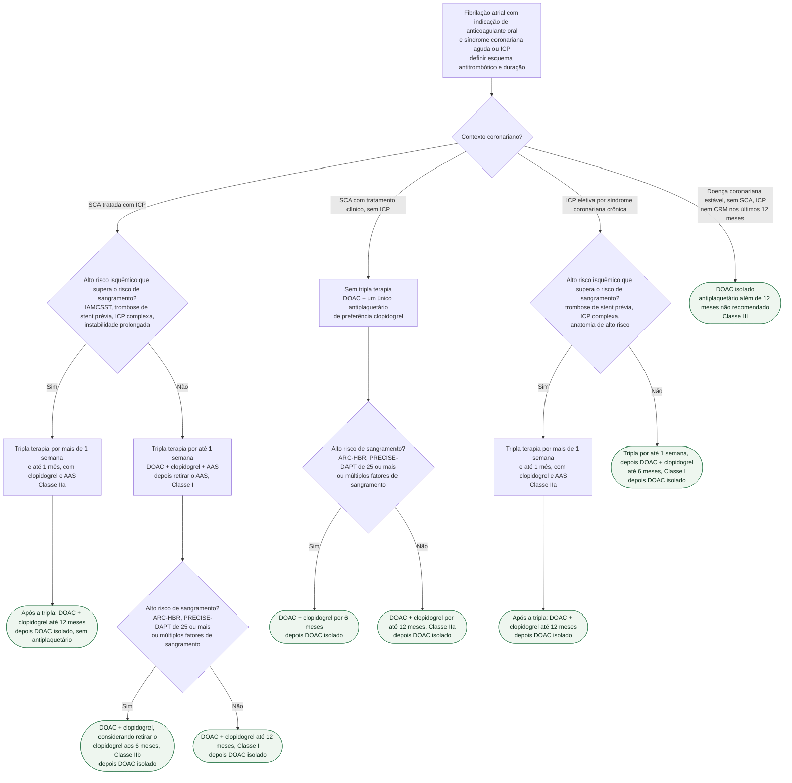

# Fluxograma: Antitrombótico na fibrilação atrial com ICP ou SCA (ESC 2023/2024)

O paciente com fibrilação atrial que sofre uma síndrome coronariana aguda ou faz uma angioplastia precisa, ao mesmo tempo, de anticoagulante para a FA e de antiplaquetário para o stent ou para a placa instável. Empilhar os três fármacos protege dos dois lados, mas cada antitrombótico a mais soma sangramento: na metanálise dos quatro ensaios com anticoagulante direto citada pela ESC 2023, a terapia dupla reduziu o sangramento maior ou clinicamente relevante em relação à tripla (RR 0,66, IC 95% 0,56-0,78), ao custo de mais trombose de stent (RR 1,59, IC 95% 1,01-2,50) e sem efeito sobre mortalidade. A decisão, portanto, não é "tripla ou dupla", e sim **por quanto tempo cada camada fica** — e as duas diretrizes europeias, a de SCA (2023) e a de FA (2024), convergem no mesmo esquema: tripla curta, dupla com clopidogrel por 6 a 12 meses, anticoagulante isolado depois. A árvore abaixo organiza esse esquema pelo contexto coronariano e pelos dois riscos que o modulam.

## Árvore de decisão

## O que vale para todos os ramos

Antes de escolher o ramo, cinco regras se aplicam a qualquer combinação de anticoagulante com antiplaquetário nas duas diretrizes:

- **Anticoagulante direto em vez de antagonista da vitamina K** em todo paciente elegível (ESC 2024, Classe I, nível A; a ESC 2023 usa a mesma preferência na estratégia padrão e em todos os cenários da Figura 12). Fora da elegibilidade — prótese mecânica, estenose mitral moderada a grave — vale a dupla com AVK e clopidogrel após até 1 semana de tripla, com INR alvo de 2,0 a 2,5 e tempo em faixa terapêutica acima de 70% (ESC 2024 Classe IIa, nível C; ESC 2023 Classe IIa, nível B). A ESC 2023 excetua desse alvo reduzido o portador de prótese mecânica em posição mitral, que mantém a intensidade de anticoagulação exigida pela prótese.
- **Dose plena do DOAC**, a de prevenção de AVC na FA, com redução só quando o paciente preenche o critério específico do fármaco (ESC 2024 registra o uso de dose reduzida sem critério como Classe III). As exceções são rivaroxabana 15 mg uma vez ao dia e dabigatrana 110 mg duas vezes ao dia, que **devem ser consideradas** enquanto durar o antiplaquetário concomitante quando a preocupação com sangramento supera a com trombose de stent ou AVC isquêmico (Classe IIa, nível B nas duas diretrizes).
- **Clopidogrel é o inibidor de P2Y12 da combinação.** Foi o fármaco de mais de 90% dos pacientes dos ensaios pivotais; ticagrelor ou prasugrel como parte da tripla terapia não são recomendados (ESC 2023, Classe III, nível C) e a evidência de qualquer um deles na dupla com anticoagulante é limitada (5 a 12% e 1 a 2% dos ensaios, respectivamente).
- **Inibidor de bomba de prótons** durante a combinação em quem tem risco de sangramento digestivo (ESC 2023 o lista entre as estratégias de redução de sangramento; a ESC 2024 chama o uso de "razoável", com evidência limitada em FA).
- **Não interromper o anticoagulante para a ICP:** a ESC 2023 orienta realizar o procedimento sem suspender AVK nem DOAC, com bolus de heparina não fracionada durante a ICP se o paciente usa DOAC ou se o INR está abaixo de 2,5 no AVK (Classe I, nível C).

## SCA tratada com ICP — o ramo padrão e o de alto risco isquêmico

A estratégia padrão da ESC 2023 é literal: em FA com CHA2DS2-VASc de 1 ou mais em homens e 2 ou mais em mulheres, **até 1 semana de tripla terapia** após o evento, seguida de **dupla com DOAC em dose de prevenção de AVC e um único antiplaquetário oral, de preferência clopidogrel, por até 12 meses** (Classe I, nível A). O prazo de 1 semana não é arbitrário: é a mediana de duração do AAS no braço investigacional do AUGUSTUS, que na verdade foi de 6 dias. A ESC 2024 repete a mesma recomendação com a mesma classe e nível, acrescentando a condição "se o risco de trombose é baixo ou o risco de sangramento é alto".

O ramo de **alto risco isquêmico** prolonga a tripla: **por mais de 1 semana e até 1 mês** quando o risco isquêmico ou uma característica anatômica ou de procedimento supera o risco hemorrágico (ESC 2023 Classe IIa, nível C; ESC 2024 Classe IIa, nível C, exigindo documentação clara do plano de alta). A ESC 2024 exemplifica: IAMCSST, trombose de stent prévia, procedimento coronariano complexo e instabilidade cardíaca prolongada — e reconhece que esses pacientes estiveram sub-representados nos ensaios. Depois da tripla, a dupla vai até 12 meses e o anticoagulante segue sozinho.

O ramo de **alto risco de sangramento** encurta a dupla: retirar o antiplaquetário aos 6 meses mantendo o anticoagulante **pode ser considerado** (ESC 2023, Classe IIb, nível B), e o texto da diretriz exemplifica com "múltiplos fatores de alto risco hemorrágico". A base é a subanálise do MASTER DAPT, em que um terço dos pacientes usava anticoagulante e a suspensão do antiplaquetário único aos 6 meses foi segura para eventos isquêmicos.

## SCA sem revascularização

Em SCA tratada clinicamente, os dados sustentam **dupla em vez de tripla** desde o início, com um antiplaquetário único, quase sempre clopidogrel, **por pelo menos 6 meses** (ESC 2023) — cerca de 24% do AUGUSTUS era desse perfil, e nele a apixabana reduziu sangramento em relação ao AVK sem diferença em morte ou eventos isquêmicos. A recomendação formal é um antiplaquetário único somado ao anticoagulante **por até 1 ano** (ESC 2023, Classe IIa, nível B); a ESC 2024 resume como "6 a 12 meses de um único antiplaquetário com DOAC de longo prazo costumam ser suficientes e minimizam o sangramento". A árvore usa o risco de sangramento para escolher entre os dois extremos do intervalo.

## ICP eletiva por síndrome coronariana crônica e doença coronariana estável

Aqui a fonte é a ESC 2024 (Figura 14 e Recommendation Table 24). Após **ICP não complicada**, a retirada precoce do AAS (até 1 semana) com manutenção de anticoagulante e inibidor de P2Y12, de preferência clopidogrel, **por até 6 meses** é recomendada para evitar sangramento maior, se o risco isquêmico é baixo (Classe I, nível A). Quando o risco de trombose de stent supera o de sangramento, a tripla por mais de 1 semana **deve ser considerada**, com duração total de até 1 mês decidida por essa avaliação e documentada (Classe IIa, nível B); nesse caso a Figura 14 leva a dupla até 12 meses.

Em **doença coronariana ou vascular estável tratada com anticoagulante**, antiplaquetário além de 12 meses **não é recomendado**, por falta de eficácia e para evitar sangramento maior (ESC 2024, Classe III, nível B). O AFIRE, citado pela ESC 2023, é a base: rivaroxabana isolada foi não inferior à combinação com um antiplaquetário para o desfecho de eficácia e superior para sangramento maior em 2.236 pacientes com FA e doença coronariana estável, mais de 1 ano após ICP ou cirurgia.

## Durações, classes e níveis por cenário

| Cenário | Tripla terapia | Dupla com DOAC + clopidogrel | DOAC isolado | Fonte |
|---|---|---|---|---|
| SCA com ICP, padrão | Até 1 semana (Classe I, nível A) | Até 12 meses (Classe I, nível A) | A partir de 12 meses (Classe I) | ESC 2023 Tabela 6, ESC 2024 Tabela 24 |
| SCA com ICP, alto risco isquêmico | Mais de 1 semana e até 1 mês (Classe IIa, nível C) | Até 12 meses (Classe I) | A partir de 12 meses | ESC 2023 Tabela 6, ESC 2024 Tabela 24 |
| SCA com ICP, alto risco de sangramento | Até 1 semana | Retirar antiplaquetário aos 6 meses pode ser considerado (Classe IIb, nível B) | A partir de 6 meses | ESC 2023 Tabela 6 e texto 6.5.1 |
| SCA sem revascularização | Nenhuma | Pelo menos 6 e até 12 meses (Classe IIa, nível B) | A partir de 6 a 12 meses | ESC 2023 Tabela 6 e texto 6.5.1, ESC 2024 texto 9.2 |
| ICP eletiva não complicada, risco isquêmico baixo | Até 1 semana (Classe I, nível A) | Até 6 meses (Classe I, nível A) | A partir de 6 meses (Classe I) | ESC 2024 Tabela 24 e Figura 14 |
| ICP eletiva, alto risco isquêmico | Mais de 1 semana e até 1 mês (Classe IIa, nível B) | Até 12 meses (Classe I) | A partir de 12 meses | ESC 2024 Tabela 24 e Figura 14 |
| Doença coronariana estável há mais de 12 meses | Nenhuma | Nenhuma (antiplaquetário além de 12 meses: Classe III, nível B) | Contínuo | ESC 2024 Tabela 24 |

| Ajuste do anticoagulante na combinação | Recomendação | Classe e nível |
|---|---|---|
| DOAC em vez de AVK em elegíveis | Recomendado | I, A (ESC 2024) |
| Rivaroxabana 15 mg uma vez ao dia em vez de 20 mg, enquanto houver antiplaquetário, se o sangramento preocupa mais que trombose de stent ou AVC | Deve ser considerado | IIa, B (ESC 2023 e 2024) |
| Dabigatrana 110 mg duas vezes ao dia em vez de 150 mg, na mesma condição | Deve ser considerado | IIa, B (ESC 2023 e 2024) |
| AVK com antiplaquetário: INR 2,0 a 2,5 e TTR acima de 70% | Deve ser considerado | IIa, B (ESC 2023) e IIa, C (ESC 2024) |
| Ticagrelor ou prasugrel como parte da tripla | Não recomendado | III, C (ESC 2023) |

## Limitações e o que confirmar

- **Diabetes.** A árvore não transforma diabetes isoladamente em indicação para prolongar a tripla terapia. O teto operacional permanece em 1 mês quando o risco isquêmico ou anatômico supera o hemorrágico, conforme as tabelas de recomendação das diretrizes ESC 2023 e 2024.
- **Risco de sangramento como critério de ramo.** As duas diretrizes usam ARC-HBR (um critério maior ou dois menores) e PRECISE-DAPT de 25 ou mais como definição de alto risco hemorrágico; a ESC 2023 fala em "múltiplos fatores de HBR" para encurtar a dupla para 6 meses, sem número exato de fatores. A ESC 2024 não recomenda usar escores de sangramento para decidir iniciar ou suspender o anticoagulante (Classe III, nível B), para evitar subuso da anticoagulação — o ramo aqui serve para modular a duração do antiplaquetário, não para negar o anticoagulante.
- **A dupla "até 12 meses" na SCA sem ICP com baixo risco de sangramento** combina a recomendação formal da ESC 2023 (até 1 ano, IIa B) com o intervalo de 6 a 12 meses do texto da ESC 2024; nenhuma das duas atribui classe ao corte de 6 meses nesse subgrupo específico.
- **Nenhum dos ensaios pivotais teve poder para eventos isquêmicos.** A metanálise citada mostra aumento de trombose de stent com a dupla (absoluto de 0,4%) contra redução de 2,3% em sangramento maior; a leitura sobre eventos isquêmicos é descritiva e o julgamento do risco de trombose de stent continua clínico.
- **Pacientes com IAMCSST foram cerca de 10% dos ensaios**, e os de alto risco isquêmico estiveram sub-representados — o ramo de tripla prolongada é o de menor evidência direta (nível C nas duas diretrizes).
- Este fluxograma não cobre o paciente sem FA: a duração da DAPT sem anticoagulante está em fluxograma-duracao-e-desescalonamento-da-dapt-apos-icp, com outros prazos e outros critérios de extensão.

## Tudo com Tudo

- [AUGUSTUS: Terapia Antitrombótica após SCA ou ICP na Fibrilação Atrial](/biblioteca/augustus-terapia-antitrombotica-apos-sca-ou-icp-na-fibrilacao-atrial)
- [Fluxograma: Duração e desescalonamento da terapia antiplaquetária dupla (DAPT) após ICP](/biblioteca/fluxograma-duracao-e-desescalonamento-da-dapt-apos-icp)
- [Fluxograma: Fibrilação Atrial — trajetória AF-CARE (ESC 2024)](/biblioteca/fluxograma-fibrilacao-atrial-af-care-esc-2024)
- [Fluxograma: Síndrome Coronariana Aguda — do primeiro contato à reperfusão (ESC 2023)](/biblioteca/fluxograma-sindrome-coronariana-aguda-esc-2023)
- [Posologia de antiagregantes e anticoagulantes na síndrome coronariana aguda (ESC 2023)](/biblioteca/posologia-de-antiagregantes-e-anticoagulantes-na-sindrome-coronariana-aguda-esc-2023)
