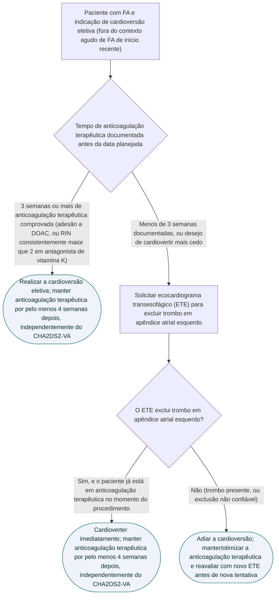

# Fluxograma: cardioversão eletiva na FA — via de anticoagulação e janela pós-procedimento (ESC 2024)

A cardioversão eletiva de FA — fora da janela aguda de início recente — organiza-se em três janelas temporais de anticoagulação, e a que mais surpreende na prática é a última: mesmo o paciente jovem sem nenhum fator de risco (CHA2DS2-VA de 0), que nunca precisaria de anticoagulação crônica, precisa de 4 semanas de anticoagulação terapêutica depois do procedimento. A razão não é o risco tromboembólico basal — é o atordoamento atrial mecânico transitório que a própria cardioversão causa.

## Árvore de decisão

## O que a árvore não mostra

**As duas vias de preparo (3 semanas de anticoagulação comprovada, ou ETE para excluir trombo e cardioverter mais cedo) são estratégias equivalentes**, escolhidas conforme a urgência clínica e a disponibilidade do exame — uma não é atalho que dispensa a outra.

**Depois das 4 semanas pós-cardioversão, a decisão de manter ou suspender a anticoagulação volta a seguir o escore de risco tromboembólico crônico (CHA2DS2-VA)** — não mais a regra periprocedimento representada nesta árvore.

**Este fluxograma cobre a cardioversão eletiva, não a FA aguda de início recente.** O corte de 24 horas para cardioversão sem necessidade de ETE, usado na FA aguda, é um cenário clínico distinto com estratégia de anticoagulação própria.