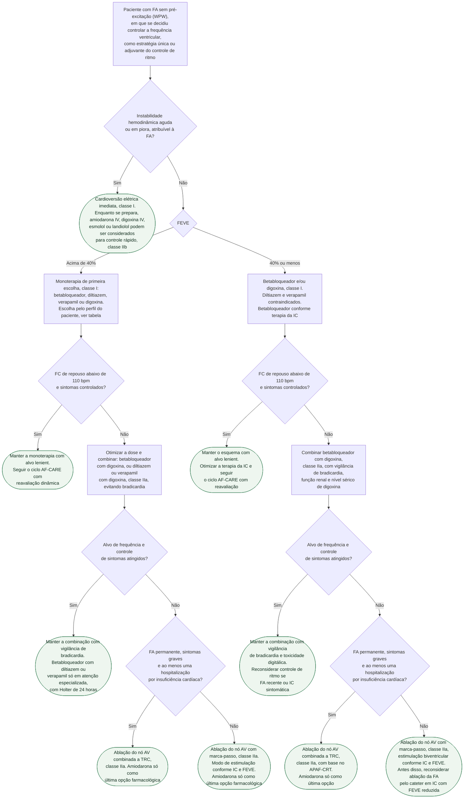

# Fluxograma: Controle de frequência na fibrilação atrial — escolha da droga pela FEVE e alvo de FC (ESC 2024)

Decidido controlar a frequência — como estratégia única, como ponte até a cardioversão ou como adjuvante do controle de ritmo —, sobra a pergunta que a diretriz ESC 2024 responde com uma única variável de corte: **a FEVE**. Acima de 40%, quatro fármacos são de primeira escolha em pé de igualdade, e a digoxina voltou a esse grupo por conta do RATE-AF; em 40% ou menos, diltiazem e verapamil saem da mesa e sobram betabloqueador e digoxina. O alvo inicial é o mesmo em todos os ramos: **frequência de repouso abaixo de 110 bpm**, o controle lenient do RACE II. O que muda de um ramo para outro é só o que fazer quando esse alvo não vem — combinação, e depois ablação do nó AV com marca-passo ou ressincronizador. Os fluxogramas já publicados nesta pasta cobrem a trajetória AF-CARE como um todo (ver fluxograma-fibrilacao-atrial-af-care-esc-2024) e a FA de início recente no pronto-socorro (ver fluxograma-fa-inicio-recente-pronto-socorro); este trata apenas da escolha e do escalonamento da droga de frequência.

## Árvore de decisão

## Primeiro ramo: instabilidade

Antes de escolher fármaco, a diretriz manda tratar a causa que precipitou a FA — sepse, sobrecarga volêmica, choque cardiogênico — antes ou em paralelo ao controle agudo de frequência ou ritmo. Na instabilidade hemodinâmica aguda ou em piora, a conduta é **cardioversão elétrica (classe I, nível C)**, não titulação de droga. O controle farmacológico rápido no paciente instável ou com FEVE gravemente reduzida — amiodarona IV, digoxina IV, esmolol ou landiolol — recebe apenas **classe IIb, nível B**, e é ponte, não substituto da cardioversão. A conduta no pronto-socorro do paciente estável com FA de início recente, incluindo a estratégia de esperar e ver, está em fluxograma-fa-inicio-recente-pronto-socorro.

No paciente estável em cenário agudo, betabloqueador (qualquer FEVE) e diltiazem/verapamil (FEVE acima de 40%) são preferidos à digoxina pelo início de ação mais rápido e pelo efeito dose-dependente; betabloqueadores beta-1 seletivos têm melhor perfil de eficácia e segurança que os não seletivos.

## FEVE acima de 40%: quatro opções de primeira escolha

Betabloqueador, diltiazem, verapamil ou digoxina são **recomendados como primeira escolha (classe I, nível B)**. A diretriz não hierarquiza entre eles; a escolha depende de sintomas, comorbidades e potencial de efeitos adversos e interações. Três pontos práticos do texto:

- Betabloqueadores costumam ser a primeira escolha pelo efeito agudo sobre a frequência e pelo benefício demonstrado na IC com FEVE reduzida — mas a diretriz registra que esse benefício prognóstico, visto em ritmo sinusal, pode não existir na FA.
- Verapamil e diltiazem têm perfil de efeitos adversos diferente e são úteis em quem não tolera betabloqueador; num ensaio cruzado de 60 pacientes não reduziram a capacidade de exercício como os betabloqueadores e tiveram efeito favorável sobre o BNP.
- A digoxina voltou ao grupo de primeira linha com base no RATE-AF: em FA permanente sintomática, sem diferença de qualidade de vida aos 6 meses contra bisoprolol, com menos efeitos adversos, maior melhora da classe mEHRA e NYHA e redução de BNP — a leitura crítica desse ensaio está em digoxina-ou-betabloqueador-no-controle-de-frequencia-da-fa-permanente-rate-af. Em ensaios randomizados não há associação entre digoxina e aumento de mortalidade por qualquer causa, e doses menores podem se associar a melhor prognóstico.

## FEVE de 40% ou menos: betabloqueador e/ou digoxina

Na FEVE de 40% ou menos, a recomendação é **betabloqueador e/ou digoxina (classe I, nível B)**. Verapamil e diltiazem estão **contraindicados** nessa faixa pela Tabela 12 da diretriz, o que faz da FEVE o único corte que de fato retira uma opção da mesa. A tabela da diretriz também exclui o atenolol na IC com FEVE reduzida e na gestação.

Quando o controle de frequência falha nessa população, vale lembrar o que a árvore não decide: em IC com FEVE reduzida e FA sintomática, o CASTLE-AF mostrou redução de mortalidade e hospitalização com ablação por cateter — a discussão dessa estratégia, antes de abolir a condução AV de vez, está em controle-de-ritmo-vs-frequencia-na-fibrilacao-atrial-affirm-east-afnet-4-e-castle-af e em fluxograma-indicacao-ablacao-cateter-fa-esc-2024.

## O alvo: lenient primeiro

O alvo inicial é **frequência de repouso abaixo de 110 bpm (classe IIa, nível B)**, com controle mais estrito reservado a quem persiste sintomático. A base é o RACE II, em FA permanente: o controle lenient (alvo abaixo de 110 bpm) foi não inferior ao estrito (abaixo de 80 bpm em repouso e abaixo de 110 bpm no exercício, com Holter de segurança) para o composto de eventos clínicos, classe NYHA e hospitalização — resultado replicado em análise post hoc combinada de AFFIRM e RACE. As duas exceções nomeadas pela diretriz para apertar o alvo são sintomas persistentes e suspeita de taquicardiomiopatia. A mesma abordagem vale para FA paroxística, persistente e permanente.

## Combinação e o paciente refratário

Se um único fármaco não controla sintomas ou frequência, **combinação deve ser considerada (classe IIa, nível C)**, desde que se evite bradicardia. A combinação de betabloqueador com verapamil ou diltiazem só deve ser feita em atenção especializada, com monitorização regular da frequência por ECG de 24 horas. Dronedarona não deve ser usada para controle de frequência — aumenta IC, AVC e morte cardiovascular na FA permanente; amiodarona e sotalol têm efeito cronotrópico, mas devem ser reservados ao controle de ritmo. A amiodarona fica como **última opção** quando a frequência não é controlada nem com combinação máxima tolerada, ou em quem não é candidato a ablação do nó AV, porque seus efeitos adversos guardam relação direta com a dose cumulativa.

No refratário, a ablação do nó AV com marca-passo **deve ser considerada (classe IIa, nível B)** em quem não responde a, ou não é elegível para, terapia intensiva de controle de frequência e sintomas. O marca-passo é implantado algumas semanas antes da ablação, com frequência inicial de estimulação de 70 a 90 bpm; a estratégia não piora a função ventricular e pode até melhorar a FEVE em selecionados. Em jovens, só depois de esgotadas as alternativas farmacológicas e não farmacológicas. Na FA permanente com sintomas graves e ao menos uma hospitalização por IC, a ablação do nó AV combinada a **TRC deve ser considerada (classe IIa, nível B)**: no APAF-CRT, em QRS estreito, foi superior aos fármacos para mortalidade por qualquer causa e para morte ou hospitalização por IC — ver ablacao-do-no-atrioventricular-e-ressincronizacao-na-fa-permanente-o-ensaio-apaf-crt. A escolha entre estimulação ventricular direita e biventricular depende de IC e FEVE.

## Fármacos e doses (Tabela 12 da ESC 2024)

| Fármaco | Via intravenosa | Manutenção oral habitual | Observações da diretriz |
|---|---|---|---|
| Metoprolol tartarato | 2,5–5 mg em bolus em 2 min, até 15 mg cumulativos | 25–100 mg 2x/dia | Não seletivos evitados na asma; contraindicados na IC aguda e em broncoespasmo grave prévio |
| Metoprolol succinato | — | 50–200 mg 1x/dia | |
| Bisoprolol | — | 1,25–20 mg 1x/dia | |
| Atenolol | — | 25–100 mg 1x/dia | Sem dados; não usar em IC com FEVE reduzida nem na gestação |
| Esmolol | 500 µg/kg em 1 min, depois 50–300 µg/kg/min | — | |
| Landiolol | Carga opcional 100 µg/kg em 1 min, depois 10–40 µg/kg/min; no crítico começar com 1–10 µg/kg/min | — | |
| Nebivolol | — | 2,5–10 mg 1x/dia | |
| Carvedilol | — | 3,125–50 mg 2x/dia | |
| Verapamil | 2,5–10 mg em bolus em 5 min | 40 mg 2x/dia até 480 mg de liberação prolongada 1x/dia | Contraindicado se FEVE de 40% ou menos; ajustar em disfunção hepática e renal |
| Diltiazem | 0,25 mg/kg em bolus em 5 min, depois 5–15 mg/h | 60 mg 3x/dia até 360 mg de liberação prolongada 1x/dia | Contraindicado se FEVE de 40% ou menos |
| Digoxina | 0,5 mg em bolus, ou 0,75–1,5 mg em 24 h em doses divididas | 0,0625–0,25 mg 1x/dia | Níveis altos associados a eventos adversos; checar função renal antes e ajustar na DRC |
| Amiodarona | 300 mg em 250 mL de glicose 5% em 30–60 min, depois 900–1200 mg em 24 h, via central | 200 mg 1x/dia após carga de 200 mg 3x/dia por 4 semanas | Contraindicada na sensibilidade ao iodo; toxicidade pulmonar, ocular, hepática e tireoidiana; múltiplas interações |

Todos os fármacos de controle de frequência, inclusive amiodarona IV, são contraindicados na síndrome de Wolff-Parkinson-White. Propranolol e labetalol não são recomendados como terapia específica de controle de frequência na FA. Para a dose baixa de digoxina do RATE-AF, monitorização de função renal, potássio e toxicidade, ver digoxina e fluxograma-intoxicacao-digitalica.

## Limitações e o que confirmar

- Os números de classe e nível da Tabela de Recomendações 14 foram lidos na tradução oficial polonesa publicada em Kardiologia Polska, não na tabela em inglês do European Heart Journal, cujo texto integral não carregou nesta sessão; a tradução polonesa grafa o corte da segunda recomendação como "LVEF <40%", enquanto a Tabela 12 e o resumo da ACC usam "≤40%" — adotou-se 40% ou menos, coerente com a contraindicação de verapamil e diltiazem.
- O texto da seção 7.1 e da Tabela 12 em inglês foi lido em reprodução textual de terceiros, conferida linha a linha contra a tradução oficial; a leitura direta do original permanece pendente para a revisão independente.
- A árvore posiciona a ablação do nó AV com TRC depois da falha da combinação farmacológica; a diretriz recomenda considerá-la na FA permanente gravemente sintomática com hospitalização por IC sem exigir explicitamente essa etapa prévia, e no APAF-CRT o comparador foi controle farmacológico de frequência — a antecipação é decisão de julgamento clínico.
- A diretriz não define numericamente o alvo "estrito" para quem persiste sintomático; o valor de 80 bpm em repouso citado aqui é o braço estrito do RACE II, não uma meta recomendada.
- Digitoxina consta da Tabela 12 (0,05–0,1 mg 1x/dia) mas foi omitida da tabela acima por não estar disponível no Brasil.

## Tudo com Tudo

- [Fluxograma: Fibrilação Atrial — trajetória AF-CARE (ESC 2024)](/biblioteca/fluxograma-fibrilacao-atrial-af-care-esc-2024)
- [Fluxograma: fibrilação atrial de início recente no pronto-socorro](/biblioteca/fluxograma-fa-inicio-recente-pronto-socorro)
- [Digoxina ou Betabloqueador no Controle de Frequência da FA Permanente? (RATE-AF)](/biblioteca/digoxina-ou-betabloqueador-no-controle-de-frequencia-da-fa-permanente-rate-af)
- [Controle de Ritmo vs. Frequência na Fibrilação Atrial: AFFIRM, EAST-AFNET 4 e CASTLE-AF](/biblioteca/controle-de-ritmo-vs-frequencia-na-fibrilacao-atrial-affirm-east-afnet-4-e-castle-af)
- [Ablação do Nó Atrioventricular e Ressincronização na FA Permanente: o Ensaio APAF-CRT](/biblioteca/ablacao-do-no-atrioventricular-e-ressincronizacao-na-fa-permanente-o-ensaio-apaf-crt)
- [Fluxograma: indicação de ablação por cateter na fibrilação atrial (ESC 2024)](/biblioteca/fluxograma-indicacao-ablacao-cateter-fa-esc-2024)
- [Fluxograma: intoxicação digitálica com risco de vida](/biblioteca/fluxograma-intoxicacao-digitalica)
