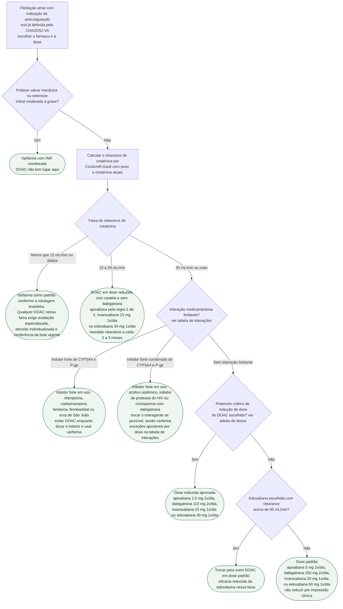

# Fluxograma: Escolha e ajuste de dose de DOAC na fibrilação atrial — função renal, idade, peso e interações

O fluxograma do CHA2DS2-VA (ver fluxograma-cha2ds2-va-decisao-de-anticoagulacao) responde SE o paciente com fibrilação atrial deve anticoagular. Esta árvore começa onde aquela termina: com a indicação já firmada, decide QUAL anticoagulante e em QUE dose. A ESC 2024 prefere os DOAC à varfarina (classe I, nível A), com duas exceções nomeadas — prótese valvar mecânica e estenose mitral moderada a grave — e é explícita ao não recomendar dose reduzida de DOAC fora dos critérios específicos de cada fármaco (classe III, nível B), porque a subdose troca sangramento por tromboembolismo evitável. O que muda a dose é objetivo e mensurável: clearance de creatinina, idade, peso, creatinina sérica e o que mais o paciente toma. O que não muda a dose é a impressão de fragilidade.

## Árvore de decisão

## Quando o DOAC não entra: prótese mecânica e estenose mitral

A única contraindicação valvar aos DOAC é o par prótese valvar mecânica e estenose mitral moderada a grave — a chamada FA valvar clássica, ou EHRA tipo 1, detalhada em terminologia-fa-valvar-versus-nao-valvar-e-o-criterio-real-que-contraindica-doac. Insuficiência mitral, estenose aórtica, bioprótese, TAVI e reparo borda a borda não contraindicam DOAC e seguem o restante desta árvore. O EHRA 2021 registra que a estenose mitral reumática moderada a grave foi excluída dos ensaios de fase III e que a varfarina permanece o padrão; a bula americana da dabigatrana lista prótese valvar mecânica como contraindicação formal (o RCM europeu, prótese valvar que exija anticoagulação); as bulas americanas e os RCM de apixabana e rivaroxabana dizem apenas que o uso não é recomendado em portador de prótese valvar cardíaca, sem citar a estenose mitral; só a rotulagem da edoxabana nomeia prótese mecânica e estenose mitral moderada a grave como situações em que o uso não é recomendado. A rivaroxabana, em particular, também não é recomendada pela bula após TAVI.

## A função renal pela fórmula certa

O EHRA 2021 manda estimar a função renal por Cockcroft-Gault, porque foi essa a fórmula dos quatro ensaios pivotais, e alerta que MDRD e CKD-EPI podem superestimar a função renal no idoso e no paciente de baixo peso — exatamente quem mais precisa de dose reduzida. A bula da edoxabana exige explicitamente Cockcroft-Gault antes de iniciar. Com clearance de 60 mL/min ou menos, o intervalo mínimo de reavaliação em meses é o clearance dividido por 10 (EHRA 2021): 30 mL/min pede reavaliação a cada 3 meses. Em intercorrência aguda — desidratação, contraste, infecção — a categoria de dose pode mudar em dias.

| Clearance por Cockcroft-Gault | Conduta nesta árvore |
|---|---|
| 30 mL/min ou mais | DOAC pela dose de bula, com os critérios de redução da tabela abaixo |
| 15 a 29 mL/min | DOAC possível com cautela e dados escassos, sem dabigatrana no Brasil |
| Menor que 15 mL/min ou diálise | Varfarina como padrão; apixabana só em decisão individualizada |

## Clearance de 15 a 29 mL/min

Nenhum ensaio pivotal incluiu pacientes com clearance abaixo de 25 a 30 mL/min em número suficiente, e o EHRA 2021 descreve essa faixa como de dados limitados. As bulas permitem: rivaroxabana 15 mg 1x/dia (faixa 15 a 49 mL/min na rotulagem europeia e brasileira; a bula americana escreve clearance de 50 mL/min ou menos, sem limite inferior na FA), edoxabana 30 mg 1x/dia (15 a 50 mL/min) e apixabana pela regra 2 de 3 — a bula brasileira não cria um critério renal isolado nessa faixa, manda usar com cautela e registra AUC 44% maior na insuficiência renal grave, enquanto a rotulagem europeia admite 2,5 mg 2x/dia só pelo clearance de 15 a 29 (EHRA 2021). A dabigatrana está contraindicada no Brasil com clearance abaixo de 30 mL/min (bula brasileira do Pradaxa, ver dabigatrana-etexilato); o esquema americano de 75 mg 2x/dia para 15 a 30 mL/min existe no DailyMed, mas não tem contrapartida na rotulagem brasileira.

## Clearance abaixo de 15 mL/min e diálise

Aqui a evidência é fraca em qualquer direção, e a árvore trata a varfarina como padrão de acordo com a rotulagem brasileira. As bulas nacionais dos DOAC não estabelecem um esquema uniforme abaixo de 15 mL/min ou em diálise, enquanto a rotulagem americana difere para alguns fármacos. Os ensaios RENAL-AF e AXADIA-AFNET 8 foram pequenos e não demonstraram superioridade de apixabana ou de antagonista da vitamina K. Portanto, a árvore não prescreve dose de DOAC nessa faixa: eventual uso deve ser decidido por especialista, com registro da incerteza, avaliação individual de risco e consulta à bula vigente.

## Interações que decidem antes da dose

Interações variam entre os fármacos e entre rotulagens. Indutores fortes — rifampicina, carbamazepina, fenitoína, fenobarbital e erva de São João — reduzem a exposição aos DOAC e devem ser evitados. Inibidores fortes combinados de P-gp/CYP3A4, azólicos sistêmicos, alguns antirretrovirais, ciclosporina, tacrolimo, dronedarona e verapamil exigem decisão específica para o DOAC escolhido. Na árvore, uma interação limitante leva à troca do interagente ou ao uso de varfarina; a tabela abaixo registra apenas combinações diretamente respaldadas pela rotulagem europeia/brasileira consultada. Antes de prescrever, deve-se conferir a bula vigente de ambos os fármacos.

| Interagente | Dabigatrana | Apixabana | Rivaroxabana | Edoxabana |
|---|---|---|---|---|
| Azólico sistêmico (cetoconazol, itraconazol, voriconazol, posaconazol) | Contraindicado (cetoconazol, itraconazol); cautela com posaconazol | Evitar | Evitar | Reduzir para 30 mg com cetoconazol; demais azólicos sem dado no RCM |
| Inibidor de protease do HIV | Evitar | Evitar | Evitar | Consultar bula específica; associação não estudada no RCM consultado |
| Ciclosporina | Contraindicada (RCM) | Consultar bula específica | Consultar bula específica | Reduzir para 30 mg |
| Tacrolimo | Não recomendado (RCM) | Consultar bula específica | Consultar bula específica | Consultar bula específica |
| Dronedarona | Contraindicada | — | Evitar (RCM europeu) | Reduzir para 30 mg |
| Verapamil | Reduzir para 110 mg 2x/dia | — | — | Sem redução na bula europeia |
| Rifampicina, carbamazepina, fenitoína, fenobarbital, erva de São João | Evitar | Evitar | Evitar | Evitar |

Na apixabana, a rotulagem americana prevê redução de 50% com determinados inibidores combinados fortes, mas essa regra não deve ser transplantada automaticamente para a prática brasileira; aplicar a bula nacional vigente ou optar por outro anticoagulante.

## Critérios de redução de dose de cada DOAC

Os critérios são específicos por fármaco e não se transferem: a regra 2 de 3 é só da apixabana; a edoxabana reduz com um critério isolado; a rivaroxabana reduz só pelo clearance; a dabigatrana tem redução obrigatória e redução a considerar. O EHRA 2021 resume: sempre que possível, usar o regime testado e aprovado, e a redução fora dos critérios publicados é desaconselhada pela falta de dados de desfecho.

| DOAC | Dose padrão em FA | Dose reduzida | Quando reduzir | Fonte |
|---|---|---|---|---|
| Apixabana | 5 mg 2x/dia | 2,5 mg 2x/dia | Pelo menos 2 de 3: idade 80 anos ou mais, peso 60 kg ou menos, creatinina 1,5 mg/dL ou mais | DailyMed, bula brasileira via acervo, EHRA 2021 |
| Dabigatrana | 150 mg 2x/dia | 110 mg 2x/dia | Obrigatório: idade 80 anos ou mais, ou verapamil. A considerar: 75 a 80 anos, clearance 30 a 50 mL/min, gastrite ou esofagite, risco hemorrágico aumentado | RCM europeu via acervo, EHRA 2021 |
| Rivaroxabana | 20 mg 1x/dia com alimento | 15 mg 1x/dia com alimento | Clearance 15 a 49 mL/min (50 mL/min ou menos na bula americana) | DailyMed, bula brasileira via acervo, EHRA 2021 |
| Edoxabana | 60 mg 1x/dia | 30 mg 1x/dia | Qualquer um: clearance 15 a 50 mL/min, peso 60 kg ou menos, ou inibidor potente de P-gp (ciclosporina, dronedarona, eritromicina, cetoconazol) | RCM europeu e bula brasileira via acervo, EHRA 2021 |

Dois detalhes que geram erro. Na apixabana, um critério isolado — só os 82 anos, só a creatinina de 1,6 — não reduz a dose: é subdose sem respaldo do ARISTOTLE (ver fibrilacao-atrial-no-idoso-anticoagulacao-versus-risco-de-queda-e-ajuste-renal). Na edoxabana, a bula americana não reduz por inibidor de P-gp na indicação de FA, ao contrário da rotulagem europeia e brasileira, e proíbe o uso com clearance acima de 95 mL/min por excesso de AVC isquêmico no ENGAGE AF-TIMI 48 nessa faixa — daí o ramo D6, que troca de fármaco em vez de aumentar a dose. A troca vale também quando o paciente com clearance acima de 95 mL/min preencheria critério de redução por peso ou interação: a bula americana proíbe a edoxabana nessa faixa em qualquer dose, e o RCM europeu só a admite após avaliação cuidadosa do risco tromboembólico e hemorrágico. Na dabigatrana com clearance de 30 a 50 mL/min e dronedarona ou cetoconazol, a bula americana reduz para 75 mg 2x/dia; no Brasil, a dronedarona simplesmente não se associa à dabigatrana, e o verapamil leva a 110 mg 2x/dia.

## Limitações

- Não há recomendação graduada que estabeleça uma dose universal de DOAC em diálise; por isso a árvore não oferece uma dose nessa situação.
- Regras de interação da rotulagem americana não substituem a bula brasileira vigente.
- Rivaroxabana e edoxabana em diálise: a bula americana da edoxabana não recomenda o uso com clearance abaixo de 15 mL/min e o RCM europeu não o recomenda em doença renal terminal ou diálise; a bula americana da rivaroxabana, na FA, admite 15 mg 1x/dia com clearance de 50 mL/min ou menos, inclusive em hemodiálise intermitente, apenas por semelhança farmacocinética com o ROCKET AF e sem desfecho clínico, enquanto o RCM europeu e a bula brasileira não recomendam abaixo de 15 mL/min — a árvore segue a rotulagem brasileira e trata as duas como fora de bula nessa faixa.
- O CHA2DS2-VA e a decisão de anticoagular ficam no fluxograma anterior; sangramento maior sob anticoagulante e interrupção periprocedimento têm fluxogramas próprios e não estão aqui.

## Tudo com Tudo

- [Fluxograma: CHA₂DS₂-VA e a Decisão de Anticoagular na Fibrilação Atrial](/biblioteca/fluxograma-cha2ds2-va-decisao-de-anticoagulacao)
- ["FA Valvar" versus "FA Não Valvar": Por que o Termo é Impreciso e Qual é o Critério Real que Contraindica DOAC](/biblioteca/terminologia-fa-valvar-versus-nao-valvar-e-o-criterio-real-que-contraindica-doac)
- [Fibrilação Atrial em Diálise: o que Diz a Evidência (RENAL-AF e AXADIA-AFNET 8)](/biblioteca/fibrilacao-atrial-em-dialise-o-que-diz-a-evidencia-renal-af-e-axadia-afnet-8)
- [Apixabana e rivaroxabana — seleção de dose pela bula brasileira 2025](/biblioteca/apixabana-rivaroxabana-dose-bula-brasil-2025-arvore-de-decisao)
- [Dabigatrana (etexilato)](/biblioteca/dabigatrana-etexilato)
- [Edoxabana](/biblioteca/edoxabana)
- [Fibrilação Atrial no Idoso: Anticoagulação versus Risco de Queda, e Ajuste de Dose Renal no Muito Idoso](/biblioteca/fibrilacao-atrial-no-idoso-anticoagulacao-versus-risco-de-queda-e-ajuste-renal)
