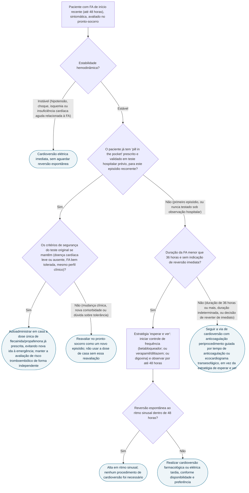

# Fluxograma: fibrilação atrial de início recente no pronto-socorro

A prática consagrada era reverter o ritmo imediatamente e mandar o paciente para casa em ritmo sinusal. O RACE 7 ACWAS testou se essa pressa é necessária — e mostrou que, em paciente hemodinamicamente estável, mais de dois terços dos casos revertem sozinhos em 48 horas, sem qualquer procedimento de cardioversão. Já o paciente com FA recorrente e "pill in the pocket" já validado num teste hospitalar prévio segue um caminho totalmente diferente, de autoadministração em casa.

## Árvore de decisão

## O que a árvore não mostra

**"Esperar e ver" não é "não tratar".** No RACE 7 ACWAS, o braço de conduta tardia recebia controle de frequência ativo desde a chegada — betabloqueador em primeira escolha, verapamil/diltiazem em segunda, digoxina em terceira, com meta de frequência cardíaca abaixo de 110 bpm — e só era encaminhado à cardioversão se a arritmia persistisse além de 48 horas, um prazo pré-definido, não uma espera indefinida.

**O resultado do RACE 7 ACWAS é de não inferioridade, não de superioridade**: ritmo sinusal em 4 semanas foi de 91% no grupo tardio contra 94% no grupo precoce — a estratégia expectante não piora o desfecho de ritmo, e o ganho prático está em evitar sedação, antiarrítmico ou choque elétrico em pacientes que revertem sozinhos.

**O "pill in the pocket" exige uma etapa de validação hospitalar que não pode ser pulada.** No ensaio original de Alboni et al., 22% dos candidatos foram excluídos do uso ambulatorial por falha de tratamento ou efeito adverso durante o teste sob observação — só quem reverteu com segurança no hospital recebe autorização para tomar a dose em casa. O risco específico a explicar ao paciente é o flutter atrial com condução ventricular rápida, mecanismo pelo qual o fármaco de classe IC pode organizar a fibrilação em um flutter que conduz 1:1 pelo nó atrioventricular.

**Nenhum dos dois caminhos dispensa a avaliação de risco tromboembólico** — a decisão sobre anticoagulação segue as mesmas regras da cardioversão em geral, independentemente da estratégia escolhida no pronto-socorro.