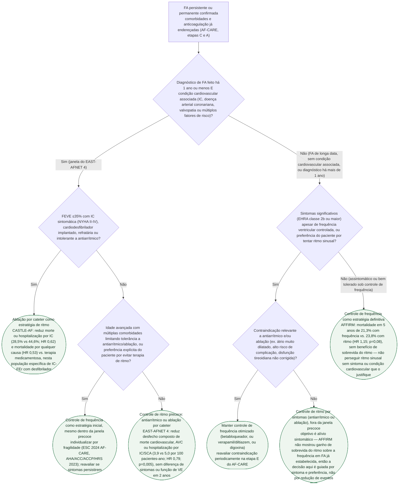

# Fluxograma: FA persistente ou permanente — controle de frequência ou de ritmo?

Na FA paroxística a discussão costuma ser resolvida cedo, a favor do ritmo. Na FA
**persistente ou permanente**, a escolha inicial entre controlar a frequência
ou tentar restaurar e manter o ritmo sinusal é mais disputada — e depende de
quando o diagnóstico foi feito, não apenas da duração do episódio atual. O
EAST-AFNET 4 mudou essa conversa ao mostrar benefício de eventos cardiovasculares
com controle de ritmo **precoce** (mediana de 36 dias desde o diagnóstico),
enquanto o AFFIRM — décadas antes, em FA já estabelecida — não encontrou
vantagem de sobrevida do ritmo sobre a frequência. As diretrizes ESC 2024
(AF-CARE) e AHA/ACC/ACCP/HRS 2023 convergem em individualizar por essa janela
temporal, associada a sintomas, idade/fragilidade e presença de IC-FEr.

## Árvore de decisão

## Por que a janela temporal decide antes da idade ou do sintoma

O ponto que separa este fluxograma de uma simples lista "ritmo se sintomático,
frequência se não" é a ordem das perguntas. A primeira pergunta não é sobre
sintoma — é sobre **quando** a FA foi diagnosticada e se há uma condição
cardiovascular associada, porque é essa combinação que define a população do
EAST-AFNET 4 (diagnóstico mediano de 36 dias, critério de inclusão de até 1
ano). Dentro dessa janela, o controle de ritmo precoce reduz eventos
cardiovasculares — não apenas sintomas — e por isso a recomendação pesa a
favor do ritmo mesmo em paciente pouco sintomático, salvo fragilidade que
limite a terapia. Fora da janela, em FA já estabelecida, o benefício
observado no AFFIRM não existe, e a escolha volta a ser guiada por sintoma e
preferência — não por expectativa de reduzir morte ou AVC.

## IC-FEr é uma bifurcação à parte, não um sintoma a mais

A presença de IC com fração de ejeção reduzida e desfibrilador implantado, na
população do CASTLE-AF, isola um subgrupo em que a ablação por cateter reduz
mortalidade por qualquer causa e hospitalização por IC de forma mais robusta
do que o observado no EAST-AFNET 4 em população mais ampla. Por isso esse
subgrupo aparece como pergunta separada, antes da avaliação de idade e
fragilidade — a indicação de ritmo por ablação nesse contexto não depende da
mesma ponderação de risco-benefício aplicada ao restante da árvore.

## O que este fluxograma não substitui

A escolha entre controle de frequência e de ritmo pressupõe que as etapas C
(comorbidades) e A (anticoagulação) do AF-CARE já foram endereçadas — este
fluxograma cobre apenas a etapa R (reduzir sintomas), e não repete os critérios
de anticoagulação por CHA2DS2-VA nem a técnica de ablação, já detalhados nos
fluxogramas "Fibrilação Atrial — trajetória AF-CARE (ESC 2024)" e "Indicação de
ablação por cateter na FA (ESC 2024)" deste acervo.
