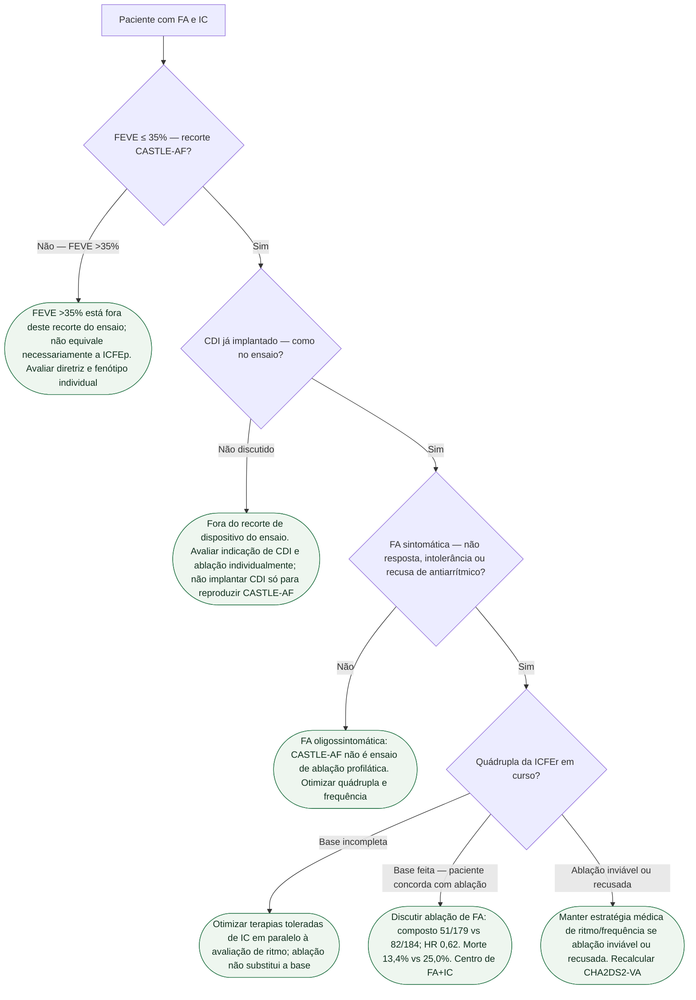

# Fluxograma: FA sintomática na ICFEr após CASTLE-AF

CASTLE-AF: FEVE ≤35%, CDI, FA sintomática. Composto morte/hosp. IC 28,5% vs 44,6%; HR 0,62. Não é ICFEp. ESC 2026: ablação por cateter IIa C em selecionados com FA sintomática e HFrEF; o ensaio tinha recorte mais estreito.

## Árvore de decisão

## Tudo com Tudo

- [CASTLE-AF: ablação de FA na IC com FE reduzida](/biblioteca/castle-af-ablacao-de-fa-na-ic-com-fe-reduzida)
- [ESC 2026: IC e FA — o que muda na ficha conjunta](/biblioteca/esc-2026-ic-e-fa-o-que-muda-na-ficha-conjunta)
- [Quando ablação de FA na IC: o que CASTLE-AF e a ESC 2026 separam](/biblioteca/quando-ablacao-de-fa-na-ic-o-que-castle-af-e-a-esc-2026-separam)
