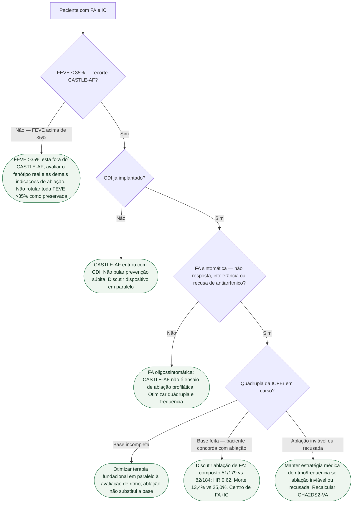

# Fluxograma: FA sintomática na ICFEr após CASTLE-AF

CASTLE-AF: FEVE ≤35%, CDI, FA sintomática. Composto morte/hosp. IC 28,5% vs 44,6%; HR 0,62. Não é ICFEp. A ESC IC 2026, Tabela 15, classifica ablação por cateter como IIa C em selecionados com FA sintomática e ICFEr, visando qualidade de vida e redução de hospitalização por IC ou morte. Essa é a linha da diretriz de IC de 2026; a ESC FA 2024 tem uma indicação específica I B quando há alta probabilidade de cardiomiopatia induzida por taquicardia, e IIa B em outros selecionados com ICFEr. Não atribuir a mesma classe a todas as situações nem transferir o resultado do CASTLE-AF para qualquer FEVE.

## Árvore de decisão

## Tudo com Tudo

- Fibrilação atrial
- Insuficiência cardíaca
- Dispositivos
- Arritmias
- Comunicação clínica

Instabilidade hemodinâmica com FA rápida exige avaliação urgente para cardioversão, antes desta árvore eletiva. A ausência de CDI limita a reprodução do CASTLE-AF, mas não é contraindicação universal à ablação. Avaliar anticoagulação pelo risco e pelo contexto, independentemente do aparente sucesso de controle do ritmo.
