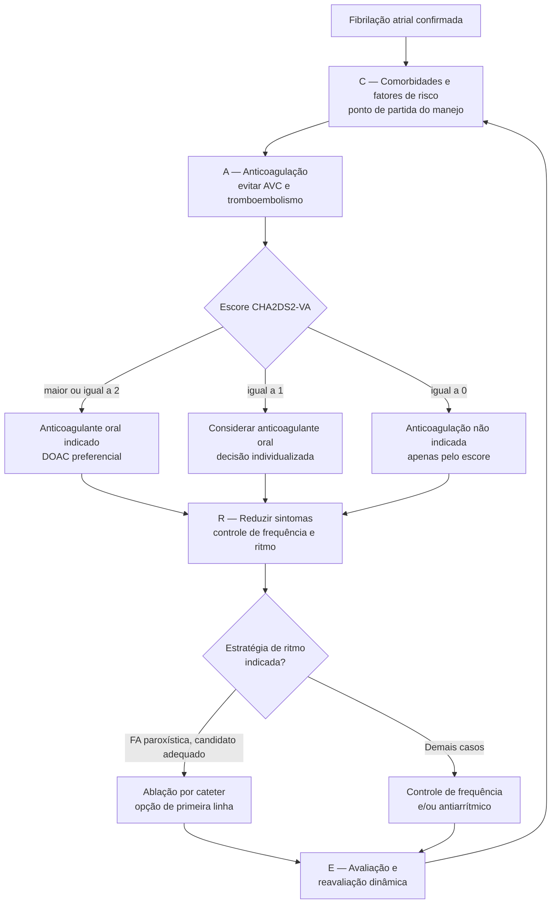

# Fluxograma: Fibrilação Atrial — trajetória AF-CARE (ESC 2024)

A diretriz ESC 2024 reorganizou o manejo da FA em torno do acrônimo **AF-CARE**.
A mudança de ênfase mais relevante é a ordem: o tratamento de comorbidades e
fatores de risco deixa de ser cuidado acessório e passa a ser **o ponto de
partida**, porque as terapias para FA são mais eficazes e a recorrência menos
provável quando as condições associadas estão controladas.

## Caminho decisório

## Cardioversão: a janela mudou

O limiar de duração da FA para cardioversão precoce **caiu de 48 para 24 horas**.
Junto com isso, a diretriz passou a recomendar uma conduta de espera vigiada
(*wait-and-see*) pela reversão espontânea, em nome da segurança do paciente.

## O escore CHA2DS2-VA

O CHA2DS2-VA substitui o CHA2DS2-VASc — a diferença é a retirada do componente
de sexo feminino do cálculo. Pontuação:

| Componente | Pontos |
|---|---:|
| Insuficiência cardíaca congestiva | 1 |
| Hipertensão | 1 |
| Idade ≥ 75 anos | 2 |
| Diabetes mellitus | 1 |
| AVC / AIT / tromboembolismo arterial prévio | 2 |
| Doença vascular | 1 |
| Idade 65–74 anos | 1 |

## Por que a ordem do acrônimo importa

O AF-CARE não é uma lista de tarefas paralelas, e sim uma sequência com
justificativa clínica. Começar por **C** (comorbidades) antes de discutir ritmo
reflete a evidência de que o controle de hipertensão, apneia do sono, obesidade
e demais fatores associados melhora o resultado das intervenções seguintes. O
**E** final devolve o paciente ao começo do ciclo: a reavaliação é dinâmica, não
um desfecho.
