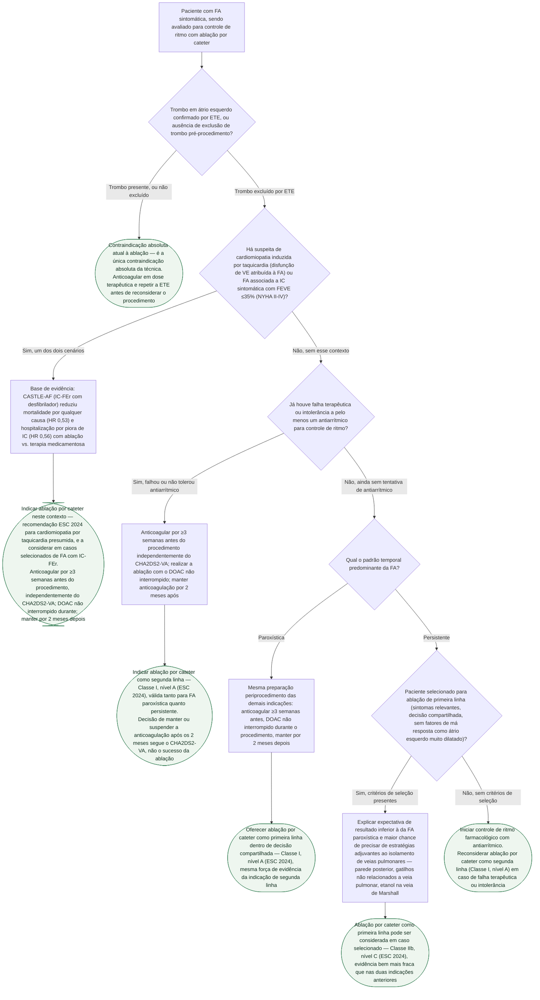

# Fluxograma: indicação de ablação por cateter na fibrilação atrial (ESC 2024)

A diretriz ESC 2024 reorganizou a indicação de ablação por cateter em três recomendações que coexistem lado a lado, para populações diferentes — e a leitura errada mais comum é tratá-las como uma sequência única (primeiro antiarrítmico, depois ablação) em vez de reconhecer que o padrão temporal da FA muda o ponto de entrada. Este fluxograma segue a árvore de decisão real da diretriz: exclusão de trombo em átrio esquerdo primeiro (única contraindicação absoluta), depois o contexto de insuficiência cardíaca (onde a evidência do CASTLE-AF justifica indicar ablação por benefício direto), depois a história prévia de antiarrítmico, e só então o padrão temporal — paroxística ou persistente — que determina se a ablação de primeira linha tem força Classe I/A ou Classe IIb/C.

## Árvore de decisão

## O que a árvore não mostra

**As três recomendações da ESC 2024 não são uma escada única.** Elas descrevem populações diferentes lado a lado na mesma tabela: ablação como segunda linha após falha/intolerância a antiarrítmico (Classe I, A, para paroxística **ou** persistente), ablação como primeira linha em FA paroxística dentro de decisão compartilhada (Classe I, A) e ablação como primeira linha em FA persistente só em pacientes selecionados (Classe IIb, C — evidência bem mais fraca). Tratar isso como "sempre tentar antiarrítmico primeiro" ignora que a paroxística já tem indicação de primeira linha com a força máxima da diretriz.

**O CABANA não entra nesta árvore como determinante da indicação.** O ensaio não mostrou diferença no desfecho primário composto por intenção de tratar (8,0% ablação vs. 9,2% terapia medicamentosa; HR 0,86; p=0,30), mas teve 27,5% de crossover do braço controle para ablação — motivo citado pelos próprios autores para não tratar esse resultado como palavra final. Os desfechos secundários (recorrência de FA, morte/hospitalização cardiovascular) favoreceram ablação. A diretriz ESC 2024 não se apoia no CABANA para as recomendações de força Classe I acima.

**Recidiva tardia por gatilho fora da veia pulmonar** é a causa mais citada de recorrência após um primeiro procedimento tecnicamente bem-sucedido, e é indicação típica de ablação repetida — cenário fora do escopo desta árvore, que trata da indicação inicial.

**FA assintomática de carga elevada** (detectada por ECG sistemático ou monitor com registro eletrocardiográfico, nunca por fotopletismografia isolada) também pode ser candidata a ablação na diretriz atual, mesmo sem o critério de sintoma explícito usado como ponto de partida nesta árvore.

**Tecnologia de ablação por campo pulsado (PFA)**, fonte de energia não térmica, não muda a indicação clínica mostrada aqui — a discussão sobre PFA é de técnica e perfil de segurança, não de quem deve ser indicado ao procedimento.
