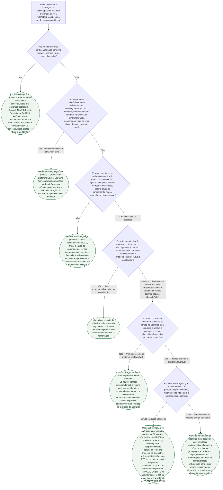

# Fluxograma: oclusão do apêndice atrial esquerdo (LAAO) versus anticoagulação prolongada em contraindicação relativa

A diretriz ESC 2024 (AF-CARE) cita a oclusão do apêndice atrial esquerdo como alternativa em quem tem contraindicação à anticoagulação de longo prazo, mas os critérios de indicação e a classe de recomendação para o dispositivo percutâneo não têm fonte de acesso aberto localizada nesta biblioteca — o que a ESC 2024 detalha com classe/nível é só o fechamento **cirúrgico** associado à ablação híbrida. A lacuna prática é fechada pela **Diretriz Brasileira de Fibrilação Atrial 2025** (SOBRAC/SBC), referência de conduta nacional: ela exige **dois critérios simultâneos** para indicar o dispositivo percutâneo — alto risco tromboembólico **e** contraindicação absoluta ou falha real da terapia anticoagulante — e trata a exclusão cirúrgica do apêndice, quando há cirurgia cardíaca indicada por outro motivo, como recomendação de força bem maior (Classe I) que a via percutânea isolada (Classe IIa). Este fluxograma segue essa lógica de dois critérios, começando pela pergunta que resolve a maior parte dos casos sem entrar em debate sobre risco hemorrágico: o paciente já vai para cirurgia cardíaca por outro motivo?

## Árvore de decisão

## O que a árvore não mostra

**A diretriz brasileira exige os dois critérios juntos para a via percutânea, não um ou outro isoladamente.** Alto risco tromboembólico sem contraindicação/falha do anticoagulante não indica oclusão — indica manter anticoagulação (ramo `C2`). Contraindicação ao anticoagulante sem risco tromboembólico relevante também não indica oclusão — indica só seguimento (ramo `C4`). É a combinação dos dois que sustenta a Classe IIa, Nível B.

**Exclusão cirúrgica (Classe I) e oclusão percutânea (Classe IIa) não são a mesma força de recomendação.** Quando há cirurgia cardíaca indicada por outro motivo, a diretriz brasileira trata a exclusão do apêndice como recomendação bem mais forte que a via percutânea isolada — sustentada pelo LAAOS III (4.770 pacientes, redução de AVC/embolia sistêmica com a oclusão associada à anticoagulação vs. anticoagulação isolada). Fora do contexto cirúrgico, a via percutânea segue os critérios acima.

**PROTECT AF e PREVAIL não são resultados idênticos, e a árvore não repete essa distinção no momento da conduta.** O PROTECT AF (2009) estabeleceu não inferioridade para o desfecho composto amplo, mas com sinal de segurança periprocedimento real (eventos primários de segurança mais frequentes com o dispositivo: 7,4 vs. 4,4 por 100 pacientes-ano). O PREVAIL (2014), desenhado para corrigir esse ponto, melhorou a segurança de forma expressiva, mas **não** confirmou não inferioridade no desfecho composto amplo — só no desfecho mais restrito de AVC/embolismo após 7 dias do procedimento.

**PRAGUE-17 comparou o dispositivo com DOAC, não com varfarina**, em população de alto risco (CHA2DS2-VASc médio 4,7; HAS-BLED médio 3,1) com história de sangramento significativo ou de evento cardioembólico sob anticoagulante. O desfecho composto (AVC/AIT, embolia sistêmica, morte cardiovascular, sangramento maior/clinicamente relevante, complicação do procedimento) foi não inferior aos 20 meses (sHR 0,84; IC95% 0,53-1,31; p de não inferioridade = 0,004) e permaneceu não inferior aos 4 anos (sHR 0,81; IC95% 0,56-1,18), com redução significativa de sangramento não relacionado ao procedimento no seguimento longo (sHR 0,55; IC95% 0,31-0,97; p=0,039).

**A "contraindicação absoluta ou falha da terapia anticoagulante" não tem lista fechada e universal na diretriz brasileira** — a árvore ilustra os cenários mais citados na prática (sangramento maior recorrente, alto risco hemorrágico sem causa reversível, intolerância confirmada a mais de uma classe), mas a decisão final é clínica e individualizada, tomada em conjunto com o paciente.

**Regime antitrombótico pós-procedimento na vida real diverge do regime aprovado em bula.** A própria diretriz brasileira registra que só cerca de 12% dos pacientes recebem o regime pós-implante aprovado pela FDA na prática clínica — a maioria usa AVK ou DOAC isolados durante a endotelização (30-90 dias), com taxas relatadas de trombose de dispositivo em torno de 3,8% em metanálise de mais de 10.000 pacientes, risco maior com hipercoagulabilidade, efusão pericárdica, disfunção renal, profundidade de implante maior que 10 mm e FA não paroxística — fatores que a árvore não desenvolve, por serem de manejo pós-procedimento e não de indicação inicial.
