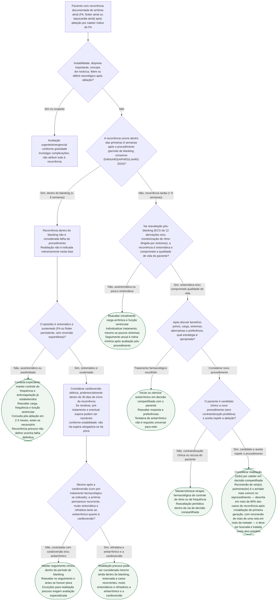

# Fluxograma: recorrência de fibrilação atrial após ablação por cateter — blanking, cardioversão, antiarrítmico e reablação

O catálogo já tem seis fluxogramas de FA, mas nenhum cobre o recorte mais comum no
seguimento pós-ablação: o que fazer diante de uma recorrência documentada depois do
procedimento. Os fluxogramas existentes tratam da indicação da primeira ablação, da
FA de início recente no pronto-socorro, da cardioversão eletiva e da anticoagulação
periprocedimento — nenhum trata da decisão entre observar, cardioverter, ajustar
antiarrítmico ou reablacionar quando a arritmia volta.

O consenso EHRA/HRS/APHRS/LAHRS 2024 sobre ablação de FA (Tzeis et al., Europace
2024) atualizou um ponto central desse manejo: o período de blanking — a janela
inicial em que a recorrência não é contada como falha do procedimento — passou de
3 meses para **8 semanas**, decisão explícita do grupo redator para reduzir a
exposição desnecessária a reablação precoce em pacientes cuja recorrência é
transitória. A árvore abaixo segue essa atualização e a lógica de manejo descrita
nas seções 9.5.1 a 9.5.3 do documento: dentro do blanking, cardioversão é
priorizada sobre reablação; fora do blanking, antiarrítmico ou nova ablação são opções individualizadas, orientada pelo fato de que a
reconexão de veia pulmonar é o achado mais comum no reprocedimento.

## Árvore de decisão

## O que a árvore não mostra

**O corte de 8 semanas substitui o de 3 meses usado até 2017/2021, e é decisão
explícita do grupo redator, não achado isolado de um único estudo.** O documento
cita a razão diretamente: ausência de recorrência nas primeiras 3 meses já
predizia ~90% de chance de permanecer livre de arritmia em 12 meses (dado de
Calkins et al., citado no próprio consenso), mas o objetivo do corte mais curto é
reduzir a "má classificação" de pacientes com recorrência precoce transitória —
e a exposição desnecessária deles a reablação. Serviço que ainda usa a janela de
3 meses não está seguindo uma prática abandonada por acaso; é uma atualização
recente (2024) que pode não ter chegado a toda a prática clínica ainda.

**A cardioversão dentro do blanking tem evidência conflitante entre os estudos
citados no próprio consenso**, e a recomendação de fazê-la preferencialmente
dentro de 30 dias da recorrência é uma leitura de conjunto do writing group, não
um resultado único e forte. Estudos observacionais retrospectivos mostram
resultado favorável e neutro lado a lado — o documento é transparente sobre essa
inconsistência antes de fazer a recomendação prática.

**O dado de reconexão de veia pulmonar (>80%, >1 veia em mais da metade) vem
especificamente da experiência com o balão de crioablação de primeira geração**,
citado no consenso ao descrever a evolução da tecnologia — não é necessariamente
a mesma proporção com radiofrequência de ponta de contato ou ablação por campo
pulsado (PFA), tecnologias mais recentes com taxas de durabilidade de isolamento
diferentes. A árvore usa o dado como justificativa geral de que a veia pulmonar
continua sendo o alvo mais produtivo na reablação, não como número que se aplica
igualmente a qualquer técnica usada no procedimento índice.

**Esta árvore não decide qual antiarrítmico usar, nem cobre a escolha entre
manter ou suspender a anticoagulação após reablação bem-sucedida** — esse segundo
tema já está coberto pelo documento publicado
[alone-af-suspensao-da-anticoagulacao-apos-ablacao-bem-sucedida-de-fibrilacao-atrial](/biblioteca/alone-af-suspensao-da-anticoagulacao-apos-ablacao-bem-sucedida-de-fibrilacao-atrial)
neste mesmo acervo. Também não substitui os fluxogramas já existentes de
indicação da primeira ablação ([fluxograma-indicacao-ablacao-cateter-fa-esc-2024](/biblioteca/fluxograma-indicacao-ablacao-cateter-fa-esc-2024))
nem de cardioversão eletiva com anticoagulação periprocedimento
([fluxograma-cardioversao-eletiva-anticoagulacao-periprocedimento](/biblioteca/fluxograma-cardioversao-eletiva-anticoagulacao-periprocedimento)) — esta árvore
começa depois que o procedimento índice já foi feito e a arritmia recorreu.

Anticoagulação não deve ser suspensa por este fluxograma ou pela ausência de sintomas; cardioversão requer avaliação tromboembólica própria. O seguimento inicial e a monitorização devem acompanhar o risco e a função ventricular.
