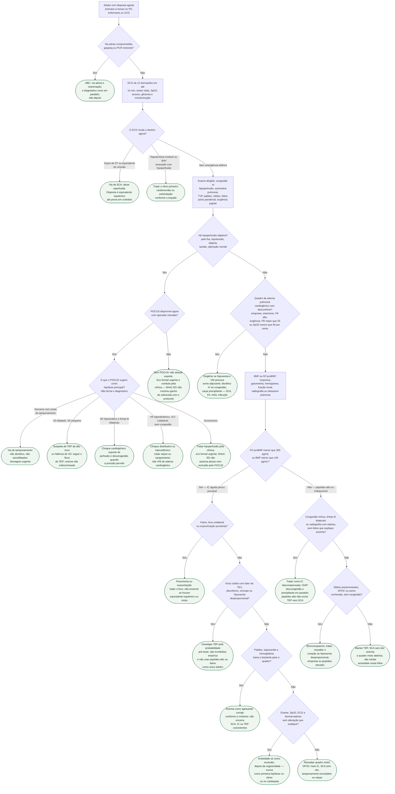

# Fluxograma: Dispneia aguda cardiogênica versus não cardiogênica — primeira hora

Árvore de reconhecimento e primeira decisão no **adulto com dispneia de minutos a horas** no pronto-socorro, na enfermaria ou na UCO. Não substitui o fluxograma de dispneia crônica ambulatorial, o manejo diurético da IC descompensada, o protocolo de SCA, o de TEP nem o de tamponamento. As folhas são **próximos caminhos**, não atestados.

A ESC 2026 chama o episódio de deterioração de **IC descompensada**; a primeira hora continua sendo a da ESC 2021/2023: oxigênio se hipoxemia, VNI se edema cardiogênico com desconforto, ECG imediato, peptídeo para afastar mais do que para confirmar.

## Árvore de decisão

## Como ler a árvore

- **Oxigênio** não é um nó porque vale em qualquer ramo com SpO2 < 90% ou PaO2 < 60 mmHg (ESC 2021, Classe I, C). O diagrama não autoriza oxigênio de rotina sem hipoxemia.
- **VNI** aparece só na folha do edema cardiogênico com desconforto (ESC 2021, Classe IIa, B). Escolha de CPAP versus bilevel, números do 3CPO e a discussão de mortalidade com a Cochrane estão no documento dedicado — este fluxo só manda iniciar cedo e não usar VNI como monoterapia.
- **POCUS** só entra no ramo de hipoperfusão. O SHoC-ED não mostrou ganho de sobrevida e não testou dispneia sem hipotensão; a folha “sem POCUS” e a “inconclusivo” existem para **não atrasar** suporte nem excluir choque cardiogênico por FOCUS “normal” (sensibilidade de 62,5% para disfunção de VE naquele subestudo).
- **Peptídeo abaixo do corte agudo** (NT-proBNP < 300 pg/mL ou BNP < 100 pg/mL) torna IC descompensada pouco provável; não torna o paciente “psiquiátrico”. Os cortes ambulatoriais (125 / 35) **não** se aplicam aqui — estão no fluxograma crônico.
- **Peptídeo alto** não fecha IC e não fecha TEP: embolia, SCA, FA, idade e rim também elevam o número.
- A ESC 2026 mudou o nome do episódio para **IC descompensada**; a folha C16 usa os dois termos de propósito, para casar o vocabulário novo com o fenótipo de EAP que o plantonista reconhece.

## Limites do diagrama

O fluxo não reproduz critérios de trombólise, pericardiocentese, reperfusão, dose de diurético nem parâmetros de VNI. Não cobre gestante, criança nem paciente já intubado. Ansiedade só aparece como folha de exclusão. Coexistência (DPOC + IC, infecção + edema, SCA + FA) é tratada como destino explícito, não como falha da árvore.

## Tudo com Tudo

- [Protocolo: Dispneia aguda de origem cardiovascular — abordagem inicial](/biblioteca/dispneia-aguda-de-origem-cardiovascular-abordagem-inicial)
- [Fluxograma: Dispneia crônica de origem indeterminada](/biblioteca/fluxograma-dispneia-cronica-de-origem-indeterminada-cardiaca-ou-pulmonar)
- [Insuficiência cardíaca aguda descompensada](/biblioteca/fluxograma-insuficiencia-cardiaca-aguda-descompensada)
- [Ventilação não invasiva no EAP cardiogênico](/biblioteca/ventilacao-nao-invasiva-no-edema-agudo-de-pulmao-cardiogenico-cpap-versus-bipap)
- [POCUS e o ensaio SHoC-ED](/biblioteca/pocus-na-triagem-do-choque-indiferenciado-o-ensaio-shoc-ed)
- [SCA — ESC 2023](/biblioteca/fluxograma-sindrome-coronariana-aguda-esc-2023)
- [TEP agudo](/biblioteca/fluxograma-tromboembolismo-pulmonar-diagnostico-esc-2019)
- [Tamponamento cardíaco](/biblioteca/fluxograma-tamponamento-cardiaco)
- [Bradicardia sintomática](/biblioteca/fluxograma-bradicardia-sintomatica-manejo-agudo)
