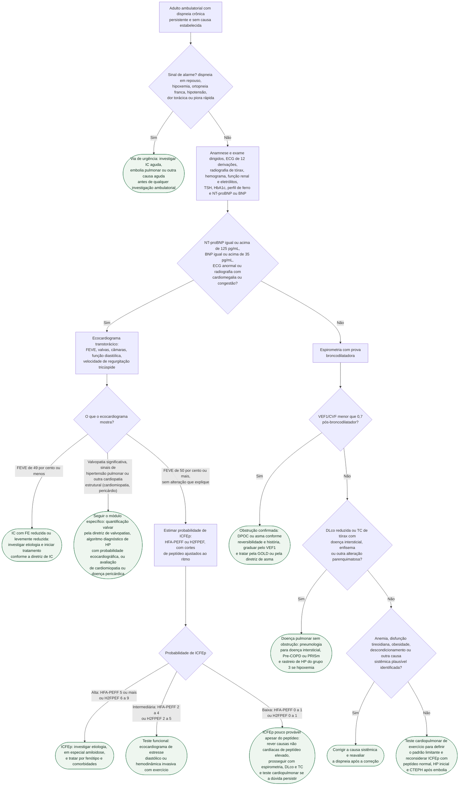

# Fluxograma: Dispneia crônica de origem indeterminada — cardíaca ou pulmonar, próximo passo

Dispneia crônica sem diagnóstico é a queixa que mais frequentemente circula entre cardiologista e pneumologista sem que nenhum dos dois feche o caso. O erro habitual é pedir o ecocardiograma e a espirometria ao mesmo tempo, receber dois laudos discretamente alterados e não saber qual deles explica o sintoma. Este fluxograma cobre o **adulto ambulatorial, estável, com dispneia persistente por semanas a meses e sem causa estabelecida**, e organiza a sequência pela lógica da diretriz ESC 2021: o peptídeo natriurético e o ECG decidem se o coração entra primeiro; quando entram e o ecocardiograma é normal, a pergunta passa a ser ICFEp, hipertensão pulmonar ou valvopatia; quando o peptídeo é normal, o ramo pulmonar da GOLD 2025 assume, e o teste cardiopulmonar de exercício fica reservado à dúvida que sobrevive a tudo isso.

O sintoma aqui é a dispneia. O fluxograma de fadiga e intolerância ao esforço já publicado nesta pasta parte de outro ponto (o que limita o esforço) e o de edema bilateral parte do sinal congestivo — os três usam o mesmo corte de NT-proBNP e convergem para os mesmos módulos de doença, sem repetir os ramos uns dos outros.

## Árvore de decisão

## Avaliação inicial: o que a ESC 2021 pede antes do ecocardiograma

A diretriz ESC 2021 lista, para todo paciente com suspeita de IC, ECG, ecocardiograma transtorácico, radiografia de tórax e exames de sangue (hemograma, ureia e eletrólitos, função tireoidiana, HbA1c, lipídios, perfil de ferro) além de BNP ou NT-proBNP. Este fluxograma separa o ecocardiograma dos demais porque é o peptídeo e o ECG que decidem a urgência dele: no cenário ambulatorial não agudo, **NT-proBNP abaixo de 125 pg/mL ou BNP abaixo de 35 pg/mL tornam o diagnóstico de IC improvável**, e o ecocardiograma passa a ser exame de segunda linha, não de triagem. A radiografia de tórax entra por outro motivo: a GOLD 2025 é explícita em que ela não estabelece o diagnóstico de DPOC, mas é valiosa para excluir alternativas e comorbidades — fibrose pulmonar, bronquiectasias, doença pleural, cifoescoliose e cardiomegalia.

O que o peptídeo não faz é confirmar IC sozinho. A ESC 2021 lista causas cardíacas e não cardíacas de elevação — entre elas fibrilação atrial, idade avançada, síndrome coronariana aguda, miocardite, valvopatia, doença renal, anemia e embolia pulmonar — e registra o inverso: **obesidade reduz o peptídeo** e pode mascarar IC. É por isso que o ramo de peptídeo normal não encerra a hipótese cardíaca — ele a devolve ao fim da árvore, no teste cardiopulmonar.

## Ecocardiograma alterado: FEVE, valva ou pressão pulmonar

Com FEVE de 40 por cento ou menos (IC com FE reduzida) ou entre 41 e 49 por cento (FE levemente reduzida), o problema deixa de ser diagnóstico e passa a ser etiológico e terapêutico — ver icfer-classificacao-diagnostico-quatro-pilares. Valvopatia significativa segue a quantificação da diretriz de valvopatias; cardiomiopatia hipertrófica, infiltrativa ou doença pericárdica com FEVE preservada seguem o módulo correspondente antes de qualquer escore de ICFEp, porque o H2FPEF foi derivado excluindo essas condições. Sinal ecocardiográfico de hipertensão pulmonar sem doença de coração esquerdo que a explique segue o algoritmo em três passos da ESC/ERS 2022, com atribuição de probabilidade ecocardiográfica antes de qualquer cateterismo — ver fluxograma-hipertensao-pulmonar-diagnostico-esc-ers-2022. O HFA-PEFF usa velocidade de regurgitação tricúspide acima de 2,8 m/s ou PSAP estimada acima de 35 mmHg como critério maior funcional, o que ilustra por que HP e ICFEp se sobrepõem no mesmo eco: pressão pulmonar elevada em paciente idoso com hipertensão e fibrilação atrial é mais frequentemente ICFEp com HP pós-capilar do que HP arterial.

## Ecocardiograma normal com peptídeo elevado: ICFEp pelo HFA-PEFF ou H2FPEF

É o ramo em que a dispneia mais fica sem dono. Dois instrumentos organizam a decisão, e o consenso ACC 2026 os trata como complementares à avaliação clínica, não como substitutos dela: o HFA-PEFF (base fisiológica, três domínios, mais adequado à avaliação especializada) e o H2FPEF (variáveis clínicas e ecocardiográficas de rotina, validado contra hemodinâmica invasiva ao exercício). Os detalhes de cada um estão em hfa-peff-algoritmo-diagnostico-para-icfep-esc-2019 e escore-h2fpef-probabilidade-diagnostica-de-icfep-em-dispneia-inexplicada; aqui vão só as entradas e as faixas.

| HFA-PEFF, domínio | Critério maior, 2 pontos | Critério menor, 1 ponto |
|---|---|---|
| Funcional | e' septal < 7 cm/s ou lateral < 10 cm/s (< 5 e < 7 se 75 anos ou mais); ou E/e' médio ≥ 15; ou VRT > 2,8 m/s (PSAP > 35 mmHg) | E/e' médio 9 a 14; ou strain longitudinal global < 16% |
| Morfológico | Volume atrial esquerdo indexado > 34 mL/m² em ritmo sinusal (> 40 em FA); ou massa VE ≥ 149 g/m² homens / ≥ 122 mulheres com espessura relativa > 0,42 | Volume atrial 29–34 mL/m² (34–40 em FA); ou massa VE ≥ 115 g/m² homens / ≥ 95 mulheres; ou espessura relativa > 0,42; ou parede ≥ 12 mm |
| Biomarcador, ritmo sinusal | NT-proBNP > 220 pg/mL ou BNP > 80 pg/mL | NT-proBNP 125–220 pg/mL ou BNP 35–80 pg/mL |
| Biomarcador, fibrilação atrial | NT-proBNP > 660 pg/mL ou BNP > 240 pg/mL | NT-proBNP 375–660 pg/mL ou BNP 105–240 pg/mL |

Vale o maior critério de cada domínio, nunca a soma; total máximo de 6. Cinco pontos ou mais fecham ICFEp; um ponto ou menos torna ICFEp muito improvável e manda investigar causa alternativa; 2 a 4 exigem a etapa funcional: E/e' médio ≥ 15 no pico do esforço soma 2 pontos (3 se acompanhado de VRT > 3,4 m/s), e na hemodinâmica invasiva PCP média ≥ 15 mmHg ou PDFVE ≥ 16 mmHg em repouso, ou PCP ≥ 25 mmHg no pico do exercício, confirmam o diagnóstico.

| H2FPEF, variável | Definição | Pontos |
|---|---|---|
| Heavy | IMC > 30 kg/m² | 2 |
| Hipertensão | 2 ou mais anti-hipertensivos | 1 |
| Fibrilação atrial | paroxística ou permanente | 3 |
| Pressão pulmonar | PSAP estimada > 35 mmHg | 1 |
| Elder | idade > 60 anos | 1 |
| Filling pressure | E/e' > 9 | 1 |

H2FPEF de 0 a 1 permite afastar ICFEp com confiança razoável, 2 a 5 é faixa intermediária que exige teste adicional, 6 a 9 permite estabelecer o diagnóstico. O H2FPEF foi derivado excluindo FEVE < 50%, valvopatia relevante, HP arterial e pericardite constritiva — por isso ele só entra depois que o eco afastou essas condições, como faz a árvore. O consenso ACC 2026 nomeia as duas armadilhas simétricas deste ramo: atribuir toda dispneia do obeso à ICFEp e excluir ICFEp porque o peptídeo não está muito elevado.

## Peptídeo normal: o ramo pulmonar pela GOLD 2025

A GOLD 2025 manda considerar DPOC em qualquer paciente com dispneia, tosse crônica ou expectoração e/ou exposição a fatores de risco, mas é categórica: **espirometria forçada com VEF1/CVF menor que 0,7 pós-broncodilatador é obrigatória para estabelecer o diagnóstico**. A gravidade da obstrução é graduada pelo VEF1 pós-broncodilatador em porcentagem do previsto (graus 1 a 4); os cortes numéricos de cada grau estão em figura do relatório e não foram lidos em texto nesta sessão — VERIFICAÇÃO HUMANA NECESSÁRIA. Reversibilidade ampla e história compatível deslocam para asma, cuja diretriz não foi consultada aqui.

Relação preservada não encerra o ramo. A GOLD 2025 descreve o Pre-COPD (sintomas, lesão estrutural como enfisema ou alteração fisiológica como VEF1 baixo, aprisionamento aéreo, difusão reduzida ou queda rápida do VEF1, sem obstrução) e o PRISm (relação ≥ 0,7 com espirometria anormal), ambos com risco de evoluir para obstrução, e recomenda medir a **DLco em qualquer pessoa com dispneia desproporcional ao grau de obstrução**, porque DLco < 60% do previsto se associa a mais sintomas, menor capacidade de exercício e maior mortalidade independentemente da obstrução. DLco reduzida com espirometria normal é o achado que pede TC de tórax de alta resolução (doença intersticial, enfisema) e que reabre a hipótese vascular pulmonar — ver hipertensao-pulmonar-do-grupo-3-dpoc-e-dpi-criterios-prognostico-e-risco-do-vasodilatador-especifico para o cruzamento entre pneumopatia e HP.

## Causa sistêmica e teste cardiopulmonar de exercício

Anemia, disfunção tireoidiana, obesidade e descondicionamento saem do laboratório inicial e do exame, mas só recebem o rótulo de causa depois que coração e pulmão foram avaliados — o próprio HFA-PEFF lembra que, no idoso, no obeso e no descondicionado, a baixa capacidade de exercício, a dispneia de esforço e o edema periférico podem ter origem não cardíaca, e o consenso ACC 2026 lembra o contrário. Quando nada explica o sintoma, o **teste cardiopulmonar de exercício tem recomendação classe IIa tanto na ESC 2021 quanto na AHA/ACC/HFSA 2022 para identificar a causa de dispneia inexplicada** (nível C-LD na americana). O HFA-PEFF registra que o CPET dá evidência objetiva da capacidade de exercício e pode separar causa cardíaca de pulmonar ou periférica, com valor limitado para distinguir ICFEp de causa não cardíaca — por isso o nó final não encerra em diagnóstico, e sim em padrão limitante que reorienta a investigação. Dois retornos obrigatórios nesse nó: ICFEp com peptídeo normal no obeso (que pode exigir hemodinâmica com exercício) e dispneia persistente após embolia pulmonar, em que a ESC/ERS 2022 recomenda investigar CTEPH, como registrado em fluxograma-fadiga-e-intolerancia-ao-esforco-proximo-passo. A GOLD 2025 aponta na mesma direção pelo lado pulmonar: a ergometria laboratorial ajuda a identificar condições coexistentes ou alternativas, entre elas diagnósticos cardíacos.

## Limitações e o que confirmar

- Cortes numéricos dos graus GOLD 1 a 4 de obstrução (VEF1 pós-broncodilatador em porcentagem do previsto) não foram lidos em texto: a tabela do relatório é imagem — VERIFICAÇÃO HUMANA NECESSÁRIA.
- A classe de recomendação da espirometria na tabela de exames especializados da ESC 2021 não foi confirmada, porque o texto integral carregou parcialmente — VERIFICAÇÃO HUMANA NECESSÁRIA; a árvore usa a espirometria pelo critério da GOLD, não pela classe da ESC.
- A janela temporal que define dispneia crônica não é fixada pela ESC 2021 nem pela GOLD 2025 no trecho lido; o fluxograma usa semanas a meses sem número.
- Os limiares de probabilidade ecocardiográfica de HP da ESC/ERS 2022 não foram relidos nesta sessão; o ramo de HP encaminha ao fluxograma específico do acervo em vez de repeti-los.
- O diagnóstico de asma e a diretriz correspondente não foram consultados; a conduta C7 apenas nomeia a alternativa.
- O fluxograma não cobre dispneia aguda, gestante, criança nem paciente com IC ou DPOC já diagnosticados.

## Tudo com Tudo

- [Fluxograma: Fadiga e Intolerância ao Esforço — do sintoma ao próximo exame](/biblioteca/fluxograma-fadiga-e-intolerancia-ao-esforco-proximo-passo)
- [Fluxograma: Edema bilateral de membros inferiores — diferencial cardíaco versus não cardíaco em avaliação ambulatorial](/biblioteca/fluxograma-edema-bilateral-membros-inferiores-diferencial-cardiaco)
- [HFA-PEFF: o Algoritmo Diagnóstico Passo a Passo para ICFEp (ESC/HFA 2019)](/biblioteca/hfa-peff-algoritmo-diagnostico-para-icfep-esc-2019)
- [Escore H2FPEF: Probabilidade Diagnóstica de ICFEp em Dispneia Inexplicada](/biblioteca/escore-h2fpef-probabilidade-diagnostica-de-icfep-em-dispneia-inexplicada)
- [Fluxograma: Hipertensão Pulmonar — algoritmo diagnóstico em três passos (ESC/ERS 2022)](/biblioteca/fluxograma-hipertensao-pulmonar-diagnostico-esc-ers-2022)
- [Insuficiência Cardíaca com Fração de Ejeção Reduzida — Classificação, Diagnóstico e os Quatro Pilares Terapêuticos](/biblioteca/icfer-classificacao-diagnostico-quatro-pilares)
- [ACC 2026: consenso atualizado para diagnóstico e manejo da ICFEp](/biblioteca/acc-2026-expert-consensus-icfep-diagnostico-fenotipos-e-tratamento)
