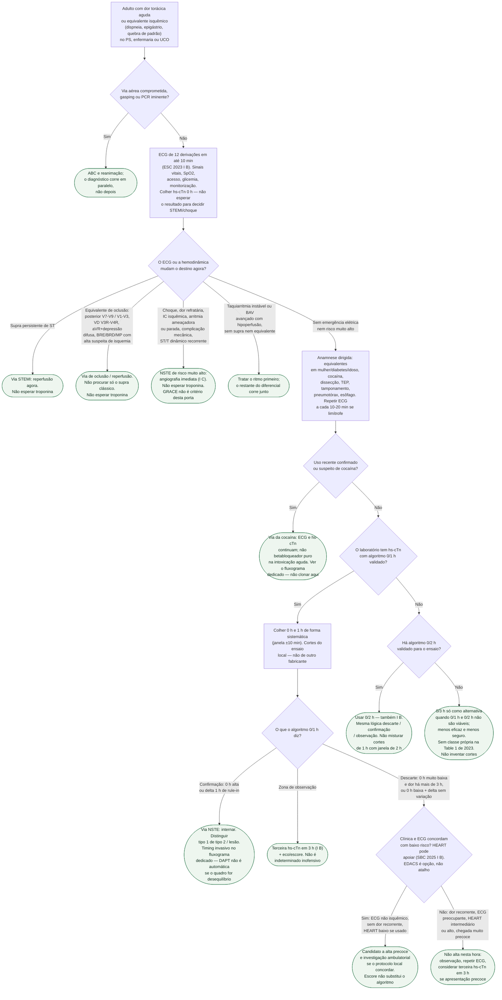

# Fluxograma: Dor torácica aguda — ECG, troponina e via de SCA na primeira hora

Árvore da **primeira hora** no adulto com dor torácica ou equivalente isquêmico (dispneia, epigástrio, irradiação) de minutos a horas, no pronto-socorro, na enfermaria ou na UCO. Não substitui o fluxograma de SCA, o algoritmo 0/1 h, o HEART, a via da cocaína nem a investigação ambulatorial. As folhas são **próximos caminhos**, não atestados.

ECG em até 10 minutos é Classe I B (ESC 2023, Table 1). STEMI, equivalente de oclusão e NSTE de risco muito alto **não esperam** troponina. Algoritmos 0/1 h ou 0/2 h são Classe I B só depois desses ramos. HEART/EDACS não são o primeiro nó.

## Árvore de decisão

## Como ler a árvore

- **ECG em 10 minutos** não é um “se”: é o passo P1, Classe I B. Dispneia, epigástrio e apresentação em mulher ou diabetes **não** abrem um atalho que pule o traçado.
- **Três folhas recusam a troponina como pedágio:** C2 (STEMI), C3 (equivalente de oclusão), C4 (NSTE de risco muito alto). Colher 0 h sim; esperar o número para ativar reperfusão ou angiografia de emergência, não.
- **GRACE não aparece em nenhum nó.** É critério de alto risco para a estratégia na internação, já fichado em outro documento. Recitá-lo nesta porta atrasa quem precisa de cateter agora.
- **Cocaína** é desvio de pacote farmacológico, não de ECG. A folha C6 manda ao fluxograma dedicado.
- **0/1 h e 0/2 h** têm a mesma classe (I B). A zona de observação exige terceira amostra em 3 h (I B). 0/3 h como estratégia **primária** é o último recurso da árvore, sem classe na Table 1.
- **HEART** só entra depois do descarte pelo algoritmo. SBC 2025 o prefere (I B). EDACS (PMID 24428678) é opção, não substituto do ECG. O “T” original do HEART é troponina convencional — não pontuar hs-cTn como se fosse o ensaio de 2008.
- **Tipo 1 versus tipo 2** não é nó precoce: supra e choque não esperam o rótulo. A folha C7 lembra que rule-in ≠ aterotrombose automática.

## Limites do diagrama

O fluxo não reproduz cortes numéricos por ensaio, critérios de fibrinólise, doses de antitrombótico, pontuação item a item do HEART/EDACS nem o corte de GRACE. Não cobre gestante, criança, SCAD nem MINOCA após a angiografia. Dissecção, TEP e tamponamento são lembretes em P2; cada um tem fluxograma próprio se a hipótese subir de posto. Ansiedade não é folha.

## Tudo com Tudo

- [Protocolo: Dor torácica aguda — primeira hora](/biblioteca/dor-toracica-aguda-primeira-hora-no-pronto-socorro)
- [Protocolo HEART e porta-ECG (SBC 2025)](/biblioteca/protocolo-de-dor-toracica-na-emergencia-escore-heart-e-tempo-porta-ecg-sbc-2025)
- [Algoritmo 0/1 h de hs-cTn](/biblioteca/fluxograma-algoritmo-0-1h-troponina-de-alta-sensibilidade-esc-2023)
- [Fluxograma SCA ESC 2023](/biblioteca/fluxograma-sindrome-coronariana-aguda-esc-2023)
- [Timing invasivo no NSTE](/biblioteca/fluxograma-sca-sem-supra-timing-da-estrategia-invasiva-esc-2023)
- [Infarto tipo 2 versus lesão](/biblioteca/infarto-tipo-2-versus-lesao-miocardica-nao-isquemica)
- [Cocaína — via aguda](/biblioteca/fluxograma-dor-toracica-aguda-com-uso-recente-confirmado-ou-suspeito-de-cocaina)
- [Cocaína — vasoespasmo](/biblioteca/fluxograma-dor-toracica-e-sca-por-vasoespasmo-coronariano-induzido-por-cocaina)
- [Dispneia aguda — primeira hora](/biblioteca/fluxograma-dispneia-aguda-cardiogenica-versus-nao-cardiogenica)
- [Dor torácica ambulatorial estável](/biblioteca/fluxograma-dor-toracica-ambulatorial-estavel-baixo-risco)
- [Escore HEART](/biblioteca/fluxograma-heart-dor-toracica-pronto-socorro)
