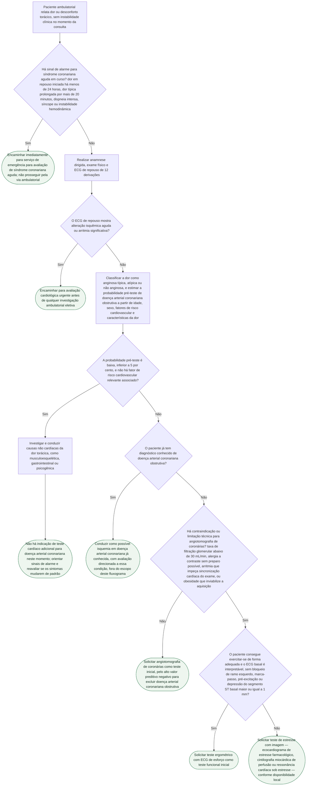

# Fluxograma: Investigação Ambulatorial da Dor Torácica Estável de Baixo Risco

Este fluxograma cobre o paciente que chega ao consultório — não ao pronto-socorro — relatando dor ou desconforto torácico sem sinais de instabilidade no momento da consulta. A pergunta não é "isto é uma síndrome coronariana aguda agora?" (isso já está coberto pelos fluxos de emergência com escore HEART e pela via de vasoespasmo por cocaína desta biblioteca), mas sim: **este paciente estável precisa de teste para doença arterial coronariana obstrutiva e, se precisar, qual teste pedir primeiro?** A diretriz 2021 AHA/ACC organiza essa decisão em duas etapas que este fluxograma preserva: primeiro estimar a probabilidade pré-teste de doença coronariana obstrutiva a partir da caracterização da dor, idade, sexo e fatores de risco; depois, só para quem não é de baixo risco, escolher entre um teste anatômico (angiotomografia de coronárias) e um teste funcional (ergométrico ou de imagem sob estresse), com a escolha determinada por capacidade de exercício, interpretabilidade do ECG basal e contraindicações técnicas — não por preferência arbitrária.

## Árvore de decisão

## Lógica por trás dos nós

**Triagem de sinais de alarme primeiro (D1/D2).** A diretriz distingue explicitamente a avaliação de dor torácica aguda (predominantemente em ambiente de emergência) da avaliação de dor torácica estável (predominantemente ambulatorial). Antes de qualquer estratificação de probabilidade pré-teste, este fluxograma garante que o paciente não está, na verdade, cursando uma síndrome coronariana aguda que exige via de emergência — e não interpretação de risco em consultório.

**Probabilidade pré-teste como bifurcação central (D3).** A diretriz recomenda o uso rotineiro de estimativas de probabilidade pré-teste de doença arterial coronariana obstrutiva — a partir de idade, sexo, características da dor e fatores de risco — para orientar se e qual teste é indicado, em vez de testar todo paciente com dor torácica de forma indiscriminada. Pacientes de baixa probabilidade pré-teste e sem fatores de risco relevantes tipicamente não se beneficiam de teste adicional para doença coronariana, e a atenção deve se voltar para causas não cardíacas.

**Escolha entre teste anatômico e funcional (D4-D6).** Para quem não é de baixo risco e não tem diagnóstico prévio de doença coronariana, a diretriz posiciona a angiotomografia de coronárias como opção de primeira linha eficaz, com alto valor preditivo negativo, especialmente quando não há contraindicação técnica. Quando a angiotomografia é tecnicamente limitada — função renal reduzida, alergia a contraste, arritmia que atrapalha a sincronização do exame, ou aquisição inviável por biotipo — a escolha recai sobre teste funcional, e dentro dele, o ECG de esforço convencional é preferido quando o paciente consegue exercitar-se e o ECG basal é interpretável; caso contrário, um teste de estresse com imagem farmacológica é a alternativa.

## O que este fluxograma deliberadamente não faz

- não avalia dor torácica aguda com necessidade de decisão em minutos a horas — para isso, ver os fluxos de escore HEART desta biblioteca;
- não repete a via de dor torácica não cardíaca por ansiedade/transtorno de pânico, já coberta em outro documento;
- não repete a via de vasoespasmo coronariano induzido por cocaína, já coberta em outro documento;
- não define conduta terapêutica para doença arterial coronariana confirmada — apenas até a indicação do teste diagnóstico inicial;
- não atribui classe de recomendação (COR/LOE) a nenhum nó específico, por não ter sido possível conferir esse dado no texto integral da diretriz nesta sessão;
- não cria cutoff numérico próprio de probabilidade pré-teste além do "baixo risco, inferior a 5%" já descrito na diretriz.

## Conexões no CorVIA

- Via de emergência com escore HEART: `protocolo-de-dor-toracica-na-emergencia-escore-heart-e-tempo-porta-ecg-sbc-2025` e `escore-heart-dor-toracica-no-pronto-socorro`;
- Dor torácica não cardíaca por ansiedade/pânico: `fluxograma-dor-toracica-nao-cardiaca-ansiedade-e-transtorno-de-panico`;
- Dor torácica por vasoespasmo induzido por cocaína: `fluxograma-dor-toracica-e-sca-por-vasoespasmo-coronariano-induzido-por-cocaina`;
- Valor prognóstico do teste ergométrico: `escore-de-duke-do-teste-ergometrico-valor-prognostico-em-dor-toracica`.
