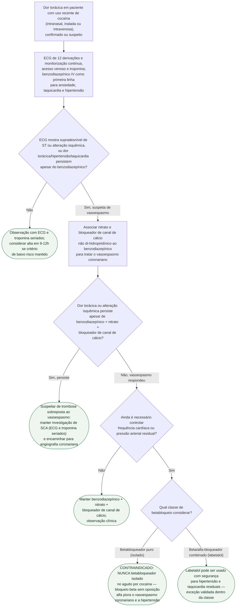

# Dor torácica e SCA por vasoespasmo coronariano induzido por cocaína

O uso recente de cocaína (intranasal, inalada ou intravenosa) causa vasoconstricção coronariana por estímulo alfa-adrenérgico não contraposto, com dor torácica e infarto possíveis mesmo sem placa aterosclerótica estabelecida. A conduta reflexa de síndrome coronariana — betabloqueador — **piora** esse espasmo em vez de tratá-lo, e é o ponto de maior risco de erro neste protocolo.

## Árvore de decisão

## Por que nunca betabloqueador isolado

Bloquear o receptor beta sem bloquear também o alfa deixa a vasoconstricção coronariana mediada por alfa **sem oposição**. No ensaio randomizado, duplo-cego, controlado por placebo de Lange et al. (Ann Intern Med. 1990), o propranolol intracoronariano administrado após a cocaína **piorou** o quadro medido objetivamente: o fluxo sanguíneo no seio coronariano, que já havia caído com a cocaína, caiu ainda mais após o betabloqueador, e a resistência vascular coronariana subiu ainda mais — mesmo sem alteração adicional da pressão arterial. A exceção é o beta/alfa-bloqueador combinado (labetalol, carvedilol): a revisão sistemática de Richards et al. (2016) não registrou evento adverso com essa combinação, e a atualização focada ACCF/AHA 2012 aprova especificamente o labetalol para SCA associada a cocaína ou metanfetamina.

## O que se repete em todo ramo, e por isso não está no diagrama

**Reavaliação seriada.** ECG e troponina são repetidos ao longo de toda a observação, em qualquer ramo da árvore — não é um passo único, é vigilância contínua enquanto o paciente permanece em risco.

**Orientação de cessação do uso de cocaína antes da alta**, em todo paciente liberado. Na coorte de validação do protocolo de observação de 9-12h (Weber et al., 2003), os únicos infartos não fatais em 30 dias ocorreram em pacientes que mantiveram o uso de cocaína após a alta — a orientação de cessação é parte do desfecho de segurança demonstrado, não um adendo genérico.

**Cuidado de suporte geral** (hidratação, controle de agitação/hipertermia associados à intoxicação, ambiente calmo) corre em paralelo em qualquer ponto da árvore e não muda a sequência de decisão farmacológica acima.

**Extrapolação indevida da janela de observação de 9-12h**: os números de segurança de Weber (risco de morte cardiovascular em 30 dias próximo de zero) valem para a população de risco baixo a intermediário validada no estudo — não para quem chega com alteração isquêmica franca ao ECG, troponina já alterada ou instabilidade hemodinâmica, que são critério de exclusão dessa coorte, não de inclusão.
