# Fluxograma: Edema bilateral de membros inferiores — diferencial cardíaco versus não cardíaco em avaliação ambulatorial

Edema bilateral de membros inferiores é uma das queixas mais transversais do consultório — chega ao cardiologista, ao clínico e ao médico de família, quase sempre sem outro sintoma que oriente a busca. A armadilha mais comum é pular direto para "é o coração" ou, no outro extremo, atribuir tudo à "circulação" sem investigar. Este fluxograma cobre o **adulto ambulatorial, estável, sem diagnóstico prévio estabelecido**, com edema que já está presente há dias a semanas — não é fluxograma de emergência, e paciente com sinal de alarme agudo é desviado para a via de urgência já no primeiro nó.

A estrutura segue a revisão clássica de Trayes et al. (Am Fam Physician 2013), que organiza a investigação de edema por dois eixos que decidem tudo o que vem depois: **simetria** (assimétrico aponta para causa local, como trombose venosa profunda; bilateral e simétrico aponta para causa sistêmica) e, dentro do bilateral, a sequência de causas sistêmicas mais frequentes — cardíaca, medicamentosa, hepática/renal, venosa crônica e, um achado menos lembrado mas relatado pela mesma revisão, a apneia obstrutiva do sono. O corte de NT-proBNP para tornar a insuficiência cardíaca pouco provável em contexto ambulatorial não agudo (≥125 pg/mL torna mais provável, valores abaixo tornam menos provável) segue o algoritmo diagnóstico da diretriz ESC 2021 de insuficiência cardíaca.

## Árvore de decisão

```mermaid
flowchart TD
    R["Adulto com edema bilateral de membros inferiores em avaliação ambulatorial, sem diagnóstico prévio estabelecido"] --> X1["Anamnese e exame físico dirigidos: tempo de evolução, simetria, cacifo, dispneia, ortopneia, ganho de peso, medicações em uso, doença hepática/renal/tireoidiana conhecida, história de TVP"]
    X1 --> D1{"Há sinal de alarme agudo — dispneia em repouso ou ortopneia franca, estertores pulmonares bilaterais, hipotensão, dor torácica ou SpO2 baixa?"}
    D1 -->|"Sim"| C1(["Encaminhar com prioridade à emergência para investigar insuficiência cardíaca aguda descompensada ou outra causa grave — não seguir a via ambulatorial (ESC 2021)"])
    D1 -->|"Não"| D2{"O edema é nitidamente assimétrico entre as pernas ou há sinal focal unilateral — dor, eritema, calor ou empastamento de panturrilha?"}
    D2 -->|"Sim"| C2(["Investigar trombose venosa profunda com ultrassom Doppler venoso antes de prosseguir pela via de edema bilateral (Trayes et al. 2013)"])
    D2 -->|"Não"| X2["Edema bilateral e simétrico confirmado: revisar sinais e sintomas sugestivos de disfunção cardíaca — dispneia aos esforços, ortopneia, turgência jugular, terceira bulha, cardiopatia estrutural conhecida, ganho de peso rápido"]
    X2 --> D3{"Há sinais ou sintomas sugestivos de disfunção cardíaca?"}
    D3 -->|"Sim"| X3["Solicitar ECG de 12 derivações e NT-proBNP ou BNP; considerar ecocardiograma conforme a suspeita clínica"]
    X3 --> D4{"NT-proBNP/BNP elevado — NT-proBNP igual ou acima de 125 pg/mL em paciente ambulatorial não agudo (ESC 2021) — com ECG ou ecocardiograma compatível?"}
    D4 -->|"Sim"| C3(["Edema provavelmente de origem cardíaca — iniciar ou otimizar tratamento dirigido à insuficiência cardíaca e encaminhar à cardiologia (ESC 2021)"])
    D4 -->|"Não"| C4(["Causa cardíaca pouco provável apesar dos sintomas sugestivos — reavaliar o diagnóstico e prosseguir a investigação de causas não cardíacas de edema bilateral"])
    D3 -->|"Não"| X4["Revisar medicações em uso associadas a edema — bloqueadores de canal de cálcio diidropiridínicos, anti-inflamatórios não esteroidais, corticosteroides, glitazonas"]
    X4 --> D5{"Há fármaco associado a edema com relação temporal compatível com o início do quadro?"}
    D5 -->|"Sim"| C5(["Suspender ou substituir o fármaco suspeito e reavaliar o edema em 2 a 4 semanas (Trayes et al. 2013)"])
    D5 -->|"Não"| X5["Investigar doença hepática crônica e síndrome nefrótica/doença renal — pesquisar ascite, icterícia, estigmas de hepatopatia, proteinúria e hipoalbuminemia"]
    X5 --> D6{"Há sinais de hepatopatia crônica (ascite, icterícia, estigmas de hepatopatia) ou de síndrome nefrótica/doença renal (proteinúria significativa, hipoalbuminemia, função renal alterada)?"}
    D6 -->|"Sim"| C6(["Investigar função hepática com ultrassonografia de abdome ou função renal com proteinúria de 24 horas/relação proteína-creatinina, conforme o achado predominante"])
    D6 -->|"Não"| X6["Investigar insuficiência venosa crônica — edema vespertino que melhora com elevação dos membros, varizes, dermatite ocre/hemossiderose"]
    X6 --> D7{"O quadro é sugestivo de insuficiência venosa crônica — piora ao longo do dia, melhora com elevação das pernas, varizes visíveis, dermatite ocre/hemossiderose?"}
    D7 -->|"Sim"| C7(["Diagnóstico presuntivo de insuficiência venosa crônica — orientar meias de compressão e elevação dos membros inferiores; considerar ultrassom Doppler venoso se houver dúvida diagnóstica (Trayes et al. 2013)"])
    D7 -->|"Não"| D8{"Há fatores sugestivos de apneia obstrutiva do sono — ronco, sonolência diurna excessiva, circunferência cervical aumentada, obesidade?"}
    D8 -->|"Sim"| C8(["Rastrear apneia obstrutiva do sono com questionário validado e considerar polissonografia — a apneia obstrutiva do sono pode causar edema bilateral de membros inferiores mesmo sem hipertensão pulmonar (Trayes et al. 2013)"])
    D8 -->|"Não"| C9(["Edema bilateral sem causa evidente na avaliação inicial — reavaliar hipóteses menos comuns (hipotireoidismo, linfedema, edema idiopático, obesidade) e encaminhar conforme achados adicionais"])
    classDef conduta fill:#eef6ef,stroke:#2f7a4f,color:#12301f;
    class C1,C2,C3,C4,C5,C6,C7,C8,C9 conduta;
```

## Por que a simetria vem antes de qualquer outra pergunta

Separar o edema assimétrico do bilateral logo no início não é só uma questão de organização — é a decisão que evita o erro mais caro deste quadro clínico: investigar causa sistêmica em uma perna que na verdade tem trombose venosa profunda unilateral, atrasando um diagnóstico que tem janela de tratamento. Trayes et al. (2013) são explícitos: edema unilateral ou nitidamente assimétrico segue via própria de investigação local (Doppler venoso, e daí em diante trombose, celulite, compressão extrínseca, insuficiência venosa segmentar), enquanto o edema verdadeiramente bilateral e simétrico é o que autoriza pensar em causa sistêmica. Um paciente com uma perna "um pouco mais inchada que a outra" não é o mesmo que um paciente com as duas pernas iguais — e tratar os dois pela mesma árvore de decisão dilui o sinal que mais importa.

## Por que a causa cardíaca é investigada primeiro, mas não por padrão

Entre as causas sistêmicas de edema bilateral, a cardíaca é a mais temida e a mais frequentemente superestimada. Este fluxograma não assume insuficiência cardíaca por padrão: ela só é investigada com ECG e NT-proBNP/BNP quando há sinais ou sintomas que a sugerem (dispneia aos esforços, ortopneia, turgência jugular, terceira bulha, cardiopatia estrutural conhecida, ganho de peso rápido). Isso segue o próprio desenho da ESC 2021 — o peptídeo natriurético é usado para **tornar o diagnóstico mais ou menos provável**, não para confirmá-lo sozinho, e por isso o resultado sempre vem acompanhado de ECG ou ecocardiograma antes de qualquer conduta. Um NT-proBNP normal em paciente com sintomas sugestivos não fecha o caso — ele redireciona a investigação para as causas não cardíacas, que é exatamente o que o nó C4 faz.

## As causas que ficam esquecidas quando o raciocínio para na insuficiência cardíaca

Duas causas de edema bilateral aparecem pouco na prática, e as duas estão descritas explicitamente na revisão de Trayes et al. (2013):

- **Fármacos** — bloqueadores de canal de cálcio diidropiridínicos (anlodipino é o exemplo mais comum), anti-inflamatórios não esteroidais, corticosteroides e glitazonas causam edema por mecanismo vascular ou de retenção de sódio, não cardíaco. A relação temporal com o início ou o aumento de dose do fármaco é o dado que orienta a suspensão de prova.
- **Apneia obstrutiva do sono** — a revisão registra explicitamente que ela pode causar edema bilateral de membros inferiores **mesmo na ausência de hipertensão pulmonar**, provavelmente por elevação da pressão venosa central durante os episódios obstrutivos noturnos. É a causa mais frequentemente ignorada nesta árvore, porque não costuma constar da lista mental de "causas de edema" que a maioria dos médicos usa.

## O que este fluxograma deliberadamente não faz

- não substitui a avaliação de emergência quando há sinal de alarme agudo — dispneia em repouso, ortopneia franca, hipotensão ou dor torácica no momento da consulta seguem via de urgência, não este fluxo ambulatorial;
- não conduz a investigação de edema unilateral ou assimétrico além de indicar o Doppler venoso — trombose venosa profunda, celulite e outras causas locais têm investigação e conduta próprias, fora do escopo deste recorte;
- não trata de anasarca, edema generalizado com envolvimento de face/mãos, nem de edema em criança ou gestante — o recorte é o adulto ambulatorial com edema confinado aos membros inferiores;
- não substitui o diagnóstico e o manejo completo de insuficiência cardíaca, síndrome nefrótica, hepatopatia crônica ou apneia obstrutiva do sono uma vez suspeitados — cada um segue sua própria linha de investigação e tratamento a partir do ponto em que este fluxograma os identifica;
- não define limiar numérico de proteinúria, hipoalbuminemia ou função renal para síndrome nefrótica — a decisão de investigar por via hepática ou renal depende do quadro clínico predominante, e o corte exato é decisão do laboratório e da avaliação clínica caso a caso;
- não cobre dor torácica, palpitações, fadiga ou síncope como sintoma predominante — cada um já tem fluxograma próprio publicado em Geral ou em tema dedicado.

## Conexões no CorVIA

- Insuficiência cardíaca: fluxogramas e documentos de diagnóstico e tratamento da insuficiência cardíaca aguda e crônica (ESC 2021), para quando o NT-proBNP/BNP e o ECG/ecocardiograma confirmam origem cardíaca;
- Tromboembolismo: fluxograma e documentos de trombose venosa profunda, para quando o edema assimétrico ou os sinais focais unilaterais direcionam para essa via;
- Geral: fluxogramas de dor torácica ambulatorial de baixo risco, dor torácica e SCA por vasoespasmo coronariano induzido por cocaína, fadiga e intolerância ao esforço, notificação de pulso irregular por dispositivo vestível e palpitações — avaliação inicial ambulatorial, para os demais sintomas indiferenciados do mesmo cenário de consulta.
