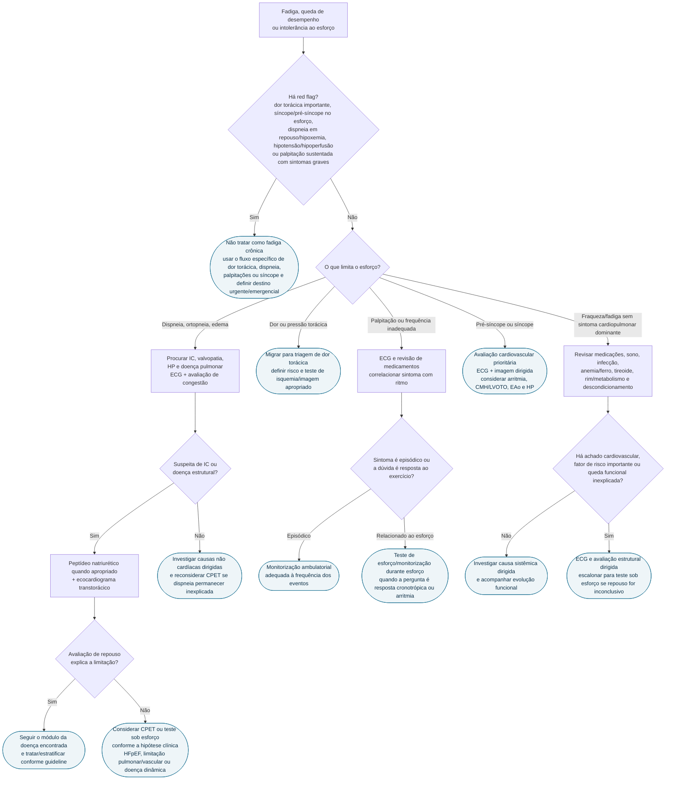

# Fluxograma: Fadiga e Intolerância ao Esforço — do sintoma ao próximo exame

Este fluxograma é a superfície operacional do documento **Fadiga e Intolerância ao Esforço: Abordagem Cardiovascular Orientada à Decisão**. Ele não tenta diagnosticar a causa pela queixa de "cansaço"; primeiro identifica risco, depois pergunta **o que efetivamente interrompe o esforço** e só então escolhe o exame com maior chance de modificar a conduta.

## Árvore de decisão

## Ramos que merecem uma regra própria

### Dispneia persistente depois de embolia pulmonar

Se a queda de tolerância ou a dispneia é persistente ou nova após embolia pulmonar, a diretriz ESC/ERS 2022 recomenda investigação adicional para **CTEPH/CTEPD (Classe I)**. Esse antecedente muda a árvore: não se deve encerrar o caso como descondicionamento sem reconsiderar doença tromboembólica crônica.

### CMH com sintomas e eco de repouso sem obstrução relevante

Em paciente sintomático com cardiomiopatia hipertrófica e sem gradiente de via de saída ≥50 mmHg em repouso ou à provocação convencional, a AHA/ACC 2024 recomenda **ecocardiograma de exercício (Classe I, B-NR)** para detectar e quantificar LVOTO dinâmica.

### Valvopatia com discrepância entre relato e capacidade funcional

A ESC/EACTS 2025 enfatiza que pacientes podem reduzir atividades de forma gradual e negar sintomas. Teste de exercício pode revelar sintomas e intolerância hemodinâmica; CPET pode ajudar quando é necessário separar limitação cardíaca, pulmonar ou descondicionamento.

### Dispneia inexplicada após avaliação inicial

Na AHA/ACC/HFSA 2022, CPET é **razoável (Classe IIa, C-LD)** em paciente ambulatorial com dispneia inexplicada para avaliar sua causa. O exame deve responder uma pergunta fisiológica concreta; não é rastreio universal para fadiga.

## O que este fluxograma deliberadamente não faz

- não cria cutoff próprio de frequência cardíaca, VO2, BNP/NT-proBNP ou teste de caminhada;
- não transforma um resultado isolado em diagnóstico;
- não presume que ECG ou ecocardiograma de repouso normais excluam HFpEF, LVOTO dinâmica, HP inicial ou arritmia intermitente;
- não prescreve quais exames laboratoriais devem ser pedidos para todo paciente com fadiga;
- não substitui os fluxos específicos quando dor torácica, dispneia, palpitação ou síncope são o sintoma dominante.

## Conexões no CorVIA

- Documento-base: `fadiga-e-intolerancia-ao-esforco-abordagem-cardiovascular-orientada-a-decisao`;
- Triagens: `dor-toracica`, `dispneia`, `palpitacoes`, `sincope-e-pre-sincope`;
- IC: `icfer-classificacao-diagnostico-quatro-pilares` e módulos de HFpEF;
- CMH: `cardiomiopatia-hipertrofica-diagnostico-e-tratamento-diretriz-brasileira-2024`;
- Valvopatias: `valvopatias-atualizacao-diretriz-esceacts-2025`;
- HP: `fluxograma-hipertensao-pulmonar-diagnostico-esc-ers-2022` e `ecocardiograma-na-triagem-da-hap-sinais-e-limites-de-acuracia`.
