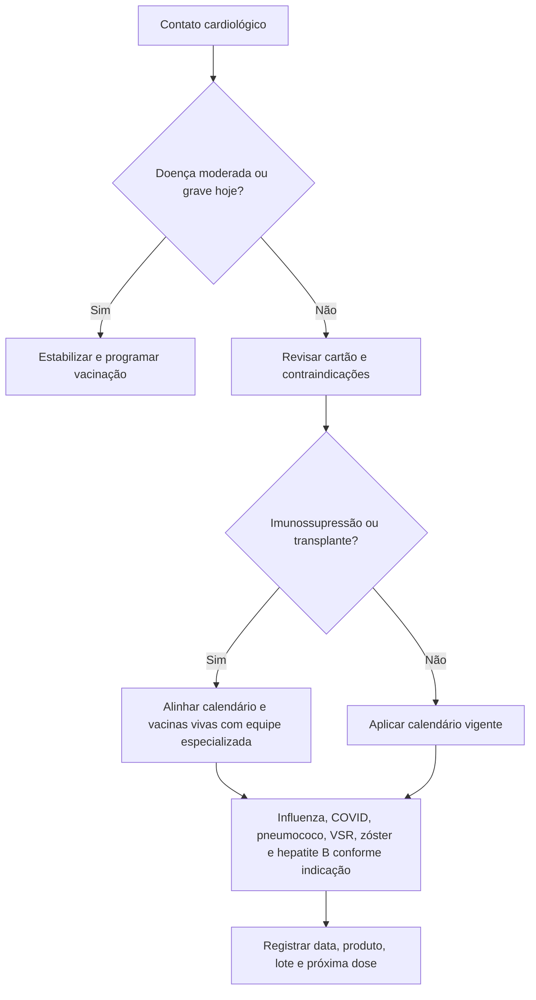

# Fluxograma — vacina no cardiopata adulto

## Leitura rápida

- A revisão vacinal cabe em todo contato; PREVENT não é critério de indicação de vacina.
- Alta após IC descompensada ou SCA pode ser oportunidade, desde que o paciente esteja clinicamente estável e sem doença aguda moderada/grave.
- LVAD, isoladamente, não define imunossupressão. Vacinas vivas exigem avaliação específica quando há transplante ou imunossupressão.
- Para VSR, pneumococo e COVID, seguir idade, condição clínica, histórico e o calendário aplicável no Brasil; recomendações dos EUA não devem ser copiadas automaticamente.
- Não suspender medicação cardiovascular apenas para vacinar; sintomas sistêmicos importantes, baixa ingestão ou desidratação exigem avaliação e regras de “sick day”.

## Conteúdo CorVIA conectado

- [Imunização do cardiopata: PNI/SBIm versus ACC 2026](/biblioteca/imunizacao-do-cardiopata-pni-sbim-2026-versus-acc-2026)
- [Imunizações do adulto como parte do cuidado cardiovascular](/biblioteca/imunizacoes-do-adulto-como-parte-do-cuidado-cardiovascular-acc-2026)
- [Vacinação do cardiopata no consultório após SCA ou IC](/biblioteca/vacinacao-cardiopata-no-consultorio-pos-sca-ic-checklist)
