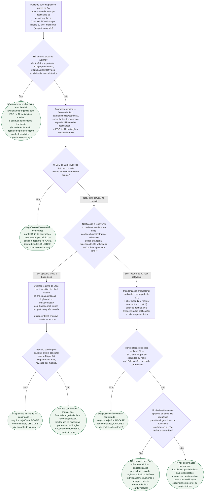

# Fluxograma: Notificação de Pulso Irregular em Dispositivo Vestível — Confirmação Diagnóstica de Fibrilação Atrial

Relógios e anéis inteligentes de consumo hoje emitem notificações de "pulso irregular" ou "possível fibrilação atrial" com base em fotopletismografia óptica, fora de qualquer contexto clínico. Esse é hoje um dos motivos mais comuns de procura espontânea ao cardiologista por paciente sem diagnóstico prévio e sem sintoma. O ponto que este fluxograma resolve é simples de enunciar e fácil de errar na prática: a notificação do dispositivo é um **gatilho para investigação**, nunca um diagnóstico — tanto a ESC 2024 quanto a ACC/AHA/ACCP/HRS 2023 são explícitas em exigir um traçado de ECG interpretado por médico (12 derivações, ou single-lead/multiderivação com pelo menos 30 segundos) antes de rotular o paciente como portador de FA e antes de qualquer decisão terapêutica, incluindo anticoagulação.

## Árvore de decisão

## Por que a fotopletismografia sozinha não fecha o diagnóstico

A ESC 2024 é explícita: a recomendação de confirmação diagnóstica "não inclui dispositivos vestíveis não baseados em ECG e outros dispositivos que tipicamente usam fotopletismografia". O padrão aceito é um traçado real — ECG de 12 derivações (10 segundos) ou registro de single-lead/multiderivação com pelo menos 30 segundos — sempre revisado por um médico. A ACC/AHA/ACCP/HRS 2023 chega à mesma exigência por um caminho formal: recomendação Classe 1 (COR 1, LOE B-NR) de que o diagnóstico inicial de FA seja feito por interpretação visual do clínico sobre o sinal eletrocardiográfico, "independentemente do tipo de ritmo ou dispositivo de monitorização". A mesma diretriz nomeia o papel correto do smartwatch: ele pode **alertar** o paciente a buscar um ECG, mas "não é suficientemente confiável para estabelecer diagnóstico de FA" isoladamente.

## Achado de alta frequência atrial abaixo do limiar clínico

Quando a monitorização dedicada não encontra FA sustentada por 30 segundos ou mais, mas mostra episódios atriais rápidos muito breves, o caso não deve ser tratado como FA clínica — e também não deve ser descartado sem registro. A ESC 2024 trata esse cenário como o mesmo problema da FA subclínica detectada por dispositivo já implantado: exige revisão de um profissional competente sobre o traçado antes de qualquer conduta, e não autoriza equiparar automaticamente o achado a indicação de anticoagulação. Este fluxograma para de propósito nesse ponto — a decisão fina de quando tratar um episódio subclínico está fora do escopo de uma notificação de smartwatch e é tratada no documento desta biblioteca sobre FA subclínica por dispositivo implantado (NOAH-AFNET 6/ARTESiA).

## O que este fluxograma deliberadamente não faz

- não trata a notificação do dispositivo como diagnóstico, em nenhum ramo;
- não decide anticoagulação — uma vez confirmada a FA clínica, a decisão de anticoagular segue o CHA2DS2-VA na trajetória AF-CARE, não este fluxograma;
- não define rastreio populacional ativo de FA (convocar quem nunca teve notificação alguma) — essa é a pergunta do LOOP e do STROKESTOP, documentada à parte;
- não cria cutoff próprio de duração para Holter, monitor de eventos ou patch além do limiar de 30 segundos citado nas diretrizes;
- não se aplica a paciente com FA já diagnosticada ou com dispositivo cardíaco implantável prévio (marca-passo, CDI) — esse achado incidental tem trajetória própria.

## Conexões no CorVIA

- Documento-base sobre o próprio dispositivo: `dispositivos-vestiveis-e-deteccao-de-fibrilacao-atrial-na-populacao-geral-o-apple-heart-study`;
- Diagnóstico confirmado, próximo passo: `fluxograma-fibrilacao-atrial-af-care-esc-2024`;
- Sintoma agudo/instabilidade: `fluxograma-fa-inicio-recente-pronto-socorro`;
- Rastreio ativo de FA em população sem notificação prévia: `rastreio-populacional-de-fibrilacao-atrial-no-idoso-loop-e-strokestop`.
