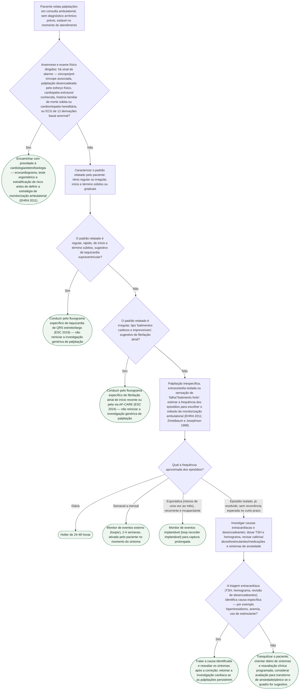

# Fluxograma: Palpitações — avaliação inicial ambulatorial sem diagnóstico prévio

A queixa de "palpitação" no consultório não é um diagnóstico — é um sintoma que pode vir de arritmia sustentada, extrassistolia isolada, ansiedade, causa metabólica ou, com frequência, de nenhuma delas identificável no momento da consulta. Este fluxograma cobre a **primeira consulta ambulatorial, com o paciente estável**, sem diagnóstico arrítmico prévio — a etapa que decide se o caso já tem padrão reconhecível (e deve migrar para o fluxograma específico de taquicardia ou de fibrilação atrial) ou se depende de monitorização prolongada para captar o ritmo durante o sintoma. Não é um fluxograma de emergência: paciente instável, com palpitação associada a síncope franca, dor torácica ou sinais de choque no momento do atendimento não segue este caminho — vai direto para avaliação cardiovascular prioritária.

A estrutura segue o posicionamento da European Heart Rhythm Association (Raviele et al., Europace 2011): anamnese e ECG basal primeiro; sinais de alarme decidem prioridade e via de investigação; padrão do sintoma relatado (regular versus irregular, início/término súbitos versus graduais) direciona para os fluxogramas de arritmia específica quando aplicável; e, na ausência de sinal de alarme e de padrão sugestivo de taquicardia ou FA, a frequência dos episódios — não a gravidade percebida pelo paciente — é o que escolhe o método de monitorização ambulatorial, do Holter de 24-48h ao monitor de eventos implantável. Zimetbaum & Josephson (NEJM 1998) sustentam a mesma lógica de escalonamento por frequência de sintoma e complementam a discussão da triagem extracardíaca.

## Árvore de decisão

## Por que a frequência do episódio decide o exame, não a gravidade percebida

A armadilha mais comum na prática é pedir Holter de 24-48h para todo paciente com palpitação, mesmo quando o episódio ocorre uma vez por mês — a chance de capturar o ritmo durante um evento tão espaçado numa janela de 1-2 dias é baixa, e um Holter negativo não exclui nada, só custa tempo e gera falsa tranquilidade. A lógica que este fluxograma segue (EHRA 2011; Zimetbaum & Josephson 1998) é a inversa: quanto mais raro o episódio, mais prolongada precisa ser a janela de monitorização — dali vem a progressão de Holter (diário) para monitor de eventos externo (semanal a mensal) e, para o episódio raro mas clinicamente relevante, o monitor de eventos implantável.

## Os dois desvios obrigatórios para fluxograma específico

Este fluxograma **não tenta diagnosticar arritmia sustentada pela descrição verbal do paciente** — ele só reconhece dois padrões clássicos o suficiente para justificar migrar para uma via já estruturada em vez de reiniciar a investigação do zero:

- **Regular, rápida, início e término súbitos** — padrão clássico de taquicardia supraventricular. Migra para o fluxograma de taquicardia de QRS estreito/largo (ESC 2019), que já cobre a estratificação e o manejo agudo.
- **Irregularmente irregular, "batimentos caóticos"** — padrão clássico de fibrilação atrial. Migra para o fluxograma de FA de início recente ou para a via AF-CARE (ESC 2024).

Quando a descrição do paciente não se encaixa claramente em nenhum dos dois — o caso mais frequente no consultório —, a árvore segue para a escolha de monitorização por frequência, que é onde este fluxograma realmente resolve o problema.

## O que este fluxograma deliberadamente não faz

- não substitui a avaliação de emergência quando a palpitação vem acompanhada de síncope franca, dor torácica aguda ou instabilidade hemodinâmica no momento do atendimento — esse cenário segue via de urgência, não este fluxo ambulatorial;
- não diagnostica o tipo de arritmia pela descrição verbal — só reconhece os dois padrões clássicos (SVT e FA) suficientes para redirecionar a um fluxograma já estruturado; qualquer padrão fora desses dois segue para monitorização, não para rótulo diagnóstico presumido;
- não define corte de duração de monitorização em horas ou dias — a faixa (diária/semanal-mensal/esporádica) orienta a categoria de exame, e a duração exata é decisão clínica caso a caso;
- não trata FA subclínica detectada por dispositivo vestível, que já tem fluxo próprio publicado em Geral (notificação de pulso irregular);
- não cobre a investigação de fadiga/intolerância ao esforço quando a palpitação não é o sintoma predominante — esse recorte já tem fluxograma próprio em Geral.

## Conexões no CorVIA

- Arritmias: fluxograma de taquicardia supraventricular de QRS estreito (ESC 2019) e de taquicardia de QRS largo (ESC 2019);
- Fibrilação atrial: fluxograma de FA de início recente no pronto-socorro e via AF-CARE (ESC 2024);
- Síncope: fluxogramas de avaliação inicial e de critérios de alto risco (ESC 2018/EUSEM 2024), para quando a palpitação vem acompanhada de perda de consciência;
- Geral: fluxograma de notificação de pulso irregular por dispositivo vestível (confirmação de FA) e fluxograma de fadiga e intolerância ao esforço.
