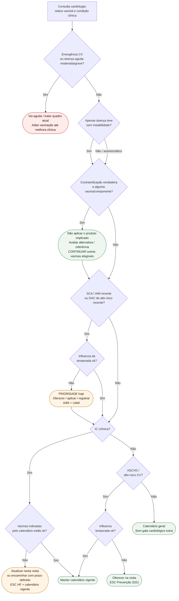

# Fluxograma: sinalizadores ambulatoriais de vacinação no cardiopata

Prosa: [`sinalizadores-ambulatoriais-vacinacao-cardiopata-quando-escalar`](sinalizadores-ambulatoriais-vacinacao-cardiopata-quando-escalar.md) e [`vacinacao-cardiopata-no-consultorio-pos-sca-ic-checklist`](vacinacao-cardiopata-no-consultorio-pos-sca-ic-checklist.md).

## Árvore de decisão

## Notas

- **D1** = doença aguda moderada/grave ou emergência: tratar primeiro; doença leve isolada não deve gerar adiamento automático.
- **D2/C2** = contraindicação é vinculada à vacina/componente implicado; o fluxo segue para as demais vacinas elegíveis.
- **D3/D4/C3** = prioridade de influenza no contexto coronariano recente; não cria janela rígida universal de 1 ano.
- **C3 → D5** = após influenza, continuar a mesma visita e verificar IC/outras vacinas indicadas.
- **D5/D6/C4** = usar calendário oficial vigente para pneumococo/COVID/demais imunobiológicos; este fluxograma não define produto, dose ou intervalo.
- **D7/C6** = ASCVD estável ainda merece oferta de influenza conforme prevenção cardiovascular.
