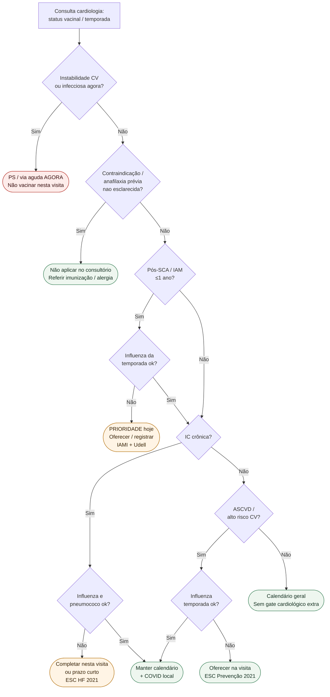

# Fluxograma: sinalizadores ambulatoriais de vacinação no cardiopata

Prosa: [`sinalizadores-ambulatoriais-vacinacao-cardiopata-quando-escalar`](sinalizadores-ambulatoriais-vacinacao-cardiopata-quando-escalar.md) e [`vacinacao-cardiopata-no-consultorio-pos-sca-ic-checklist`](vacinacao-cardiopata-no-consultorio-pos-sca-ic-checklist.md).

## Árvore de decisão

## Notas

- **D1** = gate de segurança: não imunizar na descompensação.
- **D3/D4/C3** = maior prioridade relativa (IAMI; interação Udell com SCA recente).
- **D5/D6/C4** = influenza + pneumococo na IC (ESC HF 2021).
- **D7/C6** = ASCVD estável ainda merece oferta (ESC Prevenção 2021), com benefício absoluto tipicamente menor que pós-SCA.
- Não decide doses, marcas, PCV vs PPSV, nem esquemas COVID.
