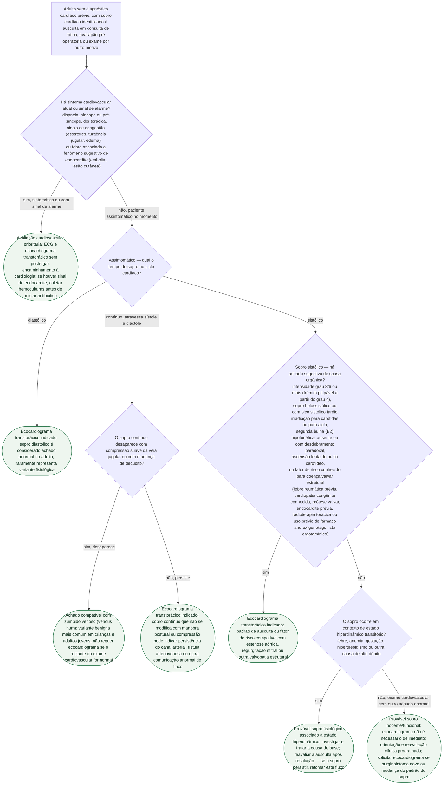

# Fluxograma: Sopro Cardíaco Incidental no Adulto Assintomático

Sopro cardíaco encontrado em ausculta de rotina — consulta clínica geral, avaliação pré-operatória, exame periódico — é uma das descobertas mais comuns do consultório e uma das que mais geram encaminhamento reflexo ao ecocardiograma, mesmo quando a semiologia já responde à pergunta. A biblioteca já tem o equivalente pediátrico (sopro inocente versus patológico na criança), mas nenhum documento cobria o **adulto sem diagnóstico cardíaco prévio, assintomático no momento do achado** — a situação mais frequente na prática do cardiologista geral e do clínico. Este fluxograma cobre exatamente essa lacuna: o adulto estável, sem sintoma cardiovascular associado, em quem o sopro foi um achado incidental de exame físico.

A lógica segue o princípio comum às duas diretrizes de valvopatia usadas como âncora (ACC/AHA 2020 e ESC/EACTS 2021): a decisão de pedir ecocardiograma nasce da **avaliação clínica cuidadosa** — sintoma associado, tempo do sopro no ciclo cardíaco, e padrão semiológico —, não de uma regra de "todo sopro faz ecocardiograma". Nenhuma das duas diretrizes-guia traz, no texto acessível nesta sessão, uma tabela numérica única separando sopro inocente de orgânico; por isso os critérios semiológicos que decidem os últimos nós desta árvore (grau, timing do pico, irradiação, comportamento de B2, ascensão do pulso carotídeo) vêm da revisão sistemática clássica de Etchells, Bell e Robb (JAMA, série "Rational Clinical Examination", 1997), que quantifica o valor desses achados para estenose aórtica especificamente — a causa orgânica mais estudada nesse desenho de pesquisa.

## Árvore de decisão

## Por que o timing do sopro decide antes do grau

A armadilha mais comum na prática é julgar o sopro só pela intensidade, pulando a pergunta que realmente separa achado benigno de achado que precisa de imagem: **em que fase do ciclo cardíaco ele ocorre**. Sopro diastólico isolado é, por convenção semiológica, tratado como anormal no adulto — ele representa fluxo através de uma valva que deveria estar fechada ou competente naquele momento do ciclo, algo que raramente acontece sem alteração estrutural. Sopro sistólico, ao contrário, é heterogêneo por natureza: a maioria dos adultos hígidos pode ter um sopro sistólico suave, mesossistólico, sem repercussão nenhuma — e é só dentro desse grupo que o grau, o momento do pico, a irradiação e o comportamento de B2 (os achados quantificados por Etchells et al.) fazem a diferenciação valer a pena.

## O que este fluxograma deliberadamente não faz

- não substitui a avaliação de emergência quando o sopro é encontrado num paciente já sintomático ou instável — esse cenário sai da árvore no primeiro nó, direto para avaliação prioritária;
- não estabelece um corte de idade para decidir ecocardiograma: nenhuma das fontes acessíveis nesta sessão fornecia um limiar etário verificável, e um número inventado seria pior do que a ausência dele — a decisão nos nós D4/D5 é por semiologia e fator de risco declarado, não por idade;
- não atribui classe de recomendação (COR/LOE) da diretriz ACC/AHA 2020 a nenhum nó específico, porque o texto integral dessa diretriz devolveu erro de acesso (403) nesta sessão e não foi lido — o fluxograma reflete o princípio geral (avaliação clínica antes de imagem) confirmado no texto da ESC/EACTS 2021, que foi lido por completo, mais os achados semiológicos quantificados por Etchells et al.;
- não cobre o sopro já conhecido em paciente com valvopatia diagnosticada, cujo seguimento segue os documentos e fluxogramas dedicados de Valvopatias, nem o sopro em criança/adolescente, coberto pelo fluxograma pediátrico já publicado em Cardiopatias congênitas;
- não substitui a decisão do ecocardiografista sobre achado incidental encontrado no próprio exame (massa, derrame, calcificação) — esse é um recorte distinto, de imagem já realizada, não de indicação inicial de pedir o exame.

## Conexões no CorVIA

- Cardiopatias congênitas: fluxograma de sopro cardíaco na criança — inocente versus patológico, para o paciente pediátrico;
- Valvopatias: documentos de estenose aórtica, regurgitação mitral e demais valvopatias estruturais, para quem o ecocardiograma deste fluxograma confirmar achado orgânico;
- Endocardite: documentos de critérios diagnósticos, para o paciente encaminhado por sopro associado a sinal de endocardite;
- Geral: fluxograma de dor torácica ambulatorial estável de baixo risco e fluxograma de palpitações, para os outros recortes de queixa cardiovascular indiferenciada já cobertos nesta mesma pasta.
