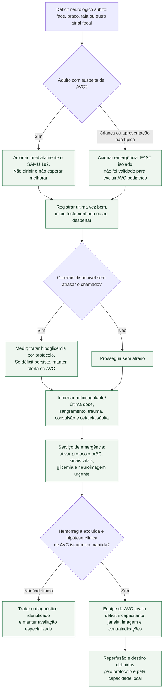

# Fluxograma: suspeita de AVC agudo — reconhecimento e primeira hora

## Limites do diagrama

O fluxo não reproduz critérios completos de trombólise, trombectomia ou metas
pressóricas. Esses critérios mudam com horário, imagem, subtipo, gravidade,
anticoagulação e capacidade local. A ação segura que o diagrama fixa é não
perder tempo nem iniciar antitrombótico antes de excluir hemorragia.
A TC sem contraste pode ser inicialmente normal no AVC isquêmico; excluir
hemorragia não equivale a exigir confirmação radiológica do infarto antes da
decisão de reperfusão.

## Tudo com Tudo

- [Protocolo de reconhecimento e primeira hora](deficit-neurologico-focal-subito-reconhecimento-e-primeira-hora-do-avc.md)
- [Alteplase](../Farmacologia/alteplase.md)
- [Tenecteplase](../Farmacologia/tenecteplase.md)

