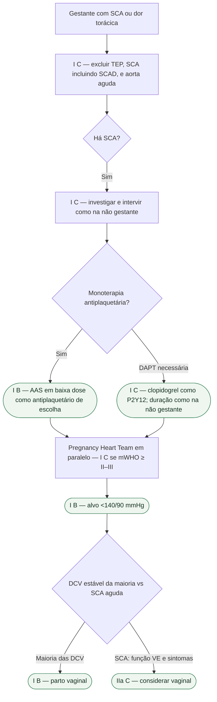

# AAS e antiplaquetário na SCA gestacional — ESC 2025

Gestante com SCA não espera um “protocolo obstétrico paralelo”. A ESC 2025 (De Backer et al., *Eur Heart J*. 2025;**46**:4462-4568; DOI 10.1093/eurheartj/ehaf193; PMID **40878294**) é explícita: investigar e intervir **como na não gestante** — **Classe I, nível C**. A gravidez acrescenta a Pregnancy Heart Team e planejamento individual do parto; não muda o princípio de salvar o miocárdio.

## Dor torácica: as três exclusões, não a ansiedade da gravidez

Em gestante com dor torácica, é **recomendado** excluir condições cardiovasculares ameaçadoras da vida, incluindo **TEP, SCA (incluindo SCAD) e síndrome aórtica aguda** — **I C**. Troponina, ECG e coronariografia não são proibidas “porque está grávida”. Percentual de SCAD por trimestre ou “fração de SCA que é SCAD”: **não reproduzido** — qualquer porcentagem aqui seria invenção.

Em ameaça à vida: desfibrilação, revascularização coronária aguda e suporte mecânico seguem a lógica da não grávida.

## Antiplaquetário: o que tem classe — e o miligrama que não se inventa

Três linhas da Recommendation Table 12 (doença coronariana e gravidez) foram lidas no extrato:

- **AAS em baixa dose** é o antiplaquetário de escolha na gravidez e na lactação quando a **monoterapia** antiplaquetária está indicada — **Classe I, nível B**.
- Se **DAPT** for necessária, **clopidogrel** é o inibidor P2Y₁₂ de escolha na gravidez — **I C**.
- A **duração** da DAPT (AAS + clopidogrel) após implante de stent deve ser a **mesma da não gestante**, com abordagem individual que sopesa risco isquêmico e sangramento do parto (inclusive anestesia neuraxial) — **I C**.

As doses de ataque e manutenção devem seguir o protocolo de SCA e a avaliação individual. A prevenção obstétrica de pré-eclâmpsia é indicação diferente: sua faixa de dose e interrupção na semana 36/37 não determinam o esquema após stent. Na SCAD estável, sem isquemia persistente, a estratégia conservadora é geralmente favorecida; revascularização depende de instabilidade, isquemia e anatomia.

## Pressão, via de parto e o que a gravidez contra-indica

Alvo pressórico na gestante: PAS **<140 mmHg** e PAD **<90 mmHg** — **I B**. Não colapsar isso na meta 130/80 da adulta não grávida.

Parto vaginal é a primeira escolha na **maioria** das mulheres com DCV — **I B**. Na SCA, o extrato da mesma tabela é mais cauteloso: parto vaginal **deve ser considerado** na maioria das gestantes com SCA, **dependendo da função VE e dos sintomas** — **IIa C**. SCA agudo é emergência, não “maioria estável”.

Pregnancy Heart Team na avaliação, aconselhamento e manejo das mulheres em mWHO 2.0 classe **≥ II–III**, da pré-concepção ao pós-parto tardio — **I C**.

**IECA, BRA e ARNI** não são recomendados na gravidez por efeitos fetais adversos (junto com ARM, ivabradina e iSGLT2 na tabela de IC da mesma diretriz) — **III C**.

## Tudo com Tudo

- [SCA na gestação, incluindo SCAD — ESC 2025](/biblioteca/sca-na-gestacao-incluindo-scad-esc-2025)
- [ESC 2025: doença cardiovascular e gravidez — Pregnancy Heart Team e mWHO 2.0](/biblioteca/esc-2025-doenca-cardiovascular-e-gravidez-equipe-e-mwho-20)
- [Fluxograma: dor torácica na gestação — ESC 2025](/biblioteca/fluxograma-dor-toracica-na-gestacao-esc-2025)
- [Alvo pressórico na gestação: ESC 2025 (<140/90) e o recorte da AHA/ACC 2025](/biblioteca/alvo-pressorio-na-gestacao-esc-2025-e-aha-2025)
