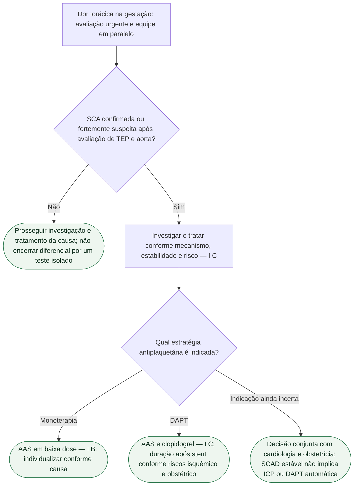

# AAS e antiplaquetário na SCA gestacional — ESC 2025

Gestante com SCA não espera um “protocolo obstétrico paralelo”. A ESC 2025 (De Backer et al., *Eur Heart J*. 2025;**46**:4462-4568; DOI 10.1093/eurheartj/ehaf193; PMID **40878294**) é explícita: investigar e intervir **como na não gestante** — **Classe I, nível C**. A gravidez muda a equipe ao redor (Pregnancy Heart Team) e a via de parto; não muda o princípio de salvar o miocárdio.

## Dor torácica: as três exclusões, não a ansiedade da gravidez

Em gestante com dor torácica, é **recomendado** excluir condições cardiovasculares ameaçadoras da vida, incluindo **TEP, SCA (incluindo SCAD) e síndrome aórtica aguda** — **I C**. Troponina, ECG e coronariografia não são proibidas “porque está grávida”. Percentual de SCAD por trimestre ou “fração de SCA que é SCAD”: **não reproduzido** — qualquer porcentagem aqui seria invenção.

Em ameaça à vida: desfibrilação, revascularização coronária aguda e suporte mecânico seguem a lógica da não grávida.

## Antiplaquetário: o que tem classe — e o miligrama que não se inventa

Três linhas da Recommendation Table 12 (doença coronariana e gravidez) foram lidas no extrato:

- **AAS em baixa dose** é o antiplaquetário de escolha na gravidez e na lactação quando a **monoterapia** antiplaquetária está indicada — **Classe I, nível B**.
- Se **DAPT** for necessária, **clopidogrel** é o inibidor P2Y₁₂ de escolha na gravidez — **I C**.
- A **duração** da DAPT (AAS + clopidogrel) após implante de stent deve ser a **mesma da não gestante**, com abordagem individual que sopesa risco isquêmico e sangramento do parto (inclusive anestesia neuraxial) — **I C**.

A faixa **75–150 mg** de AAS, nesta diretriz, aparece no recorte de **prevenção de pré-eclâmpsia** (ao deitar, da semana 12 à 36/37), não como texto de classe da SCA. Não atribuir à SCA a dose e a classe de prevenção de pré-eclâmpsia. O extrato de DAPT descreve ataque de AAS **150–300 mg** oral (ou 75–250 mg i.v. se a via oral for impossível) e manutenção **75–100 mg**; clopidogrel, ataque 300–600 mg e manutenção 75 mg/dia. As doses constam da nota da Figura 11; a classe da estratégia não deve ser apresentada como classe independente de cada dose.

Não improvisar prasugrel, ticagrelor ou duração em semanas a partir da memória.

## Pressão, via de parto e o que a gravidez contra-indica

Alvo pressórico na gestante: PAS **<140 mmHg** e PAD **<90 mmHg** — **I B**. Não colapsar isso na meta 130/80 da adulta não grávida.

Parto vaginal é a primeira escolha na **maioria** das mulheres com DCV — **I B**. Na SCA, o extrato da mesma tabela é mais cauteloso: parto vaginal **deve ser considerado** na maioria das gestantes com SCA, **dependendo da função VE e dos sintomas** — **IIa C**. SCA agudo é emergência, não “maioria estável”.

Pregnancy Heart Team na avaliação, aconselhamento e manejo das mulheres em mWHO 2.0 classe **≥ II–III**, da pré-concepção ao pós-parto tardio — **I C**.

**IECA, BRA e ARNI** não são recomendados na gravidez por efeitos fetais adversos (junto com ARM, ivabradina e iSGLT2 na tabela de IC da mesma diretriz) — **III C**.

## Tudo com Tudo

- **Gravidez:** Pregnancy Heart Team e mWHO 2.0; IECA/BRA/ARNI III C.
- **Doença coronariana:** SCA como na não gestante (I C); SCAD entra na exclusão da dor torácica, sem porcentagem inventada.
- **Hipertensão:** alvo <140/90 I B na gestante — não 130/80.
- **Tromboembolismo:** TEP é uma das três exclusões da dor torácica (I C).
- **Farmacologia:** AAS I B na monoterapia; clopidogrel I C na DAPT; 75–100 mg/dia na manutenção de AAS da Figura 11, distinta da prevenção de pré-eclâmpsia.
Na SCAD clinicamente estável, sem isquemia ativa ou persistente, a ESC 2025 aconselha manejo conservador da revascularização; o diagnóstico de SCAD não determina ICP automática. Instabilidade, isquemia persistente e anatomia de alto risco exigem decisão especializada urgente.
