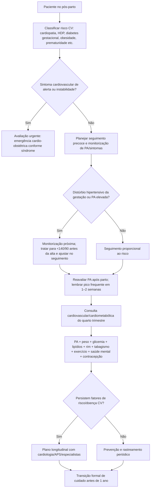
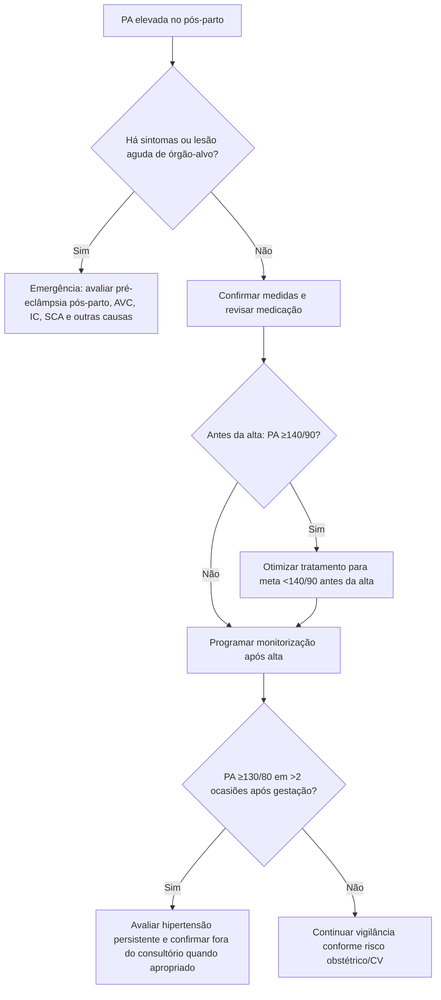

# ACC 2026 — cuidado cardiovascular no puerpério

O **ACC Expert Consensus Decision Pathway de 2026 sobre cuidado cardiovascular pós-parto** organiza o puerpério como um período cardiovascular de risco próprio, não apenas como o encerramento da gestação. Mais da metade das mortes relacionadas à gravidez ocorre após o parto, e as **primeiras 2 semanas** representam uma janela particularmente vulnerável para morbidade cardiovascular grave e reinternação.

O documento propõe uma trajetória de cuidado que começa ainda na internação do parto e se estende até o **fim do primeiro ano pós-parto**.

## 1. Quem merece vigilância cardiovascular mais intensa

O limiar para seguimento estruturado deve ser mais baixo em pacientes com:

- cardiopatia conhecida;
- hipertensão crônica;
- hipertensão gestacional ou pré-eclâmpsia;
- diabetes gestacional;
- parto prematuro;
- obesidade;
- dislipidemia;
- cardiomiopatia periparto;
- arritmia relevante;
- hipertensão pulmonar;
- doença aórtica;
- evento tromboembólico;
- complicação cardiovascular durante a gestação/parto.

Essas condições podem aumentar tanto risco imediato quanto risco cardiometabólico de longo prazo.

## 2. As primeiras 2 semanas

O ECDP enfatiza **seguimento ambulatorial precoce** para triagem de sintomas cardiovasculares e manejo de pressão arterial.

A PA pode cair logo após o parto e voltar a subir, frequentemente alcançando ou ultrapassando níveis anteparto na primeira ou segunda semana.

Hipertensão grave e pré-eclâmpsia também podem surgir **de novo no pós-parto**, inclusive em quem não tinha diagnóstico hipertensivo claro durante a gestação.

## 3. Pressão arterial antes da alta e depois

O documento orienta que a PA seja tratada para atingir **<140/90 mmHg antes da alta hospitalar** no contexto de distúrbios hipertensivos do puerpério, seguindo referências de sociedades materno-fetais e cardiovasculares.

Após a gestação, a classificação de hipertensão volta à lógica do adulto não gestante:

- normal: <120/80 mmHg;
- elevada: PAS 120–129 e PAD <80 mmHg;
- hipertensão: **≥130/80 mmHg em mais de duas ocasiões**, com confirmação fora do consultório quando apropriada.

Isso é diferente do limiar clássico ≥140/90 usado para diagnóstico de hipertensão durante a gestação.

## 4. Sintomas que não podem esperar a consulta de rotina

No puerpério, investigar de forma urgente:

- dispneia nova ou progressiva;
- ortopneia;
- dor torácica;
- síncope;
- palpitação sustentada com repercussão;
- edema importante associado a sintomas sistêmicos;
- déficit neurológico;
- cefaleia intensa/alteração visual em contexto hipertensivo;
- PA muito elevada;
- sinais de tromboembolismo;
- sintomas sugestivos de dissecção ou SCA/SCAD.

A existência de um bebê recém-nascido em casa não deve reduzir o limiar para avaliação médica de sintomas maternos potencialmente graves.

## 5. O "quarto trimestre" é oportunidade cardiometabólica

Ao final do quarto trimestre, o objetivo muda de resgate de eventos agudos para prevenção:

- rever PA;
- peso/adiposidade;
- glicemia/diabetes;
- lipídios;
- tabagismo;
- atividade física;
- função renal quando indicada;
- consequências de pré-eclâmpsia/hipertensão gestacional/diabetes gestacional;
- saúde mental;
- contracepção;
- lactação e segurança medicamentosa.

## 6. Antes do fim do primeiro ano

O ECDP recomenda transição efetiva para cuidado preventivo longitudinal antes de completar o primeiro ano pós-parto.

Esse passo evita que a paciente seja "perdida" entre obstetrícia e atenção cardiovascular após o término do puerpério obstétrico tradicional.

## Árvore de decisão — cuidado cardiovascular pós-parto

## Árvore — PA no pós-parto

## Armadilhas

- Considerar que pré-eclâmpsia não pode começar depois do parto.
- Usar automaticamente o mesmo limiar diagnóstico de PA da gestação meses após o parto.
- Atribuir dispneia a cansaço materno sem excluir PPCM/TEP/IC.
- Encerrar seguimento após a consulta obstétrica de 6 semanas.
- Não registrar pré-eclâmpsia, diabetes gestacional ou parto prematuro como marcadores de risco cardiovascular futuro.
- Prescrever medicação sem discutir compatibilidade com lactação quando relevante.

## Regra prática

**O puerpério cardiovascular dura mais que a internação e mais que 6 semanas.** Proteja as primeiras 2 semanas, reavalie o risco cardiometabólico no quarto trimestre e faça a transição para prevenção longitudinal antes de 1 ano.