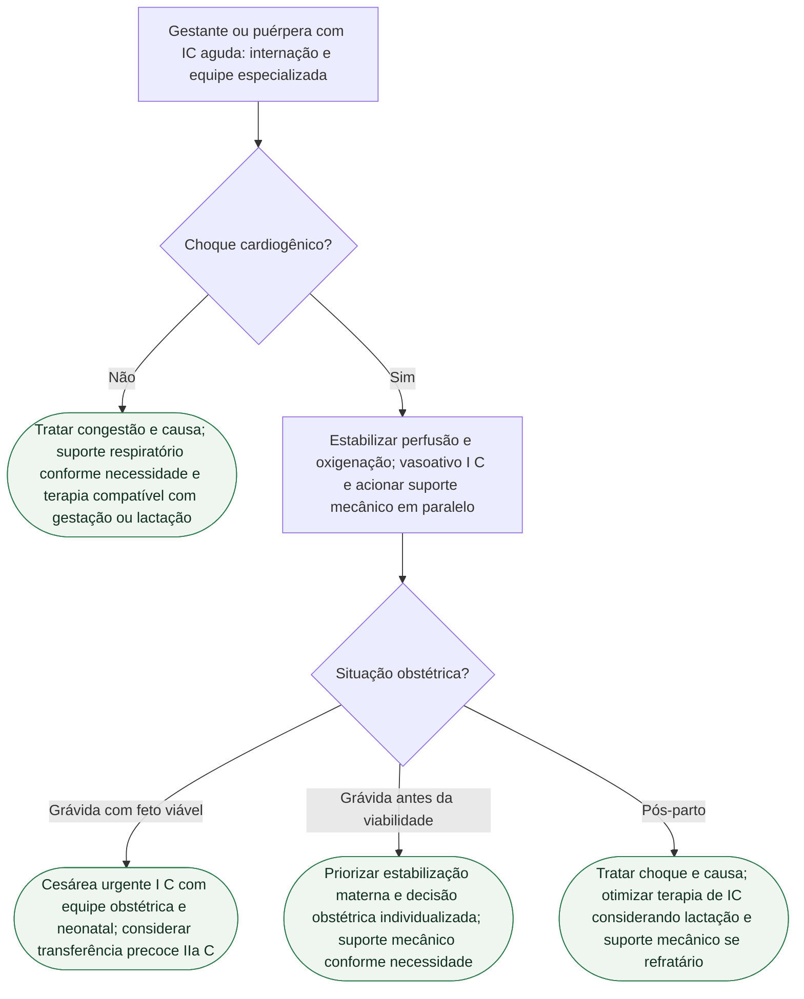

# ESC 2025: insuficiência cardíaca aguda e choque na gestação

A ESC 2025 (De Backer, Haugaa et al., *Eur Heart J*. 2025;**46**:4462-4568; DOI 10.1093/eurheartj/ehaf193; PMID **40878294**) trata a insuficiência cardíaca (IC) aguda e o choque cardiogênico da gestante — e no pós-parto (a Figura 22 apresenta até seis meses) (Figura 22) — como emergência, não como “protocolo obstétrico paralelo”. A *Pregnancy Heart Team* e a mWHO 2.0 já estão no documento-irmão; esta ficha é só a porta aguda. Dor torácica (TEP, SCA/SCAD, aorta) tem fluxograma próprio — não se redesenha aqui.

## O que a diretriz recomenda no choque

**Inotrópicos e/ou vasopressores são recomendados** na gestante com choque cardiogênico, com **levosimendana, dobutamina e milrinona** como agentes recomendados — **Classe I, nível C**. A frase é da Recommendation Table de IC crônica e aguda. Não há, no extrato conferido, um “primeiro da lista”: os três entram como recomendados.

Texto da mesma seção (não é linha de Classe/Nível isolada): levosimendana em infusão contínua **sem dose de ataque**; dobutamina é opção; **adrenalina deve ser evitada**; milrinona pode ser alternativa se o benefício superar o risco (atravessa a placenta). **Não inventar miligramas.** Abrir o capítulo e a bula para a posologia.

**Parto urgente por cesariana** é recomendado na gestante em choque cardiogênico **tão logo o feto seja viável**, levando em conta idade gestacional, comorbidades e o nível de cuidado disponível — **I C**.

**Transferência precoce** da gestante em choque para serviço com suporte circulatório mecânico **deve ser considerada** — **IIa C**. No texto, a assistência preferida em choque refratário é ECMO venoarterial; isso é narrativa da seção, não uma linha de Classe própria além da IIa C da transferência.

Outras linhas da mesma tabela: otimizar a terapia dirigida por diretriz **após o parto**, respeitando os fármacos contraindicados na lactação — **I C**. Prevenir a lactação **pode ser considerado** na IC grave pelo alto gasto metabólico — **IIb B**. IECA, BRA, ARNI, ARM, ivabradina e iSGLT2 **não** são recomendados na gravidez — **III C**.

*Essential Messages*: quando inotrópico ou tratamento avançado for necessário, **encaminhar a um centro especialista**. IC aguda exige internação urgente; o texto pede centro com IC avançada, cirurgia e suporte mecânico (ou transplante) de retaguarda.

## O que a Figura 22 organiza — sem copiar dose

Avaliar gravidade da IC. Otimizar pré-carga (volume versus diurético). **Nitratos se PAS >110 mmHg** — limiar da figura, não “meta de choque”. Na hipoxemia, otimizar oxigenação; VNI ou ventilação invasiva dependem da insuficiência respiratória e do estado clínico, não apenas de um valor isolado. No ramo de IC grave ou choque: acrescentar inotrópico/vasopressor (levosimendana sem ataque, dobutamina ou milrinona — Classe I na figura) e cesárea urgente no choque (Classe I). Bromocriptina aparece **depois do parto**, no recorte de PPCM (Classe IIb) — não é o primeiro movimento do choque.

Em ameaça à vida, medicação, desfibrilação, revascularização e suporte mecânico seguem a lógica da **não grávida**, sem retardar tratamento salvador por contraindicações relativas à gestação, com avaliação materno-fetal e adaptação da técnica (mensagem essencial).

## Pressão na mesma diretriz — o recorte agudo

Visar PAS **<140 mmHg** e PAD **<90 mmHg** na gestante — **I B**. Não colapsar na meta 130/80 da adulta não grávida. PAS ≥160 mmHg ou PAD ≥110 mmHg é emergência; tratamento em hospital — **I C**. Na hipertensão grave, para redução aguda: labetalol i.v., urapidil, nicardipino, ou nifedipino oral de ação curta ou metildopa; hidralazina i.v. é segunda linha — **I C**. Lista da crise, sem miligrama nesta ficha. Manutenção (metildopa, labetalol, BCC) está no documento de alvo pressórico.

## Armadilhas

- Não atrasar inotrópico “porque está grávida”. A linha é **I C**, com os três agentes nomeados.
- Não improvisar miligrama, nem adrenalina “porque é o que tem na gaveta”.
- Choque não é o recorte de parto vaginal da maioria das DCV estáveis.
- Não misturar esta porta com a dor torácica nem com a tabela mWHO 2.0.

## Tudo com Tudo

- **Gravidez.** A Figura 22 inclui até seis meses pós-parto; esse intervalo não exclui investigação posterior. Equipe e mWHO 2.0: [ESC 2025: doença cardiovascular e gravidez — Pregnancy Heart Team e mWHO 2.0](/biblioteca/esc-2025-doenca-cardiovascular-e-gravidez-equipe-e-mwho-20).
- **Terapia intensiva.** Porta UTI: [Choque cardiogênico na gestante — porta UTI, ESC 2025](/biblioteca/choque-cardiogenico-na-gestante-esc-2025).
- **Insuficiência cardíaca.** Os fármacos de IC crônica que a gravidez contra-indica (III C) não se “seguram” no choque; o choque ganha inotrópico.
- **Hipertensão.** Alvo <140/90 (I B); crise ≥160/110 (I C). [Alvo pressórico na gestação: ESC 2025 (<140/90) e o recorte da AHA/ACC 2025](/biblioteca/alvo-pressorio-na-gestacao-esc-2025-e-aha-2025).
- **Doença coronariana.** SCA como na não gestante (I C). Fluxograma de dor torácica: outra árvore.
- **Comunicação clínica.** Decisão compartilhada na cesárea urgente inclui idade gestacional e o que o serviço realmente oferece de suporte.

## Limite editorial

PMID **40878294**. Classe dos inotrópicos no choque gestacional: **I C** (tabela de recomendação e slides oficiais 2025). Doses em mg: não extraídas — **não inventar**. Bromocriptina e ECMO-VA: narrativa/IIb, não promover a Classe I do choque.
O alvo <140/90 é do tratamento da hipertensão, não uma meta de redução pressórica no choque. A escolha de suporte vasoativo depende de perfusão, pressão e mecanismo; os inotrópicos listados não são vasopressores equivalentes. Evitar adrenalina aqui se refere ao choque com circulação presente, não ao protocolo de parada cardíaca. Acionar centro com suporte mecânico em paralelo à estabilização e à decisão obstétrica, sem aguardar o parto ou falha prolongada.
