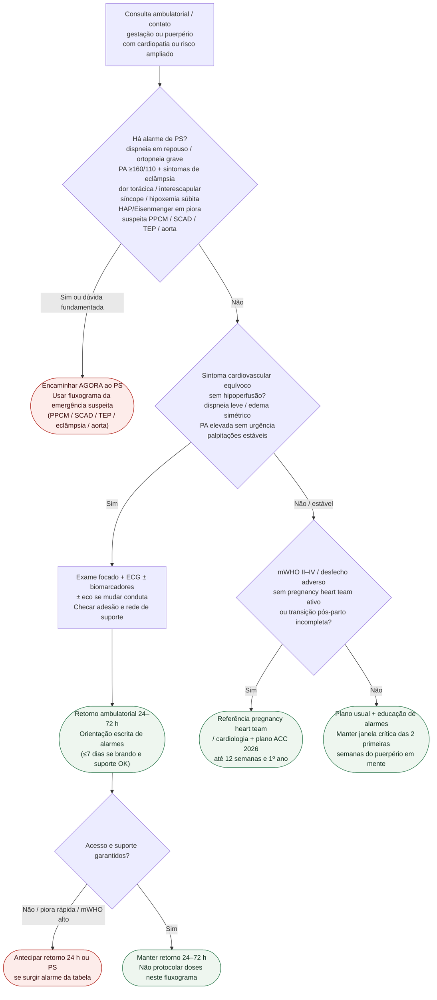

# Fluxograma ambulatorial: gestação/puerpério com piora — destino

Prosa: [`sinalizadores-ambulatoriais-gravidez-cardiopatia-quando-encaminhar`](sinalizadores-ambulatoriais-gravidez-cardiopatia-quando-encaminhar.md). Checklist: [`gravidez-checklist-ambulatorial-de-alarme`](gravidez-checklist-ambulatorial-de-alarme.md).

## Árvore de decisão

## Notas

- **D1** = gate de segurança (PPCM, PA grave/eclâmpsia, SCAD/aorta, TEP, HAP — ESC 2025 + ACC 2026).
- **D2** = sintoma equívoco ambulatorial → destino clínico precoce (primeiras semanas do puerpério).
- **D3** = ponte para pregnancy heart team / transição do 1º ano (ACC 2026), **sem** decidir fármaco aqui.
- Não decide doses de anti-hipertensivo, anticoagulação, bromocriptina nem suporte avançado.
