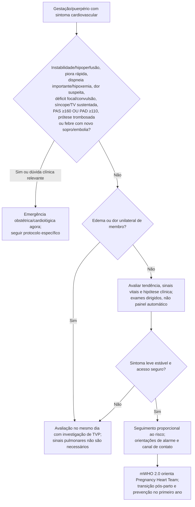

# Fluxograma ambulatorial: gestação/puerpério com piora — destino

Prosa: [[sinalizadores-ambulatoriais-gravidez-cardiopatia-quando-encaminhar](/biblioteca/sinalizadores-ambulatoriais-gravidez-cardiopatia-quando-encaminhar)](/biblioteca/sinalizadores-ambulatoriais-gravidez-cardiopatia-quando-encaminhar). Checklist: [[gravidez-checklist-ambulatorial-de-alarme](/biblioteca/gravidez-checklist-ambulatorial-de-alarme)](/biblioteca/gravidez-checklist-ambulatorial-de-alarme).

## Árvore de decisão

## Notas

- **D1** = gate de segurança (PPCM, PA grave/eclâmpsia, SCAD/aorta, TEP, HAP — ESC 2025 + ACC 2026).
- **D2** = sintoma equívoco ambulatorial → destino clínico precoce (primeiras semanas do puerpério).
- **D3** = ponte para pregnancy heart team / transição do 1º ano (ACC 2026), **sem** decidir fármaco aqui.
- Não decide doses de anti-hipertensivo, anticoagulação, bromocriptina nem suporte avançado.

## Precisão da triagem

Hipertensão grave é PAS ≥160 OU PAD ≥110 mmHg, independentemente de sintomas: confirmar prontamente a medida correta sem atrasar atendimento hospitalar. Cefaleia grave persistente, alteração visual, dor epigástrica/HCD ou edema pulmonar são sinais de gravidade; eclâmpsia designa convulsão nesse contexto. Déficit neurológico focal, hipoperfusão, TV sustentada mesmo normotensa, hipoxemia relevante de qualquer início e piora rápida exigem avaliação imediata.

Edema simétrico isolado pode ser fisiológico. Edema/dor unilateral pede investigação de TVP no mesmo dia, sem exigir taquicardia ou hipoxemia. Suspeitar de PPCM com dispneia/ortopneia progressiva e congestão; SCAD/SCA com dor isquêmica; aorta com dor abrupta intensa; TEP com quadro respiratório/pleurítico ou sinais de TEV. Sintoma leve inespecífico sozinho não confirma essas síndromes.

mWHO 2.0 organiza planejamento e intensidade do cuidado, não determina emergência isoladamente. As janelas de duas semanas, 12 semanas e primeiro ano guiam vigilância/transição, não adiam sintomas graves nem tornam toda queixa leve emergência. Medicação, lactação e contracepção exigem consulta aos protocolos específicos.
