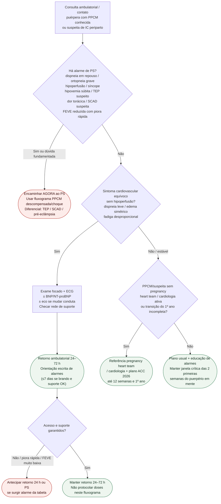

# Fluxograma ambulatorial: PPCM / suspeita no puerpério — destino

Prosa: [`sinalizadores-ambulatoriais-ppcm-puerperio-quando-encaminhar`](sinalizadores-ambulatoriais-ppcm-puerperio-quando-encaminhar.md). Checklist: [`ppcm-checklist-ambulatorial-alarme-pos-parto`](ppcm-checklist-ambulatorial-alarme-pos-parto.md). Emergência: [`fluxograma-cardiomiopatia-periparto-descompensada-e-choque-no-puerperio-esc-2025`](fluxograma-cardiomiopatia-periparto-descompensada-e-choque-no-puerperio-esc-2025.md).

## Árvore de decisão

## Notas

- **D1** = gate de segurança (congestão grave, hipoperfusão, arritmia, TEP/SCAD — Bauersachs 2019 + ESC 2025 + ACC 2026).
- **D2** = sintoma equívoco ambulatorial → destino clínico precoce (primeiras semanas do puerpério).
- **D3** = ponte para pregnancy heart team / transição do 1º ano (ACC 2026), **sem** decidir fármaco aqui.
- Não decide doses de GDMT, bromocriptina, anticoagulação nem suporte avançado.
