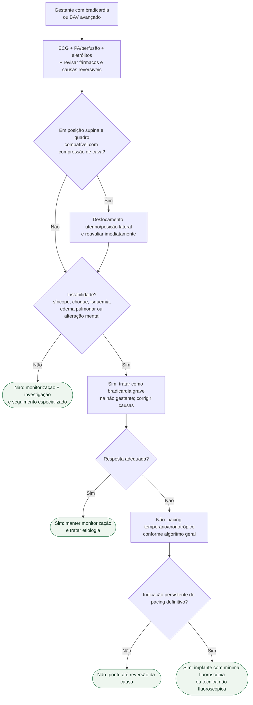

# Bradicardia sintomática/BAV na gestação

```mermaid
flowchart TD
  R0["Gestante com bradicardia<br/>ou BAV avançado"]
  P1["ECG + PA/perfusão + eletrólitos<br/>+ revisar fármacos e causas reversíveis"]
  D1{"Em posição supina e quadro<br/>compatível com compressão de cava?"}
  P2["Deslocamento uterino/posição lateral<br/>e reavaliar imediatamente"]
  D2{"Instabilidade?<br/>síncope, choque, isquemia,<br/>edema pulmonar ou alteração mental"}
  C1(["Não: monitorização + investigação<br/>e seguimento especializado"])
  P3["Sim: tratar como bradicardia grave<br/>na não gestante; corrigir causas"]
  D3{"Resposta adequada?"}
  C2(["Sim: manter monitorização<br/>e tratar etiologia"])
  P4["Não: pacing temporário/cronotrópico<br/>conforme algoritmo geral"]
  D4{"Indicação persistente de pacing definitivo?"}
  C3(["Não: ponte até reversão da causa"])
  C4(["Sim: implante com mínima fluoroscopia<br/>ou técnica não fluoroscópica"])

  R0 --> P1
  P1 --> D1
  D1 -->|"Sim"| P2
  D1 -->|"Não"| D2
  P2 --> D2
  D2 -->|"Não"| C1
  D2 -->|"Sim"| P3
  P3 --> D3
  D3 -->|"Sim"| C2
  D3 -->|"Não"| P4
  P4 --> D4
  D4 -->|"Não"| C3
  D4 -->|"Sim"| C4

  classDef conduta fill:#eef6ef,stroke:#2f7a4f,color:#12301f;
  class C1,C2,C3,C4 conduta;
```

## Regra prática

A gestação acrescenta causas e precauções, mas **não muda a indicação de salvar a mãe de uma bradicardia instável**.