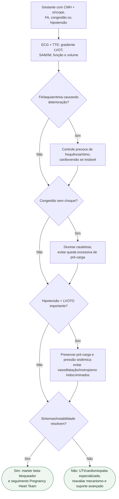

# CMH/LVOTO na gestação

```mermaid
flowchart TD
  R0["Gestante com CMH + síncope,<br/>FA, congestão ou hipotensão"]
  P1["ECG + TTE: gradiente LVOT,<br/>SAM/IM, função e volume"]
  D1{"FA/taquiarritmia causando<br/>deterioração?"}
  P2["Controle precoce de frequência/ritmo;<br/>cardioversão se instável"]
  D2{"Congestão sem choque?"}
  P3["Diurese cautelosa;<br/>evitar queda excessiva de pré-carga"]
  D3{"Hipotensão + LVOTO importante?"}
  P4["Preservar pré-carga e pressão sistêmica;<br/>evitar vasodilatação/inotropismo indiscriminados"]
  D4{"Sintomas/instabilidade resolvem?"}
  C1(["Sim: manter beta-bloqueador<br/>e seguimento Pregnancy Heart Team"])
  C2(["Não: UTI/cardiomiopatia especializada;<br/>reavaliar mecanismo e suporte avançado"])

  R0 --> P1
  P1 --> D1
  D1 -->|"Sim"| P2
  D1 -->|"Não"| D2
  P2 --> D2
  D2 -->|"Sim"| P3
  D2 -->|"Não"| D3
  P3 --> D3
  D3 -->|"Sim"| P4
  D3 -->|"Não"| D4
  P4 --> D4
  D4 -->|"Sim"| C1
  D4 -->|"Não"| C2

  classDef conduta fill:#eef6ef,stroke:#2f7a4f,color:#12301f;
  class C1,C2 conduta;
```

## Regra prática

Na CMH obstrutiva, **tratar a hemodinâmica é tratar o gradiente**: taquicardia, hipovolemia e queda de resistência sistêmica podem piorar a obstrução.