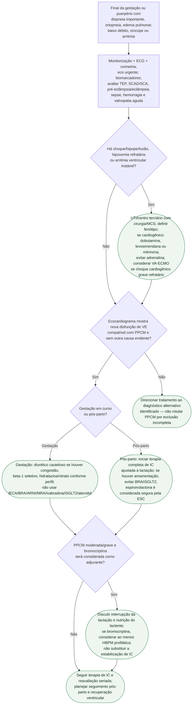

# Cardiomiopatia periparto descompensada e choque no puerpério

## Segurança

O objetivo do fluxograma é reconhecer rapidamente a paciente que precisa de suporte avançado e, ao mesmo tempo, evitar o erro de atribuir toda insuficiência cardíaca do puerpério à PPCM sem excluir TEP, SCAD/SCA, doença hipertensiva grave e sepse.

Na gestação, IECA, BRA, ARNI, antagonista mineralocorticoide, ivabradina e iSGLT2
são contraindicados por risco fetal. No pós-parto, o tratamento pode ser ampliado
de acordo com lactação; a ESC orienta evitar BRA e iSGLT2 quando amamentar for
necessário e considera espironolactona segura. A lista não substitui conferência
individual de compatibilidade do fármaco com lactação.

Em choque cardiogênico, a ESC cita dobutamina e levosimendana, com milrinona como
alternativa quando benefício superar o risco; levosimendana é usada sem bólus.
Adrenalina deve ser evitada. VA-ECMO é o suporte preferido a considerar no choque
grave refratário, em centro com experiência. Se a paciente ainda está gestante,
o choque também exige decisão urgente sobre parto cesáreo pela equipe.

Bromocriptina pode ser considerada como adjuvante, especialmente na PPCM
moderada/grave. Ela interrompe lactação e não demonstrou superioridade clara do
regime prolongado sobre o curto no ensaio citado pela diretriz; por isso este
fluxo não escolhe dose/duração. Ao menos HBPM profilática deve ser considerada
para reduzir risco tromboembólico durante o uso.

## Tudo com Tudo

- [PPCM descompensada e choque — revisão clínica](cardiomiopatia-periparto-descompensada-e-choque-no-puerperio-esc-2025.md)
- [Critérios diagnósticos, recuperação e manejo da PPCM](../Cardiomiopatias/cardiomiopatia-periparto-criterios-diagnosticos-recuperacao-e-manejo.md)
- [Bromocriptina no tratamento da PPCM](bromocriptina-no-tratamento-da-cardiomiopatia-periparto.md)
- [Base genética e variantes truncantes de TTN](base-genetica-da-cardiomiopatia-periparto-variantes-truncantes-de-ttn.md)
- [Gestação subsequente após PPCM](gestacao-subsequente-apos-cardiomiopatia-periparto-risco-por-funcao-ventricular.md)
- [TEP agudo na gestação e puerpério](fluxograma-tromboembolismo-pulmonar-agudo-na-gestacao-e-puerperio-esc-2025.md)
- [Emergência hipertensiva obstétrica](fluxograma-eclampsia-e-hipertensao-grave-na-gestacao.md)
