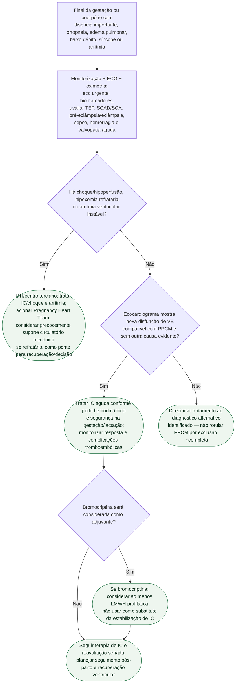

# Cardiomiopatia periparto descompensada e choque no puerpério

## Segurança

O objetivo do fluxograma é reconhecer rapidamente a paciente que precisa de suporte avançado e, ao mesmo tempo, evitar o erro de atribuir toda insuficiência cardíaca do puerpério à PPCM sem excluir TEP, SCAD/SCA, doença hipertensiva grave e sepse.
