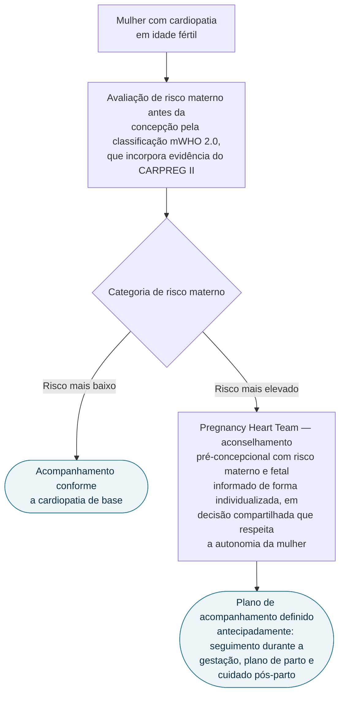

# Fluxograma: Doença Cardiovascular e Gravidez (ESC 2025)

A diretriz ESC 2025 substitui a de 2018 e incorpora sete anos de evidência,
incluindo dados de registros internacionais. Ela traz uma **mudança de eixo que
altera a conduta na prática**: sai do modelo de desaconselhar a gestação em
mulheres classificadas como de alto risco e adota uma abordagem personalizada e
multidisciplinar, centrada na autonomia reprodutiva da mulher.

## Árvore de decisão

O seguimento de longo prazo após desfecho gestacional adverso vale para as duas
categorias de risco — é consequência do desfecho, não do ramo escolhido, e por
isso não figura como folha da árvore.

## mWHO 2.0

A estratificação de risco cardiovascular materno passou a se ancorar na
classificação **modified WHO 2.0**, que incorpora a evidência do estudo CARPREG
II. Ela é o instrumento recomendado para avaliação de risco em todas as mulheres
em idade fértil com doença cardíaca, e deve ser aplicada **antes da concepção**.

## Pregnancy Heart Team

O conceito foi introduzido na diretriz de 2018 e hoje é componente estabelecido
do cuidado. A equipe multidisciplinar é responsável pelo aconselhamento
pré-concepcional, pela definição do plano de parto e pela definição do cuidado
pós-parto — três decisões que a diretriz trata como antecipáveis, não como
condutas a improvisar no momento do evento.

## O que mudou em relação a 2018

| Aspecto | 2018 | 2025 |
|---|---|---|
| Conduta no risco mais alto | desaconselhar a gestação | abordagem personalizada e multidisciplinar |
| Instrumento de risco | mWHO | mWHO 2.0, com CARPREG II |
| Seguimento tardio | — | capítulo dedicado aos efeitos de longo prazo de desfechos gestacionais adversos |

A diretriz também acrescentou capítulos sobre a organização e as atribuições do
Pregnancy Heart Team e capítulos específicos por doença.

## Por que a mudança de eixo importa

O deslocamento do desaconselhamento para a decisão compartilhada não significa
que o risco tenha diminuído — significa que a diretriz reconhece a decisão
reprodutiva como da mulher, cabendo à equipe informar o risco de forma
individualizada e organizar o cuidado que o torne o menor possível.
