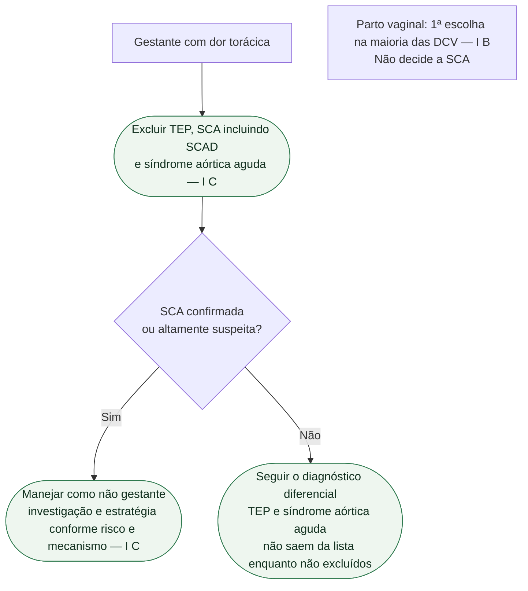

# Fluxograma: dor torácica na gestação — ESC 2025

A avaliação da dor torácica na gestante segue o mesmo protocolo da mulher não grávida: exame clínico, ECG, biomarcadores e ecocardiograma (Figura 11, até 6 meses pós-parto). A SCAD é uma causa importante de SCA associada à gestação e ao pós-parto; isso não significa que seja a principal causa de toda dor torácica.

Árvore: gestante com dor torácica → excluir TEP, SCA (incluindo SCAD) e síndrome aórtica aguda (**I C**) → se SCA, manejar como não gestante, incluindo investigação e intervenção (**I C**).

Parto vaginal é a primeira escolha na maioria das mulheres com DCV (**I B**). **Não** é o nó deste fluxograma: não usar via de parto para autorizar ou recusar angiografia, ICP ou tratamento de TEP/aorta.

## Âncoras (só o verificado)

**Exclusão (I C).** Investigar as ameaças conforme a apresentação sem atrasar o tratamento urgente indicado. Não encerrar como “refluxo” ou “ansiedade” antes de afastar os três.

**SCA (I C).** Diagnóstico e intervenção iguais aos da não gestante. Estratégia invasiva **deve ser considerada** no NSTE-ACS de alto risco — **IIa C**. AAS em baixa dose quando antiagregação simples indicada — **I B**. Se DAP: clopidogrel é o P2Y12 de escolha — **I C**. Duração da DAP após stent: a mesma da não gestante, individualizando isquemia e sangramento no parto — **I C**.

**Via de parto.** Na DCV em geral: vaginal na maioria — **I B**. Na SCA: vaginal **deve ser considerado** na maioria, conforme FEVE e sintomas — **IIa C**. Essa linha **não** atrasa ICP.

**Ameaça à vida** (mensagem essencial, sem Classe/Nível extraído): desfibrilação, intervenções, revascularização coronária aguda, suporte circulatório mecânico e medicação iguais aos da não grávida, quando necessárias para salvar a vida, com avaliação emergencial de risco e benefício.

## O que a árvore não mostra

Na SCAD estável, sem isquemia persistente, geralmente se favorece tratamento conservador; instabilidade, isquemia em curso ou anatomia de alto risco podem exigir revascularização. A existência de lacunas de evidência não elimina essa orientação clínica. Não trata TEP nem síndrome aórtica — só obriga a excluí-los. Não substitui a *Pregnancy Heart Team* em mWHO 2.0 ≥ II–III.

## Tudo com Tudo

- [SCA na gestação, incluindo SCAD — ESC 2025](/biblioteca/sca-na-gestacao-incluindo-scad-esc-2025)
- [AAS e antiplaquetário na SCA gestacional — ESC 2025](/biblioteca/aas-e-antiplaquetario-na-sca-gestacional-esc-2025)
- [ESC 2025: doença cardiovascular e gravidez — Pregnancy Heart Team e mWHO 2.0](/biblioteca/esc-2025-doenca-cardiovascular-e-gravidez-equipe-e-mwho-20)
- [ESC 2025: insuficiência cardíaca aguda e choque na gestação](/biblioteca/esc-2025-ic-aguda-e-choque-na-gestacao)
