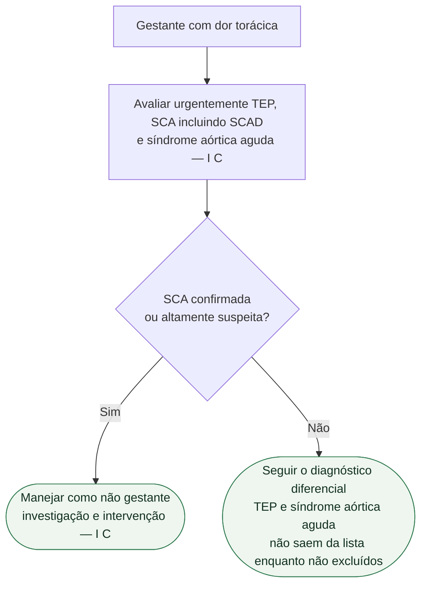

# Fluxograma: dor torácica na gestação — ESC 2025

A avaliação da dor torácica na gestante segue o mesmo protocolo da mulher não grávida: exame clínico, ECG, biomarcadores e ecocardiograma (Figura 11, até 6 meses pós-parto). A SCAD é causa mais prevalente de dor torácica na gravidez e no pós-parto precoce do que fora da gravidez. **Não há percentual** no recorte verificado.

Árvore: gestante com dor torácica → excluir TEP, SCA (incluindo SCAD) e síndrome aórtica aguda (**I C**) → se SCA, manejar como não gestante, incluindo investigação e intervenção (**I C**).

Parto vaginal é a primeira escolha na maioria das mulheres com DCV (**I B**). **Não** é o nó deste fluxograma: não usar via de parto para autorizar ou recusar angiografia, ICP ou tratamento de TEP/aorta.

## Âncoras (só o verificado)

**Exclusão (I C).** Não encerrar como “refluxo” ou “ansiedade” antes de afastar os três.

**SCA (I C).** Diagnóstico e intervenção iguais aos da não gestante. Estratégia invasiva **deve ser considerada** no NSTE-ACS de alto risco — **IIa C**. AAS em baixa dose quando antiagregação simples indicada — **I B**. Se DAPT: clopidogrel é o P2Y12 de escolha — **I C**. Duração da DAPT após stent: a mesma da não gestante, individualizando isquemia e sangramento no parto — **I C**.

**Via de parto.** Na DCV em geral: vaginal na maioria — **I B**. Na SCA: vaginal **deve ser considerado** na maioria, conforme FEVE e sintomas — **IIa C**. Essa linha **não** atrasa ICP.

**Ameaça à vida** (mensagem essencial, sem Classe/Nível extraído): desfibrilação, intervenções, revascularização coronária aguda, suporte circulatório mecânico e medicação iguais aos da não grávida, sem retardar tratamento salvador por contraindicações relativas à gestação, com avaliação materno-fetal e adaptação da técnica.

## O que a árvore não mostra

A escolha na SCAD depende de estabilidade, isquemia e anatomia; persistem lacunas de evidência em gestação, mas a diretriz orienta manejo conservador nos casos estáveis sem isquemia ativa. Não trata TEP nem síndrome aórtica — só obriga a excluí-los. Não substitui a *Pregnancy Heart Team* em mWHO 2.0 ≥ II–III.

## Tudo com Tudo

- **Gravidez:** Figura 11 cobre gestação e 6 meses pós-parto. Ver [ESC 2025: doença cardiovascular e gravidez — Pregnancy Heart Team e mWHO 2.0](/biblioteca/esc-2025-doenca-cardiovascular-e-gravidez-equipe-e-mwho-20).
- **Hipertensão:** alvo <140/90 (**I B**) não substitui o ECG. Ver [Alvo pressórico na gestação: ESC 2025 (<140/90) e o recorte da AHA/ACC 2025](/biblioteca/alvo-pressorio-na-gestacao-esc-2025-e-aha-2025).
- **Doença coronariana:** esta árvore é a porta. Ver [SCA na gestação, incluindo SCAD — ESC 2025](/biblioteca/sca-na-gestacao-incluindo-scad-esc-2025).
- **Cardiopatias congênitas:** ACHD com residual não “protege” contra TEP ou SCA; o nó de exclusão é o mesmo.
- **Aorta e doença arterial periférica:** síndrome aórtica aguda é um dos três diferenciais obrigatórios.
- **Comunicação clínica:** frase de passagem de plantão — “afastei TEP, SCA/SCAD e aorta?” Se a resposta for não, a investigação não acabou.
- **Tromboembolismo:** TEP está no primeiro ramal. Qualquer suspeita de TEV exige avaliação formal imediata (mensagem essencial).

## Limite editorial

PMID 40878294. Sem percentual de SCAD. Parto vaginal da DCV (**I B**) não decide ICP.
Na SCAD clinicamente estável, sem isquemia ativa ou persistente, a ESC 2025 aconselha manejo conservador da revascularização; o diagnóstico de SCAD não determina ICP automática. Instabilidade, isquemia persistente e anatomia de alto risco exigem decisão especializada urgente.
