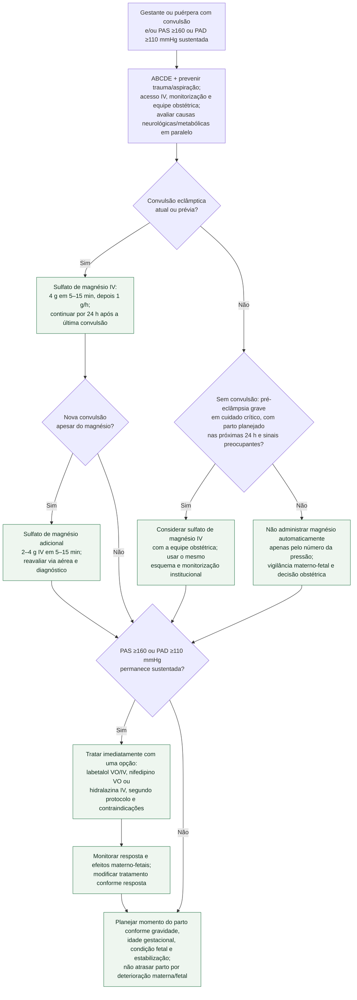

# Eclâmpsia e hipertensão grave na gestação ou puerpério

Convulsão durante gestação ou puerpério é eclâmpsia até avaliação rápida de
alternativas, sobretudo quando há hipertensão ou sinais de pré-eclâmpsia.
Hipertensão grave significa **PAS ≥160 mmHg ou PAD ≥110 mmHg** sustentada; não é
necessário que os dois componentes atinjam simultaneamente esses valores.

Acionar obstetrícia, anestesia e cuidado crítico, proteger via aérea, posicionar
com segurança, obter acesso venoso, monitorizar mãe e feto quando aplicável e
colher hemograma/plaquetas, função renal, transaminases e outros exames dirigidos.
Essas ações não devem atrasar magnésio na eclâmpsia nem o tratamento imediato da
pressão grave.

## Árvore de decisão

## Quando considerar magnésio sem convulsão

Na pré-eclâmpsia grave em cuidado crítico, o NICE recomenda **considerar**
magnésio quando o parto está planejado nas próximas 24 horas. A decisão ganha
peso diante de cefaleia grave recorrente, escotomas, náuseas/vômitos, dor
epigástrica, oligúria com hipertensão grave ou deterioração progressiva de
creatinina, transaminases ou plaquetas. Isso não equivale a prescrever magnésio
para toda pessoa que apresenta isoladamente um valor pressórico grave.

O Magpie Trial sustenta o benefício preventivo do magnésio na pré-eclâmpsia,
mas não define sozinho qual paciente contemporânea deve receber o fármaco; a
seleção e o regime operacional vêm da diretriz. Diazepam, fenitoína e outros
anticonvulsivantes **não substituem** sulfato de magnésio na eclâmpsia.

## Segurança do sulfato de magnésio

Monitorizar frequência respiratória, reflexos, diurese, estado neurológico e
função renal segundo protocolo. O risco de acúmulo aumenta na disfunção renal;
ajustes, suspensão e manejo de toxicidade devem seguir prescrição obstétrica e
farmácia clínica. A dose adicional de 2–4 g vale para recorrência de convulsão,
não para repetição automática por persistência da hipertensão.

## Tratamento da pressão e parto

Na hipertensão grave em cuidado crítico durante gestação ou após o parto, o
NICE indica tratamento imediato com **labetalol oral ou IV, nifedipino oral ou
hidralazina IV**. A escolha considera acesso, contraindicações, frequência,
função cardíaca e protocolo obstétrico; nifedipino não deve ser administrado por
via sublingual. Este fluxo não reproduz escalonamentos de dose divergentes entre
protocolos.

Controlar a pressão e a convulsão estabiliza a mãe, mas não elimina a doença
placentária. Momento e via do parto dependem de idade gestacional, condição
materna/fetal e resposta; deterioração não deve ser mascarada por uma medida de
pressão temporariamente melhor.

## Tudo com Tudo

- [Doença cardiovascular e gravidez — ESC 2025](fluxograma-doenca-cardiovascular-e-gravidez-esc-2025.md)
- [Emergência hipertensiva](../Hipertensão/fluxograma-emergencia-hipertensiva.md)
- [Cardiomiopatia periparto descompensada e choque](fluxograma-cardiomiopatia-periparto-descompensada-e-choque-no-puerperio-esc-2025.md)
- [Síndrome coronariana aguda na gestação e puerpério](fluxograma-sindrome-coronariana-aguda-na-gestacao-e-puerperio.md)
- [Síndrome aórtica aguda na gestação e puerpério](fluxograma-sindrome-aortica-aguda-na-gestacao-e-puerperio.md)
- [Sulfato de magnésio em cardiologia](../Farmacologia/sulfato-de-magnesio-em-cardiologia-torsades-de-pointes-e-adjuvante-no-controle-de-frequencia-da-fa.md)
