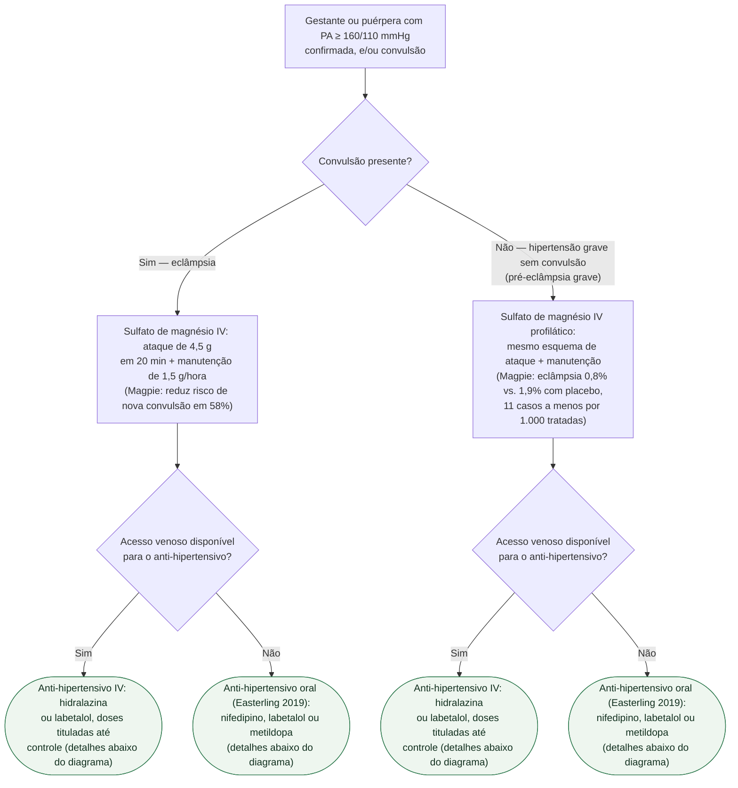

# Eclâmpsia e hipertensão grave na gestação

Diante de PA ≥ 160/110 mmHg confirmada ou de convulsão na gestante ou puérpera, a
primeira pergunta que separa as condutas é se a convulsão já aconteceu. O sulfato
de magnésio é a conduta central nos dois ramos — tratamento na eclâmpsia
estabelecida, profilaxia na pré-eclâmpsia grave sem convulsão — e depois, nos
dois ramos, a hipertensão grave em si precisa de anti-hipertensivo agudo, cuja
via (venosa ou oral) decide qual fármaco entra primeiro.

## Árvore de decisão

## Sulfato de magnésio: dose e duração

**Ataque de 4,5 g IV em 20 minutos, seguido de manutenção em infusão contínua de
1,5 g/hora** — o mesmo esquema serve para tratar a eclâmpsia já instalada e para
a profilaxia na pré-eclâmpsia grave. Na profilaxia, **manter por 12 a 24 horas
após o parto**. A dose é ajustada quando há insuficiência renal.

**Um em cada quatro tem efeito colateral** com o sulfato (24% vs. 5% com placebo
no Magpie) — é a contrapartida do benefício de 58% de redução relativa (11
mulheres a menos com eclâmpsia por 1.000 tratadas, número absoluto pequeno porque
a eclâmpsia é rara).

## Anti-hipertensivo agudo: doses por via

**Se há acesso venoso:**
- **Hidralazina IV**: 5 a 10 mg, repetir a cada 20 a 40 minutos se necessário
- **Labetalol IV**: 10 a 20 mg iniciais, escalonando 20 a 80 mg a cada 10 a 30
  minutos, até dose total máxima de 300 mg

**Se não há acesso venoso** — via oral, conforme o ensaio de Easterling (2019),
que testou justamente esse cenário em serviço público de poucos recursos:
- **Nifedipino de liberação imediata 10 mg VO**, com escalonamento horário —
  desfecho de controle pressórico em 6h em 84% (a maior frequência entre os três,
  como droga isolada)
- **Labetalol 200 mg VO**, com escalonamento horário — 77%
- **Metildopa 1.000 mg VO em dose única, sem escalonamento** — 76%

A ressalva do próprio ensaio vale aqui: nifedipino e labetalol tinham
escalonamento horário e a metildopa não, então a comparação é entre regimes, não
entre fármacos em condições iguais — mas **os três são opções orais viáveis
quando não há via endovenosa disponível de imediato**, e adiar o tratamento por
falta de acesso venoso não é justificado pelo achado do ensaio.

## O que não está nesta árvore

**Antecipação do parto versus conduta expectante** na hipertensão grave é decisão
obstétrica que depende de idade gestacional, condição fetal e resposta ao
tratamento — o documento-fonte não detalha os critérios dessa decisão, e por
isso ela não entra como ramo aqui.

**Reavaliação periódica da pressão e do quadro neurológico** se repete em todos
os ramos e por isso também não é ramo: a pressão é reavaliada a cada dose de
anti-hipertensivo, e o quadro neurológico (reflexos, cefaleia, distúrbio visual)
é reavaliado enquanto o sulfato de magnésio estiver em infusão.
