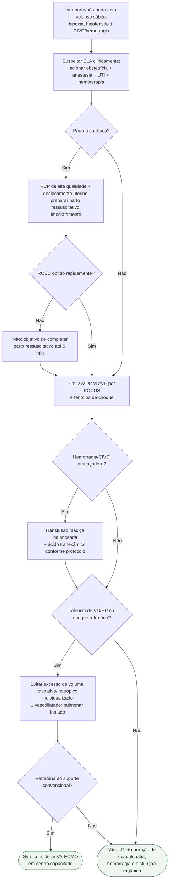

# Embolia de líquido amniótico

```mermaid
flowchart TD
  R0["Intraparto/pós-parto com colapso súbito,<br/>hipóxia, hipotensão ± CIVD/hemorragia"]
  P1["Suspeitar ELA clinicamente;<br/>acionar obstetrícia + anestesia + UTI + hemoterapia"]
  D1{"Parada cardíaca?"}
  P2["RCP de alta qualidade + deslocamento uterino;<br/>preparar parto ressuscitativo imediatamente"]
  D2{"ROSC obtido rapidamente?"}
  P3["Não: objetivo de completar<br/>parto ressuscitativo até 5 min"]
  P4["Sim: avaliar VD/VE por POCUS<br/>e fenótipo de choque"]
  D3{"Hemorragia/CIVD ameaçadora?"}
  P5["Transfusão maciça balanceada<br/>+ ácido tranexâmico conforme protocolo"]
  D4{"Falência de VD/HP ou choque refratário?"}
  P6["Evitar excesso de volume;<br/>vasoativo/inotrópico individualizado<br/>± vasodilatador pulmonar inalado"]
  D5{"Refratária ao suporte convencional?"}
  C1(["Sim: considerar VA-ECMO<br/>em centro capacitado"])
  C2(["Não: UTI + correção de coagulopatia,<br/>hemorragia e disfunção orgânica"])

  R0 --> P1
  P1 --> D1
  D1 -->|"Sim"| P2
  D1 -->|"Não"| P4
  P2 --> D2
  D2 -->|"Não"| P3
  D2 -->|"Sim"| P4
  P3 --> P4
  P4 --> D3
  D3 -->|"Sim"| P5
  D3 -->|"Não"| D4
  P5 --> D4
  D4 -->|"Sim"| P6
  D4 -->|"Não"| C2
  P6 --> D5
  D5 -->|"Sim"| C1
  D5 -->|"Não"| C2

  classDef conduta fill:#eef6ef,stroke:#2f7a4f,color:#12301f;
  class C1,C2 conduta;
```

## Regra prática

Na ELA com PCR, **parto ressuscitativo é parte da ressuscitação materna**, não uma etapa obstétrica posterior.