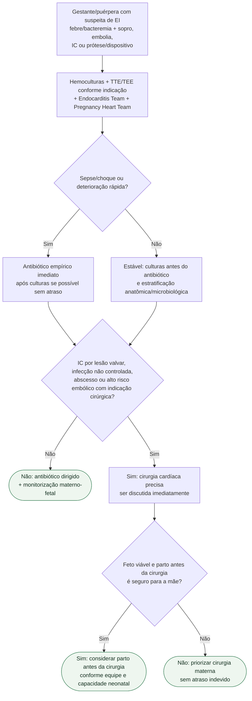

# Endocardite infecciosa na gestação/puerpério

## Regra prática

A gestação muda a escolha do antimicrobiano e o planejamento de cirurgia/parto, mas **não deve reduzir a urgência de tratar EI com insuficiência cardíaca, sepse ou complicação estrutural grave**.