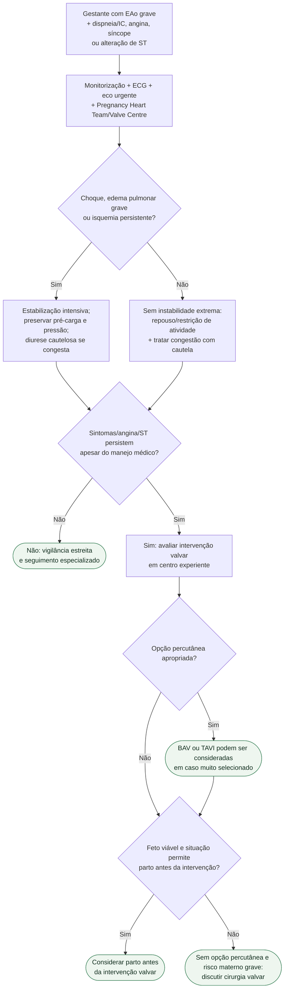

# Estenose aórtica grave sintomática na gestação

## Regra prática

Na EAo grave sintomática, **o tratamento médico compra tempo; não remove a obstrução**. Persistência de sintomas, angina ou alterações de ST deve antecipar discussão de intervenção, não apenas intensificar diurético.