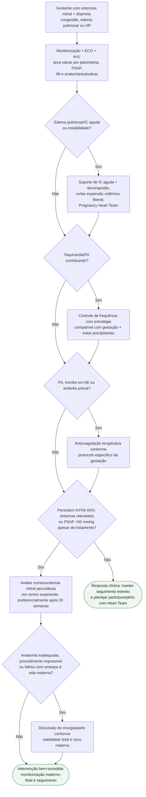

# Estenose mitral descompensada na gestação

## Regra prática

Na gestante com estenose mitral, **taquicardia e volume pioram rapidamente a pressão atrial esquerda**. Se sintomas importantes ou PSAP >50 mmHg persistirem apesar do tratamento clínico, a estratégia deve migrar cedo para avaliação de comissurotomia percutânea.