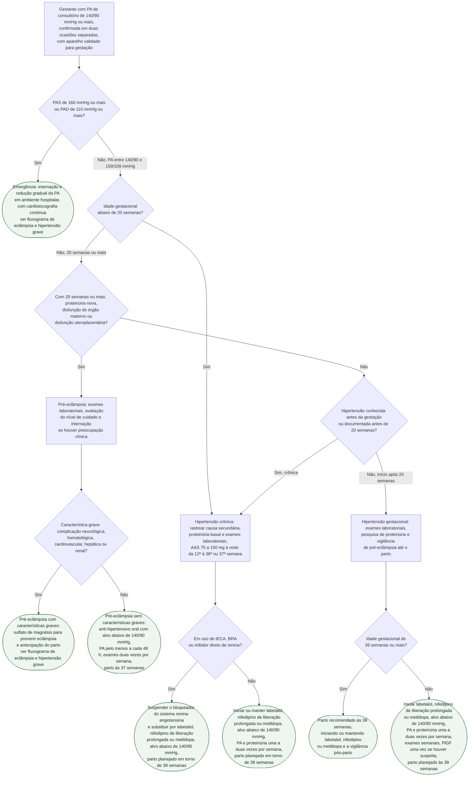

# Fluxograma: Hipertensão na gestação — crônica, gestacional e pré-eclâmpsia (ESC 2025)

Hipertensão complica 5% a 15% das gestações e é a segunda causa de morte
materna depois da hemorragia periparto. A decisão que este fluxograma organiza
é a **não emergencial**: a gestante com PA de consultório de 140/90 mmHg ou mais,
confirmada em duas ocasiões, em quem é preciso decidir três coisas em sequência
— se é crônica ou gestacional, se já é pré-eclâmpsia, e se e com o que tratar.
A ESC 2025 e a ESC 2024 convergem no ponto que mudou a prática depois do CHAP:
**tratar a partir de 140/90 mmHg, com alvo abaixo de 140/90 mmHg**, sem levar a
diastólica abaixo de 80 mmHg. A hipertensão grave (PAS de 160 ou PAD de 110 mmHg
ou mais) sai desta árvore no primeiro nó e segue no fluxograma de eclâmpsia e
hipertensão grave já publicado nesta pasta.

## Árvore de decisão

## O primeiro corte: grave ou não

A ESC 2025 define hipertensão na gestação como PAS de 140 mmHg ou mais e/ou
PAD de 90 mmHg ou mais, medida em duas ocasiões separadas — ou com 15 minutos
de intervalo quando a cifra já é grave. PAS de 160 mmHg ou PAD de 110 mmHg ou
mais é emergência, com tratamento em hospital (Classe I, nível C na ESC 2025;
a ESC 2024 fala em "pode indicar emergência" e internação imediata a ser
considerada, Classe IIa, nível C). A redução da PA nesse cenário é gradual, para
menos de 160/110 mmHg, com cardiotocografia contínua. As drogas, as doses e o
sulfato de magnésio dessa situação estão em
fluxograma-eclampsia-e-hipertensao-grave-na-gestacao, e este fluxograma não os
repete.

O que vale para todos os ramos não graves: medida com aparelho validado para
gestação (os oscilométricos comuns subestimam a PA e são pouco confiáveis na
pré-eclâmpsia grave), MAPA ou MRPA para excluir hipertensão do avental branco e
mascarada (Classe IIa, nível C), e estilo de vida — atividade física aeróbica se
não contraindicada, cessação do tabagismo, controle do peso. Restrição de sal
não é recomendada para reduzir distúrbios hipertensivos, embora a hipertensa
crônica possa manter a dieta hipossódica que já fazia.

## Pré-eclâmpsia: proteinúria ou lesão de órgão

Pré-eclâmpsia é hipertensão acompanhada, a partir de 20 semanas, de
pelo menos um dos achados abaixo (Tabela 14 da ESC 2025). Na hipertensa crônica,
o mesmo conjunto — ou elevação adicional da PA com proteinúria nova — define a
pré-eclâmpsia sobreposta. Por isso a árvore verifica primeiro se a gestação já
alcançou 20 semanas e, só então, procura esses achados antes de separar a
hipertensão crônica da gestacional.

| Critério | Corte na ESC 2025 |
|---|---|
| Proteinúria | 0,3 g ou mais em urina de 24 h, relação proteína/creatinina de 30 mg/mmol ou mais, ou relação albumina/creatinina de 8 mg/mmol ou mais (Figura 12B da ESC 2025) |
| Lesão renal aguda | creatinina de 90 μmol/L (1 mg/dL) ou mais |
| Disfunção hepática | ALT ou AST acima de 40 UI/L, com ou sem dor epigástrica ou em hipocôndrio direito |
| Complicação neurológica | eclâmpsia, alteração do estado mental, cegueira, AVC, clônus, cefaleia intensa, escotomas persistentes |
| Complicação hematológica | plaquetas abaixo de 150.000/μL, CIVD, hemólise |
| Disfunção uteroplacentária | restrição de crescimento, Doppler de artéria umbilical anormal, óbito fetal |

Quando a suspeita persiste com exames inconclusivos, o biomarcador decide: razão
sFlt-1/PlGF de 85 ou mais, ou PlGF abaixo de 12 pg/mL, confirma; razão abaixo de
38 exclui pré-eclâmpsia nos 7 dias seguintes. Os ensaios que sustentam esses
cortes estão em razao-sflt-1-plgf-na-pre-eclampsia-suspeita-prognosis-e-parrot.

A pré-eclâmpsia com características graves — hipertensão grave com ou sem
proteinúria, ou qualquer grau de hipertensão com complicação neurológica,
hematológica ou cardiovascular, disfunção hepática ou renal — recebe sulfato de
magnésio e antecipação do parto. Sem características graves, o parto é
recomendado às 37 semanas (Classe I, nível B), com PA pelo menos a cada 48 h e
exames duas vezes por semana; marcadores adversos como distúrbio da hemostasia
mandam antecipar (Classe I, nível C). O HYPITAT, que fundamenta a indução a
termo, está em inducao-do-parto-na-hipertensao-gestacional-e-pre-eclampsia-leve-a-termo-o-ensaio-hypitat.

## Crônica ou gestacional: a fronteira das 20 semanas

Hipertensão crônica precede a gestação ou surge antes de 20 semanas e costuma
persistir além de 6 semanas pós-parto; hipertensão gestacional surge depois de
20 semanas e em geral resolve em 6 semanas. Quando a PA só foi medida pela
primeira vez depois das 20 semanas, a classificação fica em aberto até a
reavaliação de 6 semanas pós-parto.

Na crônica, a ESC 2024 lembra que 10% têm causa secundária — doença renal
crônica é a mais comum, e hipertensão no primeiro trimestre, no pico do hCG,
deve levantar hiperaldosteronismo primário. Hipertensão crônica é fator de risco
alto para pré-eclâmpsia (Tabela 15 da ESC 2025), e por isso o AAS entra no passo
P2: 75 a 150 mg ao deitar, da 12ª à 36ª ou 37ª semana (Classe I, nível A, ESC
2025; a ESC 2024 escreve 100 a 150 mg, da 12ª à 36ª semana). O mesmo vale para
qualquer gestante com pelo menos um fator de risco alto ou dois moderados; a
comparação entre sociedades está em profilaxia-de-pre-eclampsia-com-aas-em-baixa-dose.

| Fatores de risco para pré-eclâmpsia (ESC 2025, Tabela 15) | Peso |
|---|---|
| Distúrbio hipertensivo em gestação anterior, hipertensão crônica, doença renal crônica, diabetes tipo 1 ou 2, doença autoimune como lúpus ou síndrome antifosfolípide, reprodução assistida na gestação atual | alto — basta um |
| Nuliparidade, idade de 40 anos ou mais, intervalo entre gestações acima de 10 anos, IMC de 35 kg/m² ou mais na primeira consulta, história familiar de pré-eclâmpsia, gestação múltipla | moderado — precisa de dois |

Na gestacional, o parto é recomendado às 39 semanas (Classe I, nível B); na
crônica bem controlada, a diretriz fala em planejar o parto em torno de 39
semanas, sem recomendação tabelada. Cálcio oral é recomendado para prevenção de
pré-eclâmpsia apenas em quem ingere menos de 600 mg por dia.

## Quando tratar, com o quê e em que dose

Iniciar fármaco a partir de PAS de 140 mmHg ou PAD de 90 mmHg de consultório
vale para a gestacional (Classe I, nível B nas duas diretrizes) e para a crônica
(Classe I, nível B na ESC 2024), com alvo abaixo de 140/90 mmHg (Classe I, nível
B na ESC 2025) e sem baixar a diastólica de 80 mmHg. A evidência é o CHAP, em
tratar-hipertensao-cronica-leve-na-gestacao-o-ensaio-chap, e o CHIPS, em
hipertensao-grave-e-eclampsia-magpie-chips-e-a-escolha-do-anti-hipertensivo-oral:
o controle rígido reduziu hipertensão grave sem restringir o crescimento fetal.

| Fármaco | Dose de partida (ESC 2025, Figura 12C) | Recomendação |
|---|---|---|
| Labetalol | 100 mg VO duas vezes ao dia | Classe I, nível C |
| Nifedipino | 5 a 10 mg VO (a Figura 12C não especifica formulação nem frequência; 10 mg se PA acima de 160/110 mmHg); a ESC 2024 prefere a liberação prolongada, cuja posologia segue a bula | Classe I, nível C |
| Metildopa | 250 mg VO duas a três vezes ao dia | Classe I, nível B |
| Metoprolol | 100 mg VO duas vezes ao dia | Classe I, nível C |

IECA, BRA e inibidores diretos de renina são estritamente contraindicados
(Classe III, nível B na ESC 2024): a hipertensa crônica que engravida em uso
deles troca de fármaco, e é esse o nó D5. Atenolol deve ser evitado por
restrição de crescimento fetal; diuréticos não são aconselhados na hipertensão
gestacional e na pré-eclâmpsia por reduzirem a perfusão uteroplacentária, embora
a furosemida não seja contraindicada quando necessária. Metildopa associa-se a
depressão pós-parto e deve ser suspensa em até 2 dias após o parto. O que a bula
brasileira registra de cada fármaco — inclusive onde diverge da prática — está
em anti-hipertensivos-na-gestacao-o-que-a-bula-registrada-diz-de-cada-um.

## Vigilância e pós-parto

| Cenário | PA | Proteinúria | Hemograma, função hepática e renal |
|---|---|---|---|
| Hipertensão 140/90 a 159/109 mmHg | uma a duas vezes por semana | uma a duas vezes por semana | uma vez por semana; PlGF uma vez se houver suspeita |
| Pré-eclâmpsia 140/90 a 159/109 mmHg | pelo menos a cada 48 h, mais se internada | repetir só se indicado | duas vezes por semana |

Após o parto, a ESC 2025 pede PA monitorada por 72 h e nova checagem em 7 a 10
dias; a ESC 2024, medida em 6 h e diária por uma semana após a alta, com
reavaliação em 6 a 12 semanas, 6 e 12 meses e depois anual, porque o risco de
hipertensão crônica é máximo nos primeiros 6 meses. A hipertensão pós-parto não
complicada é tratada com nifedipino ou labetalol.

## Limitações

- Para operacionalizar proteinúria, a árvore adota os cortes da Figura 12B da
  ESC 2025: relação proteína/creatinina de 30 mg/mmol ou relação
  albumina/creatinina de 8 mg/mmol. Esses dois exames não são intercambiáveis.
- Dose de AAS: 75 a 150 mg (ESC 2025) versus 100 a 150 mg (ESC 2024); término
  em 36 ou 37 semanas. O texto traz as duas.
- Classe da emergência em 160/110 mmHg: I C na ESC 2025, IIa C na ESC 2024.
- O parto "em torno de 39 semanas" na hipertensão crônica bem controlada é texto
  corrido da ESC 2025, não recomendação tabelada; a tabelada é para a gestacional.
- As doses da tabela são as de partida da Figura 12C da ESC 2025; escalonamento
  e doses máximas não constam da diretriz e seguem protocolo obstétrico.
- A separação crônica/gestacional depende da idade gestacional da primeira
  medida; hipertensão só documentada após 20 semanas fica inclassificável até 6
  semanas pós-parto.

## Tudo com Tudo

- [Fluxograma: eclâmpsia e hipertensão grave na gestação ou puerpério](/biblioteca/fluxograma-eclampsia-e-hipertensao-grave-na-gestacao)
- [Tratar Hipertensão Crônica Leve na Gestação: o Ensaio CHAP](/biblioteca/tratar-hipertensao-cronica-leve-na-gestacao-o-ensaio-chap)
- [Hipertensão Grave e Eclâmpsia na Gestação: Magpie, CHIPS e a Escolha do Anti-hipertensivo Oral](/biblioteca/hipertensao-grave-e-eclampsia-magpie-chips-e-a-escolha-do-anti-hipertensivo-oral)
- [Profilaxia de Pré-Eclâmpsia com AAS em Baixa Dose](/biblioteca/profilaxia-de-pre-eclampsia-com-aas-em-baixa-dose)
- [Anti-hipertensivos na gestação: o que a bula registrada diz de cada um](/biblioteca/anti-hipertensivos-na-gestacao-o-que-a-bula-registrada-diz-de-cada-um)
- [Indução do Parto na Hipertensão Gestacional e Pré-eclâmpsia Leve a Termo: o Ensaio HYPITAT](/biblioteca/inducao-do-parto-na-hipertensao-gestacional-e-pre-eclampsia-leve-a-termo-o-ensaio-hypitat)
- [Razão sFlt-1/PlGF na Pré-eclâmpsia Suspeita: o Valor Preditivo Negativo do PROGNOSIS e o Impacto Clínico do PARROT](/biblioteca/razao-sflt-1-plgf-na-pre-eclampsia-suspeita-prognosis-e-parrot)
