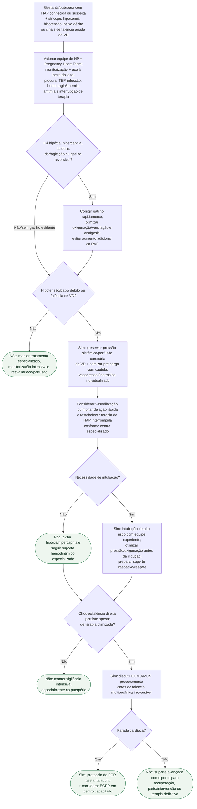

# HAP descompensada na gestação/puerpério

## Regra prática

Na HAP descompensada, o objetivo não é apenas “subir a pressão”: é **reduzir a carga do VD sem perder perfusão sistêmica**. Volume excessivo, intubação não preparada e interrupção abrupta de terapia pulmonar podem precipitar colapso.
