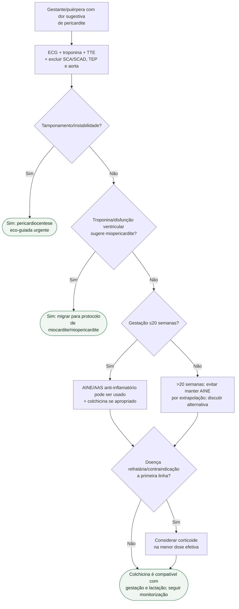

# Pericardite na gestação/puerpério

```mermaid
flowchart TD
  R0["Gestante/puérpera com dor sugestiva<br/>de pericardite"]
  P1["ECG + troponina + TTE<br/>+ excluir SCA/SCAD, TEP e aorta"]
  D1{"Tamponamento/instabilidade?"}
  C1(["Sim: pericardiocentese<br/>eco-guiada urgente"])
  D2{"Troponina/disfunção ventricular<br/>sugere miopericardite?"}
  C2(["Sim: migrar para protocolo<br/>de miocardite/miopericardite"])
  D3{"Gestação ≤20 semanas?"}
  P2["AINE/AAS anti-inflamatório pode ser usado<br/>+ colchicina se apropriado"]
  P3[">20 semanas: evitar manter AINE<br/>por extrapolação; discutir alternativa"]
  D4{"Doença refratária/contraindicação<br/>a primeira linha?"}
  P4["Considerar corticoide<br/>na menor dose efetiva"]
  C3(["Colchicina é compatível com<br/>gestação e lactação; seguir monitorização"])

  R0 --> P1
  P1 --> D1
  D1 -->|"Sim"| C1
  D1 -->|"Não"| D2
  D2 -->|"Sim"| C2
  D2 -->|"Não"| D3
  D3 -->|"Sim"| P2
  D3 -->|"Não"| P3
  P2 --> D4
  P3 --> D4
  D4 -->|"Sim"| P4
  D4 -->|"Não"| C3
  P4 --> C3

  classDef conduta fill:#eef6ef,stroke:#2f7a4f,color:#12301f;
  class C1,C2,C3 conduta;
```

## Regra prática

**20 semanas é um divisor terapêutico para AINE em dose anti-inflamatória; não é um divisor para reconhecer tamponamento ou miocardite.**