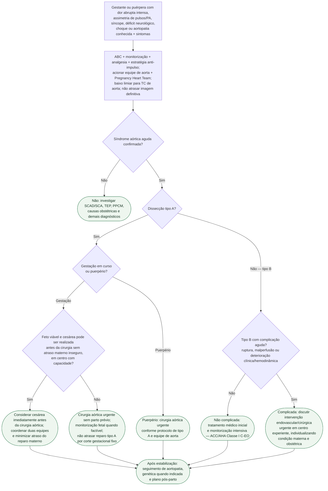

# Síndrome aórtica aguda na gestação/puerpério

## Regra prática

**Tipo A na gestação é emergência cirúrgica. Tipo B é inicialmente médico se não complicada.** A gestação modifica a coordenação materno-fetal, não elimina a urgência da doença aórtica.

Na ESC 2025, cesárea antes de cirurgia com circulação extracorpórea reduziu
mortalidade fetal na metanálise citada, sem diferença demonstrada na mortalidade
materna. A decisão, porém, deve usar **viabilidade fetal e capacidade do centro,
não trimestre fixo**. Se o parto criar atraso ou risco materno inaceitável, o
reparo tipo A permanece prioritário.

Em suspeita de síndrome aórtica aguda, a diretriz recomenda baixo limiar para TC
de aorta e consulta à equipe especializada; a radiação não justifica reter um
exame potencialmente salvador. Tipo B não complicada recebe tratamento médico e
vigilância intensiva; ruptura, malperfusão ou deterioração exigem intervenção.

## Tudo com Tudo

- [Síndrome aórtica aguda na gestação/puerpério — revisão clínica](sindrome-aortica-aguda-na-gestacao-e-puerperio.md)
- [Síndrome aórtica aguda — ESC 2024](../Aorta_e_doença_arterial_periférica/fluxograma-sindrome-aortica-aguda-esc-2024.md)
- [SCA na gestação e puerpério](fluxograma-sindrome-coronariana-aguda-na-gestacao-e-puerperio.md)
- [TEP agudo na gestação e puerpério](fluxograma-tromboembolismo-pulmonar-agudo-na-gestacao-e-puerperio-esc-2025.md)
- [Cardiomiopatia periparto descompensada](fluxograma-cardiomiopatia-periparto-descompensada-e-choque-no-puerperio-esc-2025.md)
